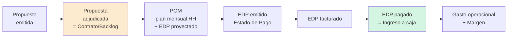

# Reporte de Datos Financieros — `Archivos 2025`

> **Pilar:** `pilar_a` — Dimensión Estratégica · **Ámbito:** cierre del ejercicio 2025
> **Generado:** 2026-06-19 · **Fuente:** `pilar_a/data/Archivos 2025/`
> **Audiencia:** agente IA de data science / BI de REDCO.
> Documento gemelo: [`Archivos 2026/REPORTE_Archivos_2026.md`](../Archivos%202026/REPORTE_Archivos_2026.md).

---

## 0. Propósito de esta carpeta dentro del pilar

`Archivos 2025` es la **línea base histórica cerrada** del sistema financiero de REDCO. Contiene la "verdad" del ejercicio 2025 (caja real, gastos reales, EDP cobrados) más los modelos de proyección y presupuesto con que se gestionó ese año. Es el **material de entrenamiento y calibración** para todo lo que el pilar debe producir hacia adelante:

| Objetivo analítico del pilar (briefing) | Qué aporta `Archivos 2025` |
| --- | --- |
| **Proyección de series de tiempo** | 12 meses reales de cada eslabón del ciclo (propuestas → EDP → facturación → ingreso → gasto) para estimar estacionalidad, tasas de conversión y *lags* de cobranza. |
| **Proyecciones de flujo de caja** | Modelos de flujo 2025 ya construidos (real y proyectado por país) que sirven de plantilla y de back-test del modelo 2026. |
| **Evaluación de escenarios** | Histórico de desviaciones Real vs. POM vs. Presupuesto; caso Rusia (Seligdar/Polyus) como nodo de escenario. |
| **Elementos para su confección** (costos · pipeline) | Costos directos por proyecto/unidad, gasto operacional por país, y el ciclo EdP como pipeline. |
| **Creación de presupuesto** | El presupuesto 2025 (`Resumen Budget 25´`) y el forecast mensual, base contra la cual se mide 2026. |

El concepto operativo que vertebra **todos** los archivos es el **ciclo EdP** (Estado de Pago):

Cada etapa tiene **fecha** y **monto USD** → de ahí salen tanto las series de tiempo como los rezagos (días a aprobación, a factura, a caja) que alimentan las proyecciones de caja.

---

## 1. Inventario de la carpeta

| # | Archivo | Tipo | Hojas | Rol |
| --- | --- | --- | ---: | --- |
| 1 | `202512_Proyección de Ingresos por Proyectos_cierre2025.xlsx` | Excel | 5 | Proyección de ingresos por proyecto (cierre Dic-2025) + ledger EdP. |
| 2 | `202601_Control Gestión Reunión 12_RevA.pptx` | PPT | 32 | Deck de la reunión mensual de resultados (cierre 2025). |
| 3 | `202601_FLUJO REDCO 2025 - Cierre diciembre.xlsx` | Excel | 39 | **Flujo de caja maestro 2025** (real + proyectado, multi-país). |
| 4 | `202601_Proyeccion_Ing+Modulos 1_Edu.xlsx` | Excel | 16 | **Forecast + Presupuesto + módulos de proyecto** (modelo de Eduardo). |
| 5 | `HH_EDP_Diciembre 2025.xlsx` | Excel | 3 | Conciliación Horas-Hombre (HH) vs. EDP de diciembre. |
| 6 | `Respaldos/` | carpeta | — | Versiones alternativas del flujo + CSV de HH. |

> **Nota de prefijos.** `2025xx` = mes del *dato*; `2026xx` = mes en que se *cerró/consolidó* (enero 2026 cierra diciembre 2025). El `Cierre diciembre` es la foto definitiva del año.

---

## 2. Archivo 1 — `202512_Proyección de Ingresos por Proyectos_cierre2025.xlsx`

**Propósito.** Proyectar y consolidar el **ingreso por proyecto** al cierre 2025 y su arrastre a 2026. Es la vista *comercial/devengo* del ingreso (no de caja).

| Hoja | Estado | Contenido |
| --- | --- | --- |
| `Proyección Ingresos 2025_Dic` | oculta | Cálculo base de la proyección de ingresos por proyecto. |
| `PY Ingresos 2026` | visible | Tabla dinámica: ingreso 2026 por proyecto × mes (arrastre de cartera a 2026, p. ej. Perú). |
| `TD EDP 2025` | visible | **Tabla dinámica de EDP "Ingresado USD" por proyecto × mes (ene–dic 2025).** Núcleo de la serie de ingresos. |
| `CicloEdP_2023_v1` | visible | **Ledger EdP** (628 filas) — ver §6 (guía de campos canónica). |
| `POM 2025` | oculta | Plan de operaciones mensual 2025 (snapshot). |

**Guía de campos — `TD EDP 2025`:** filas = `Nombre Teams` (proyecto); columnas = meses `ene…dic` + `Total general`; valores = USD ingresado. Ej.: `BHP_Medidas de Control` 911 kUSD, `LasBambas_Ferrobamba` 856 kUSD, `Twin Metals` 482 kUSD → revela **concentración de ingresos** en pocos proyectos/clientes (riesgo estratégico ya señalado en el diagnóstico: dependencia de 3–4 clientes clave).

**Conexión estratégica.** Insumo directo del **caso de negocio** y de las **hipótesis de creación de valor** (output 2 y 3 del pilar): muestra *de qué proyectos/países/clientes* proviene el valor y cuánto se arrastra al horizonte 2028. Base de la serie de tiempo de ingresos.

---

## 3. Archivo 2 — `202601_Control Gestión Reunión 12_RevA.pptx`

**Propósito.** Acta visual de la **Agenda de Cumplimiento mensual** (Reunión de Resultados, cierre Diciembre 2025). Es el artefacto **"Monitorear & Aprender" (Etapa 5 de Kaplan-Norton)** materializado.

**Composición (32 láminas):**

| Bloque | Contenido relevante para BI |
| --- | --- |
| Desarrollo de Negocios / Comercial | Propuestas emitidas (N°15 / 2.970 kUSD), adjudicaciones, pipeline (Lundin, Caserones). |
| Status Ingeniería | 23 proyectos en ejecución (vs. 25), dotación (4 directores / 7…), **HH y EDP diciembre**, EDP enero proyectado **1.390 kUSD**. |
| Resultados de desempeño operacional | Saldo de cajas al cierre, **variación gasto operacional acumulado +11% / +623 kUSD**, proyección de caja enero 2026. |
| Modelo Operativo | Avances de profesionalización; "11 de 12 meses las HH reales estuvieron sobre el POM" → justifica el control de horas. |

**Conexión estratégica.** Evidencia el **foro de decisión** (gobernanza nivel 2) y el meta-objetivo del programa: reducir dependencia del fundador institucionalizando la reunión de gestión. El dato "HH real > POM 11/12 meses" es una **hipótesis cuantificable de fuga de margen** a validar con `statistical-analysis`.

---

## 4. Archivo 3 — `202601_FLUJO REDCO 2025 - Cierre diciembre.xlsx` ⭐

**Propósito.** El **flujo de caja maestro 2025**: verdad de caja del año + proyección. Es el **predecesor directo** del modelo `.xlsm` 2026 (Archivo 6 de la carpeta 2026).

**Composición (39 hojas, agrupadas):**

| Grupo | Hojas clave | Contenido |
| --- | --- | --- |
| **Presupuesto vs Real** | `Ppto vs Real_Nov` | Gasto presupuestado vs real por ítem × mes (TC = 920 CLP/USD). Sueldos por entidad (REDCO/REDCROSS/R+/REDTEC), externos, operacionales (capacitación, seguros, pasajes…). |
| **Consolidado** | `Flujo Consolidado por mes`, `Flujo Anual por unidad`, `Resumen Flujo consolidado` | Flujo operacional mensual: Σ Ingresos op., Costos (Sueldos / Honorarios / Gastos op.), Costos administrativos. |
| **Por entidad** | `Flujo Redco Chile / Perú / Brasil / USA / BVI` | Flujo de caja por sociedad/país. |
| **Gasto** | `Gasto Operacional_Dic` (pivot) | Gasto por país × mes: **Chile 4,65M · Perú 1,73M · Brasil 0,52M USD** (anual). |
| **Ingreso/Cobranza** | `Facturas e Ingresos 2024/2025`, `Facts. e Ingresos Perú/Brasil/USA`, `INGRESOS`, `CMP Ret. 5%` | Facturación y cobranza real por cliente/país. |
| **Tesorería** | `Saldos ctas. ctes.`, `FFMM`, `Préstamo BVI`, `Boletas/Btas. de garantía` | Saldos bancarios, fondos mutuos, préstamos intercompañía, boletas de garantía. |
| **Nóminas / Pagos** | `Pagos agosto…enero`, `Nómina de pago …` | Detalle de egresos por mes. |

**Guía de campos — `Flujo Consolidado por mes` (estructura típica de flujo):**
`RESUMEN` (etiqueta de línea) × columnas mensuales `ene…dic 2025`. Bloques: `TOTAL INGRESOS OPERACIONALES`, `SUELDOS / HONORARIOS / GASTOS OPERACIONALES`, `TOTAL COSTOS OPERACIONALES`, `COSTOS ADMINISTRATIVOS`.

**Conexión estratégica.** Es la **fuente de verdad de caja 2025** y el back-test obligatorio del modelo 2026. Permite: (a) validar la estructura de costos por país/entidad; (b) cuantificar la **multi-moneda** y los flujos intercompañía (BVI/REDTEC/R+); (c) construir la línea base de **liquidez** y **burn rate** mensual.

---

## 5. Archivo 4 — `202601_Proyeccion_Ing+Modulos 1_Edu.xlsx` ⭐

**Propósito.** El **modelo integrado Forecast + Presupuesto + costeo por proyecto** ("módulos") con el que se gestionó 2025. Conceptualmente es el **puente entre el P&L de gestión y el flujo de caja**, y el origen de la lógica que migró al modelo 2026.

**Composición (16 hojas):**

| Hoja | Contenido |
| --- | --- |
| `Resumen Forecast 25´` | **P&L mensual de gestión** (la pieza central). Filas: `Propuestas · Ventas · EDP · Facturación · Ingresos · Gasto · Beneficio · Margen %`. |
| `Resumen Budget 25´` | **Presupuesto 2025** (misma estructura) → la línea base. |
| `Resumen` / `Dashboard` | Consolidados y tablero (Dashboard con 131 columnas). |
| `Costo Directo Proyectos` / `Costos Proyectados por Unidad` | **Costos directos por proyecto y por unidad** (insumo del "Curso de evaluación económica" / costeo). |
| `Ingreso Proyectado` / `EDP Proyectado` | Proyección de ingreso y EDP por proyecto. |
| `Gantt Proyectos` | Cronograma (timing de devengo/HH por proyecto). |
| `Flujo Caja` | **Flujo de caja por país** (Chile/Perú/Brasil/USA/Otros): filas `Ingreso · Costos · Margen`. |
| `Listas y Parametros` / `Personal` | Maestros de parámetros y dotación. |

**Guía de campos — `Resumen Forecast 25´` (P&L de gestión):**

| Fila | Definición | Ejemplo (Dic-25, kUSD) |
| --- | --- | --- |
| Propuestas | Valor de propuestas emitidas (devengo comercial) | 3.037 |
| Ventas | Propuestas adjudicadas | 1.306 |
| EDP | Estados de pago emitidos | 611 |
| Facturación | EDP facturados | 886 |
| Ingresos | EDP pagados (caja) | 846 |
| Gasto | Costo total del mes | 960 |
| Beneficio | Ingresos − Gasto | −114 |
| Margen % | Beneficio / Ingresos | −13% |

> **Hallazgo clave:** el margen 2025 es **volátil y se deteriora en el 2º semestre** (sept −3%, nov −7%, dic −13%). Esta serie es candidata directa a **modelado de drivers de margen** (`statsmodels` / `shap`).

**Conexión estratégica.** Realiza dos outputs del pilar: el **presupuesto** (Budget vs Forecast) y los **insumos del caso de negocio**. El `Budget` de aquí es el que en 2026 aparece citado como meta de **817 kUS$/mes de ingreso**. Es el archivo más reutilizable como motor de proyección.

---

## 6. Archivo 5 — `HH_EDP_Diciembre 2025.xlsx`

**Propósito.** Conciliar **Horas-Hombre planificadas vs reales** y vincularlas al **EDP** → mide eficiencia de ejecución y adherencia a plan (drivers de los KPIs 8 y 9 de 2026).

| Hoja | Contenido |
| --- | --- |
| `Hoja1` | Pivot de Horas por proyecto × tipo `{OTI, POM, Real}`. |
| `Hoja2` | Tabla por proyecto: HH (OTI/POM/Real + Dif. + Var.%) y EDP (POM/Real + Dif. + Var.%). |
| `Listado de verificación` | **Grano fino:** 3.011 filas `Proyecto · Profesional · Horas_v2 · Tipo Planificación · Año · Mes · Día`. |

**Guía de los 3 tipos de HH (vocabulario crítico del modelo):**

| Tipo | Significado | Uso analítico |
| --- | --- | --- |
| **OTI** | Horas comprometidas en la oferta técnica inicial (lo vendido). | Baseline contractual. |
| **POM** | Horas replanificadas en el Programa de Operaciones Mensual. | Plan vigente. |
| **Real** | Horas efectivamente ejecutadas. | Resultado. |

Ej.: `Seligdar_Kyuchus` OTI 578 / POM 702 / **Real 1.707** (+143% sobre POM) con **EDP = 0** → sobre-ejecución sin cobro: el caso Rusia en su forma más cruda.

**Conexión estratégica.** La HH es el **costo variable** del negocio de consultoría ("no vendemos horas, vendemos criterio" — pero el costo *son* horas). Esta es la materia prima de la **rentabilidad por proyecto** y de la **capacidad** (HH disponibles vs comprometidas).

---

## 7. Carpeta `Respaldos/`

| Archivo | Rol |
| --- | --- |
| `202512_FLUJO REDCO 2025 - Cierre definitivo diciembre_IM.xlsx` (47 hojas) | Versión "definitiva" del flujo con hojas extra: `UTILIDAD X AÑO`, `EERR sept.2025`, `Facturas e ingresos 2026`. |
| `202601_FLUJO REDCO 2025 - Cierre diciembre_v1_BVI_ER.xlsx` (39 hojas) | Variante con foco BVI / Estado de Resultados. |
| `Listado de verificación.csv` (218 KB) | Export plano del detalle diario de HH (mismo contenido que la hoja homónima). **Formato ideal para ingesta directa con `polars`/`pandas`.** |

> **Recomendación de gobierno de datos:** trabajar siempre sobre `202601_FLUJO REDCO 2025 - Cierre diciembre.xlsx` (raíz) como versión canónica; los `Respaldos` son históricos/auditoría. Conviene **versionar** y documentar cuál es la fuente de verdad para evitar el problema de "verdad dispersa" que el propio modelo 2026 declara resolver.

---

## 8. Conexión con los objetivos analíticos del `pilar_a`

| Capacidad objetivo | Dónde se apoya en `Archivos 2025` | Técnica / skill sugerida |
| --- | --- | --- |
| **Series de tiempo** | `TD EDP 2025`, `Resumen Forecast 25´`, `Gasto Operacional_Dic` (12 puntos/mes por eslabón) | `statsmodels`, `aeon`, `timesfm-forecasting` |
| **Flujo de caja proyectado** | `Flujo Caja` (Edu) y `Flujo Consolidado por mes` como plantilla y back-test | reconstruir en notebook (`polars`) |
| **Escenario · árbol de decisión** | Caso Rusia (Seligdar OTI/POM/Real vs EDP=0) = nodo "cobra / no cobra"; Bid/No Bid del taller | `networkx` (árbol), reglas |
| **Escenario · Monte Carlo** | Distribuciones empíricas de *lags* (días envío→factura→pago) y de **tasas de conversión** entre eslabones | `numpy`/`scipy` sobre el ledger EdP |
| **Costos · pipeline** | `Costo Directo Proyectos`, `Costos Proyectados por Unidad`; pipeline = `CicloEdP` + cartera | `exploratory-data-analysis` |
| **Presupuesto** | `Resumen Budget 25´` (línea base 2025) | base para Stratex/BSC |

**Riesgos de datos a vigilar (calidad):** multi-moneda con TC variable (920 CLP/USD en una hoja, otras en USD), múltiples entidades (REDCO/REDCROSS/R+/REDTEC/BVI), versiones paralelas del flujo, y devengo vs caja mezclados en algunas vistas. Estandarizar a **USD** y separar **devengo (EDP/factura)** de **caja (ingreso)** es el primer paso de cualquier consolidación → ya resuelto conceptualmente en el modelo 2026 (ver reporte gemelo).

---

*Fin del reporte `Archivos 2025`.*
