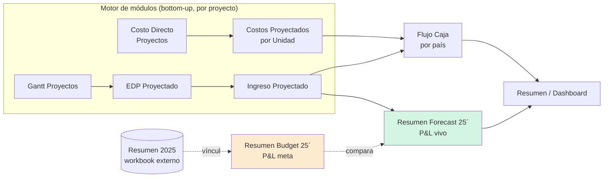
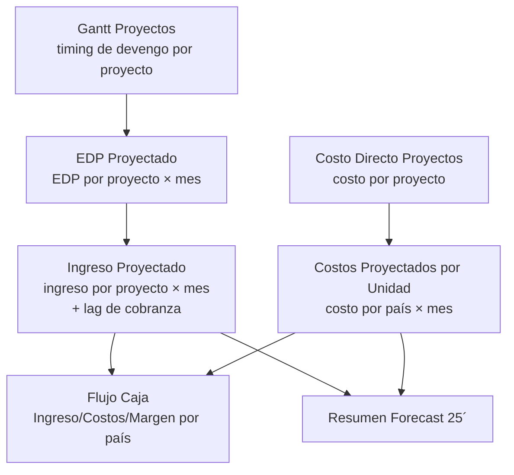

# Reporte del Modelo de Presupuesto — `Archivos 2025`

> **Pilar:** `pilar_a` — Dimensión Estratégica · **Artefacto:** modelo de presupuesto / forecast 2025
> **Generado:** 2026-06-22 · **Fuente:** `pilar_a/data/Archivos 2025/202601_Proyeccion_Ing+Modulos 1_Edu.xlsx`
> **Audiencia:** agente IA de data science / BI de REDCO.
> Documento gemelo: [`Archivos 2026/REPORTE_Modelo_Presupuesto_2026.md`](../Archivos%202026/REPORTE_Modelo_Presupuesto_2026.md).
> Reporte de inventario de la carpeta: [`REPORTE_Archivos_2025.md`](REPORTE_Archivos_2025.md) (§5 describe este archivo).

---

## 0. Qué es y dónde vive

El **modelo de presupuesto 2025** no es un archivo aparte: vive **dentro del modelo integrado de Eduardo** (`202601_Proyeccion_Ing+Modulos 1_Edu.xlsx`), repartido en dos hojas gemelas y un motor de cálculo ("módulos") que las alimenta:

| Capa | Hoja(s) | Rol |
| --- | --- | --- |
| **Presupuesto (la meta)** | `Resumen Budget 25´` | **Línea base anual**: P&L de gestión mensual *planificado*. |
| **Forecast (la expectativa viva)** | `Resumen Forecast 25´` | Misma estructura, pero con datos **reales en los meses transcurridos** + proyección del resto. |
| **Motor de proyección ("módulos")** | `Ingreso Proyectado`, `EDP Proyectado`, `Costo Directo Proyectos`, `Costos Proyectados por Unidad`, `Gantt Proyectos` | Cálculo bottom-up por proyecto que **alimenta** el Forecast. |
| **Salida de caja** | `Flujo Caja` | Traduce el devengo a **flujo de caja por país**. |
| **Consolidado / tablero** | `Resumen`, `Dashboard` | Vistas ejecutivas. |
| **Maestros** | `Listas y Parametros`, `Personal` | Parámetros y dotación. |

La pieza que el briefing del pilar llama **"el presupuesto"** es **`Resumen Budget 25´`**, y su **promedio mensual de ingresos de 819,5 kUS$** es el origen directo de la **meta de 817 kUS$/mes** que se cita en 2026.



---

## 1. La estructura común: el P&L de gestión (8 líneas + margen)

Ambas hojas (`Budget` y `Forecast`) comparten **exactamente el mismo esqueleto**: una matriz **ítem × mes** que reproduce el **ciclo EdP** como un Estado de Resultados de gestión. Las filas son los eslabones del embudo comercial→caja:

| Fila | Ítem | Definición | Unidad |
| ---: | --- | --- | --- |
| 2 | **Propuestas** | Valor de propuestas emitidas (devengo comercial) | kUS$ |
| 3 | **Ventas** | Propuestas adjudicadas (contrato/backlog) | kUS$ |
| 4 | **EDP** (rotulada **"POM"** en la columna Total) | Estados de pago emitidos / plan mensual | kUS$ |
| 5 | **Facturación** | EDP facturados | kUS$ |
| 6 | **Ingresos** | EDP pagados (caja) | kUS$ |
| 7 | **Gasto** | Costo total del mes | kUS$ |
| 8 | **Beneficio** | `Ingresos − Gasto` | kUS$ |
| 9 | **Margen %** | `Beneficio / Ingresos` | % |

**Disposición de la matriz:**
- **Columnas `B…M`** = los 12 meses (`ene…dic 2025`, fechas reales en la fila 1).
- **Columnas `O…Q`** = `Ítem · Total · Promedio` (con `=SUM(B:M)` y `=AVERAGE(B:M)`).
- **Fila 10** = beneficio **acumulado** (`=SUM($B$8:B8)` arrastrado).
- **Filas 33–40** = **subtotal del 1.er bloque** (`=SUM($B:F)`, esto es ene–may), usado para cortes semestrales.

> ⚠️ **Detalle terminológico:** en el Budget, la columna `Total` rotula la fila EDP como **"POM"** (`O4='POM'`). Es la evidencia de que, en la lógica del modelo, **EDP planificado ≡ POM** (el plan mensual de EDP). Ver el concepto POM en [`REPORTE_Archivos_2025.md`](REPORTE_Archivos_2025.md) §6.

---

## 2. La lógica de cálculo del PRESUPUESTO (`Resumen Budget 25´`)

Aquí está el corazón del modelo de presupuesto. Cada fila tiene una **regla de derivación** distinta:

### 2.1 Propuestas — derivadas de la meta de ventas por una tasa de conversión fija

```
Propuestas[mes] = Ventas[mes] / 0,43
```
Ej.: `B2 = B3/0,43`. El **0,43 es la tasa de adjudicación supuesta** (win-rate): para vender 1, hay que proponer ~2,3×. Es el **único parámetro de embudo** del presupuesto y está **hardcodeado** en cada celda (no es una celda-parámetro editable → riesgo de mantenibilidad).

### 2.2 Ventas — el input maestro (lo único "a mano")

`Ventas` (fila 3) son **valores escritos directamente** (meta comercial mensual). Es la **variable de decisión** que gobierna todo el presupuesto: define Propuestas (hacia arriba) y, vía el motor externo, EDP/Facturación/Ingresos (hacia abajo). Total Budget: **10.800 kUS$**.

### 2.3 EDP, Facturación, Ingresos, Gasto — vínculo a un workbook externo

Las cuatro filas operativas **no se calculan en este archivo**: traen sus valores de un **libro externo** vía referencias `'[1]Resumen 2025'!`:

```
EDP[mes]         = '[1]Resumen 2025'!C11..N11
Facturación[mes] = '[1]Resumen 2025'!C12..N12
Ingresos[mes]    = '[1]Resumen 2025'!C13..N13
Gasto[mes]       = '[1]Resumen 2025'!C15..N15
```

El `[1]` es un **vínculo externo roto/congelado** (el archivo `Resumen 2025` no está en la carpeta). En la práctica esto significa que el Budget es un **snapshot de valores** cuya fuente viva está fuera del repositorio.

> 🔎 **Gobierno de datos:** para reconstruir el presupuesto hay que **internalizar** ese origen externo o tratar los valores actuales como constantes. Documentar esta dependencia es prioritario (mismo problema de "verdad dispersa" que el modelo 2026 viene a resolver).

### 2.4 El rezago de cobranza está embebido en los datos

Observando los valores, el modelo **incorpora un lag de ~1 mes por etapa**:

```
EDP(ene)=754  →  Facturación(feb)=754  →  Ingresos(mar)=754
```

Es decir: **lo que se emite como EDP en el mes _m_ se factura en _m+1_ y entra a caja en _m+2_**. El presupuesto asume un **rezago total EDP→caja de ~2 meses**, constante. Es la simplificación clásica de cobranza (en 2026 esto se vuelve estocástico vía los "días a aprobación/factura/caja").

### 2.5 Beneficio y Margen — aritmética de cierre

```
Beneficio[mes] = Ingresos[mes] − Gasto[mes]
Margen %[mes]  = Beneficio[mes] / Ingresos[mes]
```

### 2.6 Cifras clave del Presupuesto 2025 (totales anuales)

| Ítem | Total año (kUS$) | Promedio mes (kUS$) |
| --- | ---: | ---: |
| Propuestas | 25.116 | 2.093 |
| Ventas | 10.800 | 900 |
| EDP / POM | 10.002 | 833 |
| Facturación | 9.854 | 821 |
| **Ingresos** | **9.834** | **819,5** ← *origen de la meta "817/mes"* |
| Gasto | 6.709 | 559 |
| **Beneficio** | **3.125** | 260 |
| **Margen %** | **31,8 %** | — |

---

## 3. La hoja FORECAST: misma estructura, motor distinto

`Resumen Forecast 25´` es la **versión viva** del mismo P&L. Difiere del Budget en **de dónde saca los números**:

| Fila | Budget (origen) | Forecast (origen) |
| --- | --- | --- |
| Propuestas | `Ventas/0,43` | **Real escrito** ene–may; `Ventas/0,43` jun–dic |
| Ventas | Input meta | Input real/estimado |
| EDP | Externo `[1]Resumen 2025` | **Interno**: `=O34..Z34` (módulos, `EDP/1000`) |
| Facturación | Externo | **Interno**: `=O37..Z37` |
| Ingresos | Externo | **Interno**: `=O28..Z28` (bloque de cálculo propio) |
| Gasto | Externo | **Interno**: `=O31..Z31` |

El Forecast **se auto-contiene**: arrastra el detalle por proyecto desde el bloque de "módulos" (filas 27–37 traen EDP/Facturación/Ingreso/Gasto en USD y los dividen `/1000` a kUS$). Incluye además **factores de calibración** explícitos:
- `Factor EDP = 1,228` (W3)
- `Factor Factura = 0,984` (W4)

que ajustan los montos modelados a la realidad observada.

### 3.1 Forecast vs Budget — la brecha que importa

| Ítem (total año, kUS$) | Budget | Forecast | Δ |
| --- | ---: | ---: | ---: |
| Ingresos | 9.834 | 9.151 | **−683 (−7 %)** |
| Gasto | 6.709 | 7.435 | **+726 (+11 %)** |
| Beneficio | 3.125 | 1.716 | **−1.409 (−45 %)** |
| **Margen %** | **31,8 %** | **18,8 %** | **−13 pp** |

> 🚩 **Hallazgo central del modelo:** la rentabilidad real (Forecast) es **la mitad** de la presupuestada. El doble golpe es **ingresos por debajo de la meta** y **gasto por encima**. El margen se **deteriora en el 2.º semestre** (Forecast: sep −3 %, nov −7 %, dic −13 %). Esta es la serie candidata directa a **modelado de drivers de margen** (`statsmodels` / `shap`).

---

## 4. El motor de "módulos" (cómo se construye el Forecast desde abajo)

El Forecast se sostiene en un cálculo **bottom-up por proyecto**, repartido en cuatro hojas-motor de ~210 filas cada una (una fila por proyecto/EDP):



- **`EDP Proyectado` / `Ingreso Proyectado`** — proyectan EDP e ingreso por proyecto a lo largo de los meses (el ingreso aplica el rezago de cobranza sobre el EDP).
- **`Costo Directo Proyectos`** → **`Costos Proyectados por Unidad`** — escalan el costo directo por proyecto y lo agregan por **país/unidad**.
- **`Gantt Proyectos`** — fija el *timing* (cuándo devenga cada proyecto), insumo del calendario de EDP.

---

## 5. La salida de caja: `Flujo Caja` (por país)

La hoja `Flujo Caja` traduce el devengo del motor a **flujo de caja por país** (`2025`, abr–dic). Estructura repetida por país (**Chile · Perú · Brasil · USA · Otros**) + un bloque **Total**:

| Línea | Fórmula | Significado |
| --- | --- | --- |
| **Ingreso** | `SUMIFS('Ingreso Proyectado'…, país)` | Cobranza proyectada por país × mes. |
| **Costos** | `='Costos Proyectados por Unidad'!…` | Costo por país × mes. |
| **Margen** | `Ingreso − Costos` | Resultado de caja por país. |

Esto es lo que convierte el presupuesto de gestión (P&L) en un **presupuesto de caja segmentado geográficamente** — el antecesor conceptual directo de las "5 cajas" del modelo 2026.

---

## 6. Mapa de fórmulas (referencia rápida para reconstrucción)

| Magnitud | Fórmula canónica | Hoja |
| --- | --- | --- |
| Propuestas | `Ventas / 0,43` | Budget |
| Ingresos (mes _m_) | `≈ EDP(m−2)` (lag 2 meses) | Budget (vía externo) |
| Beneficio | `Ingresos − Gasto` | ambas |
| Margen % | `Beneficio / Ingresos` | ambas |
| Beneficio acumulado | `SUM($B$8:m8)` | ambas, fila 10 |
| Subtotal H1 (ene–may) | `SUM($B:F)` | ambas, filas 33–40 |
| EDP Forecast | `EDP_proyecto_USD / 1000`, × `Factor EDP 1,228` | Forecast (módulos) |
| Ingreso de caja por país | `SUMIFS(Ingreso Proyectado, país)` | Flujo Caja |
| Costo por país | `='Costos Proyectados por Unidad'!` | Flujo Caja |

---

## 7. Limitaciones, riesgos y calidad de datos

1. **Vínculo externo roto (`[1]Resumen 2025`):** las 4 líneas operativas del Budget dependen de un archivo ausente → los valores están **congelados**, no recalculables. *Acción:* internalizar o documentar como constantes.
2. **Parámetros hardcodeados:** la tasa `0,43` y los factores `1,228 / 0,984` están incrustados en fórmulas, no en celdas-parámetro. Dificulta el análisis de sensibilidad.
3. **Lag de cobranza determinista (2 meses fijos):** el modelo 2026 lo reemplaza por rezagos empíricos por EDP → mejor base para Monte Carlo.
4. **Dos fuentes para lo mismo:** Budget (externo) y Forecast (interno) calculan el mismo P&L con motores distintos; conviene declarar **cuál es la verdad** para cada uso.
5. **Snapshot, no vivo:** es la foto de cierre 2025, no un sistema encadenado (a diferencia del `.xlsm` 2026).

---

## 8. Conexión con los objetivos del `pilar_a`

| Capacidad objetivo del pilar | Qué aporta este modelo | Skill sugerida |
| --- | --- | --- |
| **Creación de presupuesto** | `Resumen Budget 25´` = línea base; estructura P&L reutilizable | base para Stratex/BSC (`xlsx`) |
| **Proyección de series de tiempo** | 12 puntos/mes por eslabón (Propuestas→Ingresos→Gasto) | `statsmodels`, `aeon` |
| **Drivers de margen** | Brecha Budget vs Forecast (−13 pp) + deterioro 2.º semestre | `statsmodels`, `shap` |
| **Flujo de caja proyectado** | `Flujo Caja` por país como plantilla | `polars` (reconstrucción) |
| **Tasa de conversión del embudo** | El `0,43` (win-rate) como parámetro a validar empíricamente | `statistical-analysis` |

> **Síntesis:** el modelo de presupuesto 2025 es un **P&L de gestión mensual ítem×mes**, gobernado por una **meta de ventas** que cae en cascada por una **tasa de conversión fija (0,43)** y un **rezago de cobranza de 2 meses**, con un motor bottom-up por proyecto que produce el forecast y un anexo de caja por país. Su valor para el pilar es doble: es **la línea base presupuestaria heredada a 2026** y la **primera evidencia cuantificada del deterioro de margen** que el caso de negocio 2028 debe explicar.

---

*Fin del reporte del modelo de presupuesto `Archivos 2025`.*
