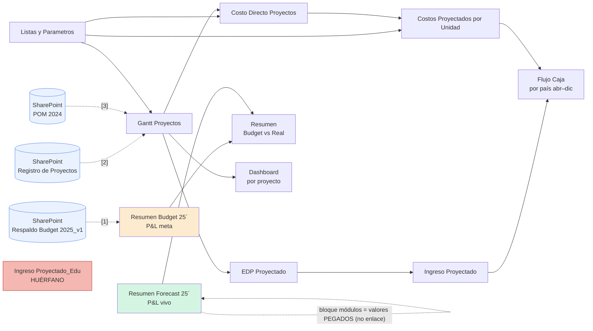
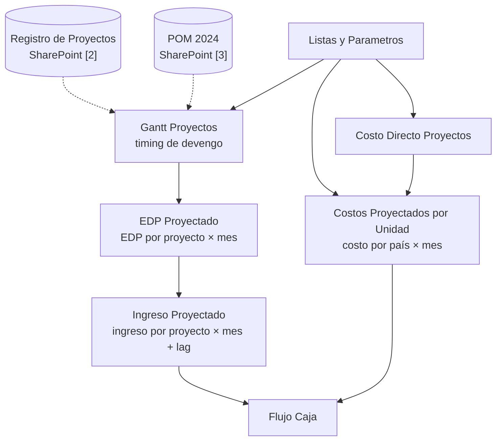

# Reporte del Modelo de Presupuesto — `Archivos 2025`

> **Pilar:** `pilar_a` — Dimensión Estratégica · **Artefacto:** modelo de presupuesto / forecast 2025
> **Generado:** 2026-06-22 · **Verificado celda-a-celda y ampliado:** 2026-06-25 (lectura directa de fórmulas con `openpyxl` sobre las 16 hojas).
> **Fuente:** `pilar_a/data/Archivos 2025/202601_Proyeccion_Ing+Modulos 1_Edu.xlsx`
> **Audiencia:** agente IA de data science / BI de REDCO.
> Documento gemelo: [`Archivos 2026/REPORTE_Modelo_Presupuesto_2026.md`](../Archivos%202026/REPORTE_Modelo_Presupuesto_2026.md).
> Reporte de inventario de la carpeta: [`REPORTE_Archivos_2025.md`](REPORTE_Archivos_2025.md) (§5 describe este archivo).

> **Nota de revisión (2026-06-25):** reescrito tras abrir el `.xlsx` y rastrear cada referencia entre celdas de las **16 hojas**. La versión anterior acertaba en la lógica del Budget (tasa 0,43, lag 2 meses, factores 1,228/0,984 — todo **confirmado**), pero (a) documentaba ~11 de 16 hojas, (b) describía mal el vínculo externo, y (c) tenía equivocada la arquitectura del motor. Las correcciones se marcan con **✱ Corrección**.

---

## 0. Qué es y dónde vive

El **modelo de presupuesto 2025** no es un archivo aparte: vive **dentro del modelo integrado de Eduardo** (`202601_Proyeccion_Ing+Modulos 1_Edu.xlsx`, **16 hojas**), repartido en dos hojas gemelas de P&L, un motor de cálculo ("módulos") por proyecto, una salida de caja por país y dos hojas de consolidación:

| Capa                                        | Hoja(s)                                                                                                                                                     | Rol                                                                                                  |
| ------------------------------------------- | ----------------------------------------------------------------------------------------------------------------------------------------------------------- | ---------------------------------------------------------------------------------------------------- |
| **Presupuesto (la meta)**             | `Resumen Budget 25´`                                                                                                                                     | **Línea base anual**: P&L de gestión mensual *planificado*.                                |
| **Forecast (la expectativa viva)**    | `Resumen Forecast 25´`                                                                                                                                   | Misma estructura, con real ene–may + proyección (vía bloque de módulos**pegado**, ✱ §4). |
| **Motor de proyección ("módulos")** | `Gantt Proyectos`, `EDP Proyectado`, `Ingreso Proyectado`, `Ingreso Proyectado_Edu`, `Costo Directo Proyectos`, `Costos Proyectados por Unidad` | Cálculo bottom-up por proyecto.**Alimenta solo `Flujo Caja`** ✱.                           |
| **Salida de caja**                    | `Flujo Caja`                                                                                                                                              | Devengo del motor → flujo de caja por país (abr–dic).                                             |
| **Consolidado / tablero**             | `Resumen`, `Dashboard`                                                                                                                                  | `Resumen` = Budget vs Real; `Dashboard` (131 cols) = vista por proyecto desde `Gantt`.         |
| **Maestros**                          | `Listas y Parametros`, `Personal`                                                                                                                       | Parámetros, dotación y competencias.                                                               |
| **Residuales**                        | `Calculos ->`, `Hoja1`, `Hoja4`                                                                                                                       | Separadores / restos sin rol analítico.                                                             |

La pieza que el briefing del pilar llama **"el presupuesto"** es **`Resumen Budget 25´`**, y su **promedio mensual de ingresos de 819,5 kUS$** es el origen directo de la **meta de 817 kUS$/mes** que se cita en 2026.

### 0.1 Inventario real de las 16 hojas

|  # | Hoja                              | Filas×Cols | Fórmulas | Rol                                                             |
| -: | --------------------------------- | ----------- | --------: | --------------------------------------------------------------- |
|  0 | `Resumen Forecast 25´`         | 46×27      |       186 | P&L vivo (real + proyección pegada)                            |
|  1 | `Resumen Budget 25´`           | 40×20      |       121 | P&L meta (← SharePoint`[1]`)                                 |
|  2 | `Resumen`                       | 71×22      |       448 | **Consolidado Budget vs Real** (no documentado)           |
|  3 | `Dashboard`                     | 91×131     |       472 | **Tablero por proyecto** desde `Gantt` (no documentado) |
|  4 | `Calculos ->`                   | 1×1        |         0 | Separador vacío                                                |
|  5 | `Listas y Parametros`           | 295×30     |       800 | Maestros y desplegables                                         |
|  6 | `Gantt Proyectos`               | 279×49     |     1.437 | Timing de devengo (← SharePoint`[2]`,`[3]`)                |
|  7 | `Hoja1`                         | 21×4       |         0 | Resto                                                           |
|  8 | `Costo Directo Proyectos`       | 211×42     |     6.383 | Costo por proyecto                                              |
|  9 | `EDP Proyectado`                | 211×47     |     6.480 | EDP por proyecto × mes                                         |
| 10 | `Hoja4`                         | 26×11      |         1 | Resto                                                           |
| 11 | `Ingreso Proyectado`            | 211×42     |     6.392 | Ingreso por proyecto × mes (lag)                               |
| 12 | `Costos Proyectados por Unidad` | 167×17     |     1.292 | Costo por país × mes                                          |
| 13 | `Flujo Caja`                    | 32×16      |       180 | **Caja por país (abr–dic)**                             |
| 14 | `Ingreso Proyectado_Edu`        | 211×42     |     6.392 | **Duplicado huérfano** de `Ingreso Proyectado` ✱      |
| 15 | `Personal`                      | 93×13      |         6 | Dotación + competencias                                        |



> ✱ **Tres correcciones de arquitectura** respecto a la versión anterior (detalle en §4 y §7): (1) el motor **no alimenta el Forecast por fórmula** — su bloque de módulos son valores pegados; alimenta solo `Flujo Caja`. (2) Los vínculos externos son **3 libros vivos de SharePoint**, no un archivo ausente. (3) `Ingreso Proyectado_Edu` es un **duplicado huérfano** (nada lo consume).

---

## 1. La estructura común: el P&L de gestión (8 líneas + margen)

Ambas hojas (`Budget` y `Forecast`) comparten **exactamente el mismo esqueleto**: una matriz **ítem × mes** que reproduce el **ciclo EdP** como un Estado de Resultados de gestión:

| Fila | Ítem                                                        | Definición                                      | Unidad |
| ---: | ------------------------------------------------------------ | ------------------------------------------------ | ------ |
|    2 | **Propuestas**                                         | Valor de propuestas emitidas (devengo comercial) | kUS$   |
|    3 | **Ventas**                                             | Propuestas adjudicadas (contrato/backlog)        | kUS$   |
|    4 | **EDP** (rotulada **"POM"** en la columna Total) | Estados de pago emitidos / plan mensual          | kUS$   |
|    5 | **Facturación**                                       | EDP facturados                                   | kUS$   |
|    6 | **Ingresos**                                           | EDP pagados (caja)                               | kUS$   |
|    7 | **Gasto**                                              | Costo total del mes                              | kUS$   |
|    8 | **Beneficio**                                          | `Ingresos − Gasto`                            | kUS$   |
|    9 | **Margen %**                                           | `Beneficio / Ingresos`                         | %      |

**Disposición de la matriz:**

- **Columnas `B…M`** = los 12 meses (`ene…dic 2025`, fechas reales en la fila 1).
- **Columnas `O…Q`** = `Ítem · Total · Promedio` (con `=SUM(B:M)` y `=AVERAGE(B:M)`).
- **Fila 10** = beneficio **acumulado** (`=SUM($B$8:B8)` arrastrado).
- **Filas 33–40** = **subtotal del 1.er bloque** (`=SUM($B:F)`, esto es ene–may), usado para cortes semestrales.

> **Detalle terminológico (confirmado):** en el Budget, la columna `Total` rotula la fila EDP como **"POM"** (`O4='POM'`). En la lógica del modelo, **EDP planificado ≡ POM**. Además `S4 = P4/P5 = 1,015` (relación EDP/Facturación anual).

---

## 2. La lógica de cálculo del PRESUPUESTO (`Resumen Budget 25´`)

### 2.1 Propuestas — derivadas de la meta de ventas por una tasa de conversión fija (confirmado)

```
Propuestas[mes] = Ventas[mes] / 0,43        (ej.: B2 = +B3/0,43)
```

El **0,43 es la tasa de adjudicación supuesta** (win-rate): para vender 1, hay que proponer ~2,3×. Es el **único parámetro de embudo** del presupuesto y está **hardcodeado** en cada celda (no es celda-parámetro → riesgo de mantenibilidad).

### 2.2 Ventas — el input maestro (lo único "a mano")

`Ventas` (fila 3) son **valores escritos** (930, 1008, 1590, …). Es la **variable de decisión** que gobierna todo el presupuesto. Total Budget: **10.800 kUS$** (promedio **900/mes**).

### 2.3 EDP, Facturación, Ingresos, Gasto — vínculo a SharePoint

Las cuatro filas operativas **no se calculan aquí**: traen sus valores de un libro externo vía `'[1]Resumen 2025'!`:

```
EDP[mes]         = '[1]Resumen 2025'!C11..N11
Facturación[mes] = '[1]Resumen 2025'!C12..N12
Ingresos[mes]    = '[1]Resumen 2025'!C13..N13
Gasto[mes]       = '[1]Resumen 2025'!C15..N15
```

> ✱ **Corrección:** `[1]Resumen 2025` **no es un "archivo roto/ausente"**. Es un **vínculo a un libro vivo de SharePoint**:
> `…/Presupuesto 2025 REDCO/Respaldo Budget 2025_v1.xlsx`.
> Localmente quedan **valores cacheados** (recalculables solo con acceso al SharePoint). Hay además otros **dos** vínculos externos en el motor (§4): `[2]` = `Registro de Proyectos.xlsx`, `[3]` = `POM 2024/POM 2024.xlsx`. *Gobierno de datos:* internalizar esos orígenes o tratar los valores como constantes; documentar la dependencia es prioritario.

### 2.4 El rezago de cobranza está embebido en los datos (confirmado, lag 2 meses)

La diagonal de valores lo evidencia: **lo que se emite como EDP en el mes _m_ se factura en _m+1_ y entra a caja en _m+2_**:

```
EDP:         B4=753,9  C4=843,4  D4=899,0 …
Facturación: B5=509    C5=753,9  D5=843,4 …   ⇒  Facturación[m] = EDP[m−1]
Ingresos:    B6=825    C6=509    D6=753,9 …   ⇒  Ingresos[m]   = Facturación[m−1] = EDP[m−2]
```

Rezago total EDP→caja de **~2 meses, constante**. En 2026 esto se vuelve estocástico vía los "días a aprobación/factura/caja".

### 2.5 Beneficio y Margen — aritmética de cierre

```
Beneficio[mes] = Ingresos[mes] − Gasto[mes]
Margen %[mes]  = Beneficio[mes] / Ingresos[mes]
```

### 2.6 Cifras clave del Presupuesto 2025 (totales anuales, verificadas)

| Ítem               | Total año (kUS$) | Promedio mes (kUS$) |                                                    |
| ------------------- | ----------------------------------------: | -------------------------------------------------: |
| Propuestas          |                                    25.116 |                                              2.093 |
| Ventas              |                                    10.800 |                                                900 |
| EDP / POM           |                                    10.002 |                                                833 |
| Facturación        |                                     9.854 |                                                821 |
| **Ingresos**  |                           **9.834** | **819,5** ← *origen de la meta "817/mes"* |
| Gasto               |                                     6.709 |                                                559 |
| **Beneficio** |                           **3.125** |                                                260 |
| **Margen %**  |                          **31,8 %** |                                                 — |

---

## 3. La hoja FORECAST: misma estructura, motor distinto

`Resumen Forecast 25´` es la **versión viva** del mismo P&L. Difiere del Budget en **de dónde saca los números**:

| Fila         | Budget (origen)           | Forecast (origen)                                                  |
| ------------ | ------------------------- | ------------------------------------------------------------------ |
| Propuestas   | `Ventas/0,43`           | **Real escrito** ene–may; `Ventas/0,43` jun–dic          |
| Ventas       | Input meta                | Input real/estimado                                                |
| EDP          | Externo`[1]` SharePoint | **Interno** `=O34..Z34` (bloque de módulos, `EDP/1000`) |
| Facturación | Externo`[1]`            | **Interno** `=O37..Z37`                                    |
| Ingresos     | Externo`[1]`            | **Interno** `=O28..Z28`                                    |
| Gasto        | Externo`[1]`            | **Interno** `=O31..Z31`                                    |

El Forecast incluye **factores de calibración** explícitos que ajustan los montos modelados a la realidad: `Factor EDP = 1,228` (W3) y `Factor Factura = 0,984` (W4) — **ambos confirmados**.

> ✱ **Corrección clave:** el bloque de módulos del Forecast (filas 27–37, columnas O–Z) **son valores pegados, no fórmulas** que enlacen a las hojas-motor. Por ejemplo `O27 = 717165,73` (número plano), y `O28 = O27/1000`. Es decir: **el motor `Ingreso/EDP Proyectado` NO alimenta el Forecast por fórmula** — sus salidas fueron **copiadas como valores** en este bloque. Verificado: el Forecast no referencia ninguna hoja-motor (solo `Budget` y `Resumen`). La cadena motor→Forecast es un **snapshot manual**, no un enlace vivo.

### 3.1 Forecast vs Budget — la brecha que importa (verificada)

| Ítem (total año, kUS$) |           Budget |         Forecast |                         Δ |
| ------------------------ | ---------------: | ---------------: | -------------------------: |
| Ingresos                 |            9.834 |            9.151 |    **−683 (−7 %)** |
| Gasto                    |            6.709 |            7.435 |     **+726 (+11 %)** |
| Beneficio                |            3.125 |            1.716 | **−1.409 (−45 %)** |
| **Margen %**       | **31,8 %** | **18,8 %** |          **−13 pp** |

> 🚩 **Hallazgo central:** la rentabilidad real (Forecast) es **la mitad** de la presupuestada — doble golpe de **ingresos bajo meta** y **gasto sobre meta**. El margen se **deteriora en el 2.º semestre** (Forecast: sep **−3,5 %**, nov **−6,6 %**, dic **−13,5 %**). Serie candidata directa a **modelado de drivers de margen** (`statsmodels` / `shap`).

---

## 4. El motor de "módulos" (cómo se construye `Flujo Caja` desde abajo)

✱ **Corrección de arquitectura:** el motor bottom-up por proyecto **no alimenta el Forecast** (§3) — alimenta **`Flujo Caja`**. El `Dashboard` lo alimenta `Gantt Proyectos` por separado. La cadena real de cálculo es:



- **`Gantt Proyectos`** (279×49) — fija el *timing* (cuándo devenga cada proyecto). Lee `Listas` + los externos `[2]Registro de Proyectos` y `[3]POM 2024`. Es el insumo del calendario de EDP **y** la fuente del `Dashboard` (355 refs).
- **`EDP Proyectado` → `Ingreso Proyectado`** — proyectan EDP e ingreso por proyecto; el ingreso aplica el rezago de cobranza sobre el EDP. (`Ingreso Proyectado_Edu` es un **clon huérfano**: 6.392 fórmulas idénticas, pero **nadie lo consume** — `Flujo Caja` usa `Ingreso Proyectado`.)
- **`Costo Directo Proyectos` → `Costos Proyectados por Unidad`** — escalan el costo directo por proyecto y lo agregan por **país/unidad** en bloques de 8 filas (Chile r13, Perú r21, Brasil r29, USA r37, Otros r45, Total r53; columnas I:Q = abr–dic).

---

## 5. La salida de caja: `Flujo Caja` (por país, abr–dic)

`Flujo Caja` traduce el devengo del motor a **flujo de caja por país**, **9 meses (abr–dic 2025)**. Estructura repetida por país (**Chile · Perú · Brasil · USA · Otros**) + un bloque **Total**:

| Línea            | Fórmula                                         | Significado                                  |
| ----------------- | ------------------------------------------------ | -------------------------------------------- |
| **Ingreso** | `SUMIFS('Ingreso Proyectado'!AH..AP, F=país)` | Cobranza proyectada por país × mes.        |
| **Costos**  | `='Costos Proyectados por Unidad'!I13` …      | Costo por país × mes (referencia directa). |
| **Margen**  | `Ingreso − Costos`                            | Resultado de caja por país.                 |

### 5.1 ✱ Hallazgo nuevo — el margen de caja es muy desigual por país

| País           | Ingreso total (US$) | Costos (US$) | **Margen caja (US$)** |                          |
| --------------- | -----------------------------------: | --------------------------: | -----------------------: |
| Chile           |                            2.047.849 |                   3.375.587 | **−1.327.738** 🔴 |
| Perú           |                            2.311.209 |                     468.361 |     **+1.842.848** |
| Brasil          |                            1.730.307 |                     679.800 |     **+1.050.508** |
| USA             |                              531.685 |                     389.498 |       **+142.187** |
| Otros           |                                    0 |                           0 |                        0 |
| **Total** |                  **6.621.050** |         **4.913.245** |     **+1.707.805** |

> **Chile opera con caja profundamente negativa** (−1,33 M): su estructura de costo directo casi duplica su cobranza proyectada. **Perú y Brasil sostienen la compañía.** Este desglose país —antecesor directo de las "5 cajas" del modelo 2026— es una pista fuerte para el análisis de rentabilidad por unidad y refuerza la tesis de dependencia/desbalance del Core.

---

## 6. Las hojas de consolidación: `Resumen` y `Dashboard` (no documentadas antes)

- **`Resumen`** ("RESUMEN GESTIÓN") es el **comparador Budget vs Real** mes a mes: por cada ítem (Venta, EDP, Facturación, Ingresos, Gastos, Margen Operativo, % Margen) trae `Budget` (de `Resumen Budget 25´`) y `Real` (de `Resumen Forecast 25´`), con bloques de **acumulado**, **comparativa a diciembre** y **año completo**. Es la vista ejecutiva de la brecha de §3.1.
  > ✱ Nota: el bloque "TABLA COMPARATIVA AÑO 2025 / Budget 25" (filas 33–38) en realidad lee de `Resumen Forecast 25´!P3..P7` pese al rótulo "Budget" → probable error de etiqueta.
  >
- **`Dashboard`** (91×**131** columnas) es un **tablero por proyecto** alimentado por `Gantt Proyectos` (col D, filas 96+) — lista proyecto a proyecto con su año de venta y timing. No consume el Forecast ni el Flujo Caja.

---

## 7. Mapa de fórmulas (referencia rápida para reconstrucción)

| Magnitud                      | Fórmula canónica                                                 | Hoja                    |
| ----------------------------- | ------------------------------------------------------------------ | ----------------------- |
| Propuestas                    | `=+Ventas / 0,43`                                                | Budget (hardcoded)      |
| EDP/Fact/Ing/Gasto (Budget)   | `='[1]Resumen 2025'!Cnn` (SharePoint, cacheado)                  | Budget                  |
| Ingresos (mes_m_)             | `≈ EDP(m−2)` (lag 2 meses)                                     | Budget                  |
| Beneficio / Margen %          | `Ingresos − Gasto` / `Beneficio / Ingresos`                   | ambas                   |
| Beneficio acumulado           | `=SUM($B$8:m8)`                                                  | ambas, fila 10          |
| Subtotal H1 (ene–may)        | `=SUM($B:F)`                                                     | ambas, filas 33–40     |
| EDP/Fact/Ing/Gasto (Forecast) | `=O34..Z34` etc → **bloque de valores pegados** `/1000` | Forecast (filas 27–37) |
| Factores de calibración      | `Factor EDP 1,228` (W3) · `Factor Factura 0,984` (W4)         | Forecast                |
| Ingreso de caja por país     | `=SUMIFS('Ingreso Proyectado'!AH..AP, F=país)`                  | Flujo Caja              |
| Costo por país               | `='Costos Proyectados por Unidad'!I13…`                         | Flujo Caja              |
| Comparación Budget vs Real   | `='Resumen Budget 25´'!… vs 'Resumen Forecast 25´'!…`        | Resumen                 |

---

## 8. Limitaciones, riesgos y calidad de datos (incluye correcciones verificadas)

1. ✱ **Vínculos externos = 3 libros de SharePoint, no uno ausente:** `[1]Respaldo Budget 2025_v1` (Budget), `[2]Registro de Proyectos` y `[3]POM 2024` (Gantt). Valores **cacheados** localmente; recalculables solo con acceso al SharePoint. *Acción:* internalizar o documentar como constantes.
2. ✱ **El motor no enlaza al Forecast:** el bloque de módulos del Forecast (O27:Z37) son **valores pegados** (snapshot manual). Si cambia el motor, el Forecast **no se actualiza solo**. Declarar cuál es la verdad para cada uso.
3. ✱ **`Ingreso Proyectado_Edu` es un duplicado huérfano:** clon de `Ingreso Proyectado` que nada consume → riesgo de divergencia silenciosa. `Flujo Caja` usa el original.
4. **Parámetros hardcodeados:** la tasa `0,43` y los factores `1,228 / 0,984` están incrustados en fórmulas, no en celdas-parámetro. Dificulta el análisis de sensibilidad.
5. **Lag de cobranza determinista (2 meses fijos):** el modelo 2026 lo reemplaza por rezagos empíricos por EDP → mejor base para Monte Carlo.
6. **Dos motores para el mismo P&L:** Budget (externo) y Forecast (módulos pegados) calculan el mismo P&L con orígenes distintos.
7. **Snapshot, no vivo:** es la foto de cierre 2025, no un sistema encadenado (a diferencia del `.xlsm` 2026).
8. **Hojas residuales:** `Calculos ->`, `Hoja1`, `Hoja4` no tienen rol analítico (limpiar en cualquier reconstrucción).

---

## 9. Conexión con los objetivos del `pilar_a`

| Capacidad objetivo del pilar              | Qué aporta este modelo                                                     | Skill sugerida                   |
| ----------------------------------------- | --------------------------------------------------------------------------- | -------------------------------- |
| **Creación de presupuesto**        | `Resumen Budget 25´` = línea base; estructura P&L reutilizable          | base para Stratex/BSC (`xlsx`) |
| **Proyección de series de tiempo** | 12 puntos/mes por eslabón (Propuestas→Ingresos→Gasto)                    | `statsmodels`                  |
| **Drivers de margen**               | Brecha Budget vs Forecast (−13 pp) + deterioro 2.º semestre               | `statsmodels`, `shap`        |
| **Rentabilidad por unidad**         | `Flujo Caja` por país: **Chile −1,33 M vs Perú +1,84 M** (§5.1) | `exploratory-data-analysis`    |
| **Flujo de caja proyectado**        | `Flujo Caja` por país (abr–dic) como plantilla → "5 cajas" 2026        | `polars`                       |
| **Tasa de conversión del embudo**  | El`0,43` (win-rate) como parámetro a validar empíricamente              | `statistical-analysis`         |

> **Síntesis:** el modelo de presupuesto 2025 es un **P&L de gestión mensual ítem×mes**, gobernado por una **meta de ventas** que cae en cascada por una /**tasa de conversión fija (0,43)** y un **rezago de cobranza de 2 meses** (todo confirmado), con un motor bottom-up por proyecto que produce **el flujo de caja por país** (no el Forecast, que recibe el motor como **valores pegados**) y dos hojas de consolidación. Verificado a nivel de celda, sus debilidades de gobierno son los **3 vínculos vivos a SharePoint**, el **snapshot manual motor→Forecast** y el **clon huérfano `_Edu`**. Su valor para el pilar es triple: es **la línea base presupuestaria heredada a 2026**, la **primera evidencia cuantificada del deterioro de margen** (−13 pp), y la **primera señal de desbalance de caja por país** (Chile en rojo) que el caso de negocio 2028 debe explicar.

---

*Fin del reporte del modelo de presupuesto `Archivos 2025`.*
