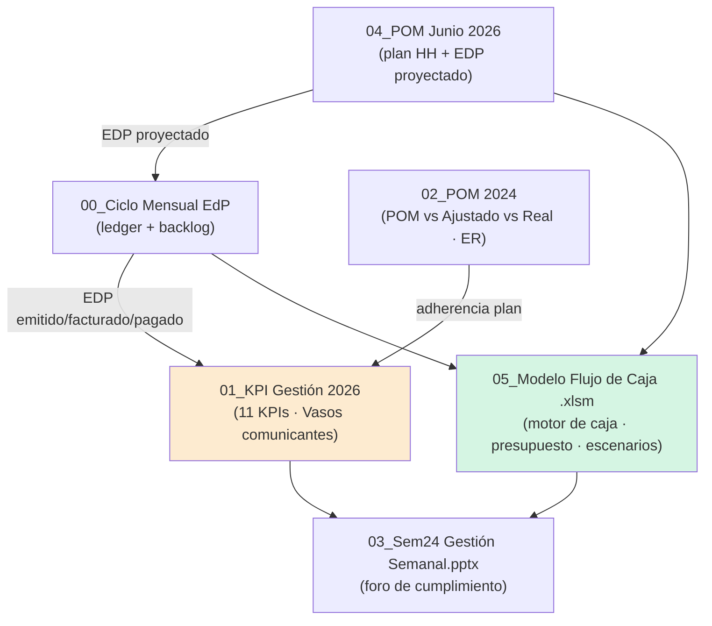

# Reporte de Datos Financieros — `Archivos 2026`

> **Pilar:** `pilar_a` — Dimensión Estratégica · **Ámbito:** ejercicio vigente 2026
> **Generado:** 2026-06-19 · **Fuente:** `pilar_a/data/Archivos 2026/`
> **Audiencia:** agente IA de data science / BI de REDCO.
> Documento gemelo: [`Archivos 2025/REPORTE_Archivos_2025.md`](../Archivos%202025/REPORTE_Archivos_2025.md).

---

## 0. Propósito de esta carpeta dentro del pilar

`Archivos 2026` es el **sistema de gestión financiera vivo** de REDCO. A diferencia de 2025 (foto cerrada), aquí los archivos están **encadenados y en operación**: del pipeline comercial hasta la caja, con horizonte de proyección y tablero ejecutivo. Es el estado del arte de la **profesionalización** que el programa busca institucionalizar — y el sustrato del que saldrán el **Balanced Scorecard, el Stratex y los dashboards** (Etapas 2, 4 y 5 de Kaplan-Norton).

Los seis archivos forman una **cadena de valor de la información**, no piezas sueltas:



La columna vertebral sigue siendo el **ciclo EdP** (Estado de Pago): *Propuesta → Adjudicación → POM → EDP emitido → facturado → pagado → caja*. La novedad de 2026 es que cada eslabón es ahora un **KPI medido semanalmente** y un **input automatizado** del modelo de caja.

| Objetivo analítico del pilar (briefing) | Archivo(s) que lo habilitan |
| --- | --- |
| **Proyección de series de tiempo** | `00_Ciclo EdP`, `01_KPI` (historia semanal/mensual 2024-25-26) |
| **Proyecciones de flujo de caja** | `05_Modelo Flujo de Caja` (motor), `04_POM` (driver de ingreso) |
| **Escenarios — árbol de decisión** | `05` → `Efecto Seligdar_Rusia` (toggle), `02_POM 2024` (Rusia POM vs Real) |
| **Escenarios — Monte Carlo** | `05` (días a aprobación/factura/caja), `01_KPI` (tasas de conversión) |
| **Elementos — costos · pipeline** | `05` (`20_BBDD Costos`, categorías), `01` (`Vasos comunicantes`), `04` (HH/costo) |
| **Creación de presupuesto** | `05` (`01_Parametros`, flujo 12m), `04_POM` (plan), Budget heredado de 2025 |

---

## 1. Inventario de la carpeta

| # | Archivo | Tipo | Hojas/Láminas | Rol |
| --- | --- | --- | ---: | --- |
| 00 | `00_Ciclo Mensual EdP 2023_v0.xlsx` | Excel | 9 | **Ledger EdP** + backlog (por facturar / por cobrar) + plantilla de Estado de Resultados. |
| 01 | `01_KPI Gestión REDCO_2026.xlsx` | Excel | 12 | **Sistema de los 11 KPIs** + análisis comparativo + Vasos comunicantes. |
| 02 | `02_POM 2024.xlsx` | Excel | 10 | **POM histórico** + adherencia POM/Ajustado/Real + Información ER por proyecto. |
| 03 | `03_20260608_Sem24_Gestión Semanal.pptx` | PPT | 23 | **Foro de gestión semanal** (Agenda de Cumplimiento) — Semana 24, Jun-2026. |
| 04 | `04_POM Junio 2026.xlsx` | Excel | 66 | **POM vivo de junio**: una hoja por proyecto (plan HH diario) + EDP proyectado. |
| 05 | `05_Modelo_Flujo_de_Caja_REDCO_Mining_Consultants.xlsm` | Excel macro | 39 | **Modelo maestro de flujo de caja** (caja real + proyección + presupuesto + escenarios). |

---

## 2. Archivo 00 — `00_Ciclo Mensual EdP 2023_v0.xlsx`

**Propósito.** Es la **plantilla canónica del ciclo EdP** y el ledger histórico desde 2023. Define el formato con que cada Estado de Pago avanza por sus etapas y expone los dos *backlogs* críticos para la caja.

| Hoja | Estado | Contenido |
| --- | --- | --- |
| `CicloEdP_2023_v1` | visible | **Ledger maestro** (701 filas): un registro por EDP con sus 4 etapas fechadas y montadas. |
| `Ingresos` / `Facturación` / `EDP` | visible | Vistas/pivots derivadas (EDP emitido por proyecto × mes, etc.). |
| `Reporte_ER` | oculta | **Plantilla de Estado de Resultados mensual**: EDP / Facturas / Ingresos / Gasto / Otros Ingresos / Otros Egresos / Cta Corriente. |
| `EDP por facturar` | visible | Backlog: EDP emitidos pendientes de factura (610 filas). |
| `Facturas por cobrar` | visible | Backlog: facturas emitidas pendientes de cobro (610 filas). |
| `EDP Pendientes - Ejecutivo` | visible | Vista ejecutiva de pendientes. |
| `Base` | oculta | Maestros/parámetros. |

**Guía de campos — `CicloEdP_2023_v1` (esquema canónico del EdP):**

| Campo | Tipo | Descripción |
| --- | --- | --- |
| `N`, `Código` | id | Correlativo y código de proyecto (`CH-CMP-OU-FEL00-…` = país-cliente-unidad-fase). |
| `Nombre Teams`, `Proyecto`, `Cliente`, `País`, `Año` | dim | Dimensiones de análisis. |
| `Proyección` / `Fecha Proyeccion` / `Proyectado USD` | **etapa 1** | Lo planificado (POM). `-1` = sin proyección previa (entró ya emitido). |
| `Emisión` / `Fecha Emisión` / `N°EDP` / `Emitido USD` | **etapa 2** | EDP emitido. |
| `N° Factura` / `Fecha Facturación` / `Facturado USD` | **etapa 3** | Factura. |
| `Pagado` / `Fecha Ingreso` / `Ingresado USD` | **etapa 4** | Cobro a caja. |
| `Observaciones` | texto | Notas. |

> **Por qué es la pieza más valiosa para series de tiempo:** cada fila contiene las **4 fechas + 4 montos** del mismo EDP. De ahí se derivan empíricamente: (a) la **estacionalidad** del ingreso; (b) las **tasas de conversión** entre etapas; (c) los **rezagos** (días emisión→factura→pago) — exactamente los parámetros que el modelo de caja necesita para proyectar y que una **simulación de Monte Carlo** muestrearía.

**Conexión estratégica.** Es el sustrato del KPI 10/11 (backlogs) y del **aseguramiento dinámico de recursos** del sistema de dos agendas: saber cuánta caja viene "en cañería".

---

## 3. Archivo 01 — `01_KPI Gestión REDCO_2026.xlsx` ⭐

**Propósito.** El **cuadro de mando de los 11 KPIs de negocio** de REDCO, con seguimiento semanal y comparación interanual. Es el embrión directo del **Balanced Scorecard** del pilar.

**Los 11 KPIs (hoja `KPI´s de negocio 2026`)** — medidos en `#` (cantidad) y `kUS$`:

| # | KPI | Resp. | Naturaleza | Etapa del ciclo EdP |
| ---: | --- | --- | --- | --- |
| 1 | Propuestas Emitidas | PA | Comercial | Entrada del embudo |
| 2 | Propuestas Adjudicadas | PA | Comercial | Conversión a contrato |
| 3 | POM | EC | Operación | Plan de EDP del mes |
| 4 | EDP Emitidos | EC | Operación | Devengo |
| 5 | EDP Facturados | IM | Administración | Factura |
| 6 | EDP Pagados *(Ingreso Operacional)* | IM | Caja | Cobro |
| 7 | Gasto Operacional | IM | Costo | — |
| 8 | Cumplimiento POM vs EDP | EC | Eficacia | EDP emitido / POM |
| 9 | Adherencia POM vs EDP | EC | Precisión | qué tan fiel fue el plan |
| 10 | Backlog EDP (por facturar) | EC | Cartera | 10.1 pend. aprobación · 10.2 aprobados por facturar |
| 11 | Backlog Facturas (por cobrar) | IM | Cartera | 11.1 facturas vencidas |

*(Resp.: PA = Comercial/Propuestas · EC = Ejecución/Control · IM = Ingresos/Administración.)*

| Hoja | Contenido |
| --- | --- |
| `KPI´s de negocio 2024 / 2025 / 2026` | Serie histórica de los 11 KPIs (semanal `S1…Sn` + mensual). Base de comparación interanual. |
| `Análisis Comparativo` | **2026 vs 2025**, mensual y acumulado (Δ abs. y Δ%, media). Ej. acum. ene-may: Propuestas Adjudicadas −19,3%, POM −6,7%, EDP Facturados −11,8%. |
| `Dashboard 2026` | Tablero visual de los KPIs. |
| `Vasos comunicantes` | **Embudo de conversión a caja** (ver abajo). |
| `Compromisos` | Bitácora de acuerdos (acción/responsable/fecha/estatus) — *Agenda de Cumplimiento*. |
| `Modulo 2025`, `Ventas 2026`, `Respaldo` | Auxiliares. |

**`Vasos comunicantes` — el embudo de caja (kUS$, mayo 2026):**

| Etapa | Concepto | kUS$ | % del remanente |
| ---: | --- | ---: | ---: |
| 0 | Remanente Contratos (saldo al 30/04) | 2.680 | — |
| 1 | Proyectado actual (POM) | 634 | 24% |
| 2 | Emitido por aprobar | 777 | 29% |
| 3 | Aprobado por facturar | 0 | 0% |
| 4 | Facturado por pagar | 847 | 32% |
| — | **Flujo en cañería (1+2+3+4)** | **2.258** | **84%** |

**Conexión estratégica.** Estos 11 KPIs **son** los indicadores de la *Agenda de Cumplimiento*. El reto de diseño BI es mapearlos contra el **Estado de Resultados formal** (P&L) y graduarlos en un BSC con metas y líneas base — tarea explícita del pilar. La caída interanual de adjudicaciones/facturación es una **hipótesis de riesgo** que el caso de negocio 2028 debe abordar.

---

## 4. Archivo 02 — `02_POM 2024.xlsx`

**Propósito.** Histórico del **POM (Programa de Operaciones Mensual)** 2024-2025 y, sobre todo, el motor de **adherencia POM vs Ajustado vs Real** por proyecto, con su Estado de Resultados asociado.

| Hoja | Contenido |
| --- | --- |
| `POM 2024` / `POM 2025` / `POM 2025__old` | Planes de operación por año (HH y EDP por proyecto). |
| `260209__Información ER` | **Núcleo:** por proyecto, `Contrato / Emitido / Saldo USD` + por mes `POM · Ajustado · Real`. |
| `Comparación ene-26` | Resumen `POM / Ajustado / Real` por proyecto (enero 2026). |
| `Curva S` | Curva S de avance (acumulado planificado vs real). |
| `Formato reporte EDP_2024`, `Formato Backlog_Sept25` | Plantillas. |
| `Proyectos Vigentes_2025` | Maestro de proyectos activos. |

**Guía de campos — `260209__Información ER`:** `# · Nombre de Proyecto · País · Contrato USD · Emitido USD · Saldo USD`, y para cada mes el triplete `POM / Ajuste / Real`.

> **Caso Rusia (Seligdar / Polyus / AtlasMining) — variable de escenario crítica:**
> `Seligdar_Kyuchus` Contrato **4.339.988 USD**, Emitido 3.397.350, Saldo 942.638 — pero **Real ene/feb = 0**. Idéntico patrón en `Polyus_*` y `AtlasMining`. Estos contratos inflan el POM pero **no convierten a caja** → distorsionan cualquier proyección que use POM crudo. Por eso el modelo de caja 2026 incluye un **interruptor "Efecto Seligdar_Rusia"** (ver §6). Este es el **nodo de decisión estocástico** más importante del negocio.

**Conexión estratégica.** Mide la **calidad de la planificación** (¿el POM predice el Real?) y aísla el **riesgo país Rusia**, alineado con el marco "distancia al Core" del diagnóstico (Rusia = adyacencia de mayor riesgo).

---

## 5. Archivo 03 — `03_20260608_Sem24_Gestión Semanal.pptx`

**Propósito.** Acta del **foro de gestión semanal** (Semana 24, junio 2026) — la *Agenda de Cumplimiento* en cadencia semanal. Es el dashboard ejecutivo "en uso".

**Composición (23 láminas, 3 secciones):**

| Sección | Contenido relevante para BI |
| --- | --- |
| **1. Gestión / Finanzas** | Tablero semanal de indicadores; **Vasos comunicantes**; resultados mayo 2026 vs 2025; **ajuste efecto Seligdar** (considera solo 400 kUSD); EDP programados POM (n=13 / 616 kUSD, **cumplimiento 53%**); EDP por aprobar (n=21 / 626 k); **Budget 817 vs media real 755 kUS$/mes**. |
| **2. Ingeniería** | **Reporte de costos y rentabilidad acum. ene–may 2026: margen neto US$1,37M (37,6%), 45 proyectos (27 rentables)**; detalle por proyecto (margen, rentabilidad, backlog); plan de trabajo / asignación de recursos. |
| **3. Comercial y Desarrollo de Negocios** | Propuestas, capacidad de ingeniería y utilización (abril 2026). |

**Conexión estratégica.** Demuestra el **sistema de control de gestión operando** (Etapa 5 Kaplan-Norton, gobernanza nivel 2-3). La rentabilidad por proyecto (37,6% margen) y la utilización de ingeniería son **insumos directos** de la "evaluación económica de proyectos" del briefing. El gap Budget (817) vs real (755) es la **brecha presupuestaria** a explicar.

---

## 6. Archivo 04 — `04_POM Junio 2026.xlsx` ⭐

**Propósito.** El **POM vivo de junio 2026**: planifica al detalle diario las **Horas-Hombre por profesional y proyecto**, y de ahí deriva el **EDP proyectado** del mes. Es el artefacto de **"Planear las Operaciones" (Etapa 4 Kaplan-Norton)**: plan de capacidad de recursos + previsión de ventas.

**Composición (66 hojas):**

| Grupo | Hojas | Contenido |
| --- | --- | --- |
| **Maestros** | `Listado Proyectos`, `Listado Profesionales` | Catálogo de proyectos y **68 profesionales** (país, RUT/DNI, área, cargo, fechas de contrato). |
| **Resúmenes** | `Resumen`, `Resumen EDP POM`, `Resumen HH POM`, `Summary HH POM`, `Resumen Personal` | Consolidados de HH y EDP por proyecto/persona. |
| **Hojas-proyecto** (≈50) | `EroCopper_…`, `Codelco_…`, `Minsur_…`, `Seligdar_Kyuchus`, `Polyus_…`, etc. | **Una hoja por proyecto** con plan HH diario por profesional (estilo Gantt, calendario laboral). |
| **Salida BI** | `Reporte POM PBI` (2.244 filas), `Resultados Intermedios`, `CHECK PBI` | Tablas planas para Power BI. |

**Guía de campos — `Resumen EDP POM` (el puente plan→ingreso):**

| Campo | Descripción |
| --- | --- |
| `Gerente` / `Jefe de Proyecto` / `País` / `Proyecto` | Dimensiones. |
| `HH POM` | Horas-hombre planificadas el mes. |
| `Monto Contrato` | Valor total del contrato (USD). |
| `Saldo actual` | Remanente del contrato sin emitir. |
| `EDP (POM)` | **EDP que se proyecta emitir este mes** → alimenta el flujo de caja. |
| `Saldo proyectado` | Saldo tras el EDP del mes. |

Totales POM junio: **5.181 HH · Contrato 4,00M · Saldo 2,78M · EDP POM 0,84M · Saldo proyectado 1,93M USD.**

**Guía — hoja-proyecto (p. ej. `EroCopper_Expansión Xavantina`):** encabezado con Director, N° ingenieros, Horas Totales (876), **Estado de Pago proyectado del mes (55.069 USD)**, Entregables; grilla de `Profesional × día` con horas asignadas (calendario con feriados). `Summary HH POM` agrega por persona: `Horas asignadas vs Horas máx mes (192h) vs holgura` → **utilización de la dotación**.

**Conexión estratégica.** Conecta tres palancas del taller: **capacidad** (HH disponibles), **pipeline** (EDP proyectado) y **costo** (HH × tarifa). Es donde se observa la **dependencia de "héroes"** (personas sobre-asignadas, p. ej. Luis Chumpitaz 330h > 192h) y el insumo para **modelos de asignación óptima de recursos** (`scikit-learn`/`pymoo`).

---

## 7. Archivo 05 — `05_Modelo_Flujo_de_Caja_REDCO_Mining_Consultants.xlsm` ⭐⭐

**Propósito.** El **modelo maestro de flujo de caja** de REDCO: integra proyectos, EDP/cobranza, movimientos bancarios reales, costos por naturaleza, personal, impuestos y relacionadas, todo **normalizado a USD**, con **proyección a 12 y a 3 meses**, **conciliación** y **dashboard ejecutivo**. Es, simultáneamente, el motor de **flujo de caja**, de **presupuesto** y de **escenarios** que el briefing pide. Su `00_README` lo define como *"modelo rápido de rescate para empresa con información dispersa"*.

**Parámetros del modelo (`01_Parametros`):** Caja inicial global **560.088 USD** · Horizonte mensual **12 meses** · Proyección corta **3 meses** · Moneda base **USD** · Mes base detectado con `TODAY()`.

**Las 5 cajas operativas (`03A_Cajas`):** Chile (24.112) · Perú (73.457) · Brasil (392.757) · USA (69.762) · **Rusia (0)** → la geografía del Core + adyacencias del diagnóstico.

**Arquitectura modular (39 hojas):**

| Bloque | Hojas | Función |
| --- | --- | --- |
| **Configuración** | `00_README`, `01_Parametros`, `02_Listas`, `03_FX_Mensual`, `03A_Cajas`, `Categorías_Subcategorías` | Parámetros, FX→USD, cajas, taxonomía de gasto. |
| **Entradas (devengo/pipeline)** | `04_Proyectos` (maestro, 58), `05_EDP_Cobranza` (136 EDP) | Cartera y pipeline de cobro (con días a aprobación/factura/caja). |
| **Entradas (caja real)** | `06_Movimientos` (hasta 5.000 mov.) | **Fuente de verdad de caja**: extractos bancarios reales. |
| **Egresos por naturaleza** | `09_Personal` (84), `09A_Bonos`, `09B_Honorarios`, `10_Viajes` (63), `11_Terceros` (122), `11A_Asesorías`, `12_Oficina`, `13_Creditos`, `14_Impuestos`, `15_Relacionadas_Cajas`, `16_REDCROSS_Backoffice` | Compromisos programados por categoría. |
| **Salidas (flujo)** | `07_Flujo_Mensual - Real`, `07_Flujo_Mensual + Proyección`, `07_Flujo_Categorías(_Proy)`, `08_Flujo_3_Meses`, `Ingreso` | Flujo de caja consolidado y proyectado. |
| **Cierre / control** | `17_Conciliacion`, `17A_Estado_Caja`, `19_Tablero_Consistencia`, `Crosscheck`, `Validación_Países(_Proy)` | Cuadres y controles de integridad. |
| **Reporte** | `18_Dashboard`, `18A_Dashboard_Data`, `Resumen_Egresos_Pais`, `G&A_Resumen`, `Resultados Cajas (Resumen)` | Tablero ejecutivo y resúmenes. |
| **Escenario** | `Efecto Seligdar_Rusia` | **Interruptor de escenario** (Con/Sin Seligdar). |
| **(Vacío)** | `20_BBDD Costos` | Reservado para base de datos de costos. |

**Guía de campos — `07_Flujo_Mensual` (estructura del flujo, columnas = 12 meses):**

```
Caja inicial
Ingresos totales
  ├─ Proyectos | Créditos | FFMM | otras cuentas Personales | IVA/IGV | Movimientos entre cajas
Egresos totales
  ├─ Personal (Sueldos | Honorarios | Finiquitos | Imptos. Honorarios)
  ├─ Bonos/Comisiones/Dividendos
  ├─ Viajes y Ferias (Proyectos | Comercial | Ferias)
  ├─ Externos (Terceros Técnicos | Servicios Admin | Comercial) | Asesorías/Inversiones
  ├─ Oficina | Impuestos (IVA/IGV) | Créditos | REDCROSS Backoffice
  └─ Relacionados / entre cajas (Chile|Brasil|Perú|USA|REDTEC|R+)
Caja final  (= inicial + ingresos − egresos)
```

**Taxonomía de gasto (`Categorías_Subcategorías`)** — el esquema canónico de costos: `OPERACIONES · DESARROLLO DE NEGOCIOS · G&A · INVERSIONES · GASTOS FINANCIEROS · OTROS`, con subcategorías (Sueldos, Honorarios, Viajes, Ferias, Asesoría, Oficina, Arriendo, Créditos, Impuestos, Backoffice…).

**`04_Proyectos` / `05_EDP_Cobranza` — campos clave para proyección de caja:**
`Monto Contrato USD`, `EDP cargados USD`, `Saldo contrato USD`, y los **rezagos** `Días a Aprobación / Días a Factura / Días a Caja` (más `Días totales ciclo`). Estos rezagos son los **parámetros estocásticos** de cualquier Monte Carlo de cobranza.

**Estado actual (`17_Conciliacion` / `18_Dashboard`):** Proyectos 58 ✔ · EDP 136 ✔ · Personal 84 ✔ · ⚠ Viajes sin proyecto 63, Terceros sin proyecto 122, **16 meses con caja final negativa**. Dashboard: caja global 80.094 · cobranza confirmada 90D **3,6M** · cartera pendiente 2,5M · burn medio 213k/mes.

**Conexión estratégica.** Este archivo es la **realización física de varios entregables del pilar a la vez**:

- **Presupuesto / Stratex** — el flujo a 12 meses parametrizable es el presupuesto base.
- **Flujo de caja proyectado** — Etapa 4 de Kaplan-Norton.
- **Escenarios** — el toggle `Efecto Seligdar_Rusia` convierte el modelo en un **árbol de decisión** de un nodo (con/sin el contrato ruso); generalizable a un árbol multi-nodo (Bid/No Bid, apertura de país) y a Monte Carlo sobre conversión y rezagos.
- **Reducción de dependencia del fundador** — institucionaliza en una herramienta lo que antes era criterio del dueño (meta-objetivo del programa).

---

## 8. Conexión con los objetivos analíticos del `pilar_a`

| Capacidad objetivo | Implementación recomendada sobre `Archivos 2026` | Skill / técnica |
| --- | --- | --- |
| **Series de tiempo** | Reconstruir desde `CicloEdP_2023_v1` (fechas+montos por etapa) y la historia de `01_KPI` (3 años). Modelar estacionalidad y conversión. | `statsmodels`, `aeon`, `timesfm-forecasting` |
| **Flujo de caja proyectado** | Replicar la lógica de `05` en notebook (`polars`): caja inicial + Σ(EDP×prob×lag) − egresos por categoría. | `polars`, `statistical-analysis` |
| **Árbol de decisión estocástico** | Formalizar `Efecto Seligdar_Rusia` + Bid/No Bid + apertura de país como árbol con probabilidades (las del marco "distancia al Core": 35/15/8/−5%). | `networkx`, `what-if-oracle` |
| **Monte Carlo** | Muestrear `Días a Aprobación/Factura/Caja` y tasas de conversión del embudo `Vasos comunicantes` → distribución de caja final 90D y prob. de caja negativa. | `numpy`/`scipy`, `pymc` |
| **Evaluación económica de proyectos** | Usar margen/rentabilidad por proyecto del deck semanal + costo HH del POM → ROI/payback por proyecto y por país. | `statistical-analysis`, `shap` |
| **Costos · pipeline** | `Categorías_Subcategorías` como taxonomía; poblar `20_BBDD Costos`; pipeline = `EDP por facturar` + `Facturas por cobrar` + `Vasos comunicantes`. | `exploratory-data-analysis` |
| **Presupuesto / Stratex / BSC** | Mapear los 11 KPIs al P&L formal y al flujo; definir metas y líneas base; armar BSC con perspectivas. | base para `pptx`/`xlsx`/dashboards |

**Calidad de datos a vigilar:** (a) el **POM crudo sobreestima** ingreso por el efecto Rusia — usar siempre el flujo *ajustado*; (b) "viajes/terceros sin proyecto" rompen la trazabilidad costo↔proyecto (122 y 63 partidas); (c) hay **devengo (EDP) vs caja (movimientos)** — el modelo los separa correctamente, conviene preservar esa separación aguas arriba; (d) **16 meses con caja final negativa** marcados para revisión: priorizar antes de presentar proyecciones.

---

## 9. Lectura conjunta 2025 ↔ 2026 (lineamiento estratégico)

El salto de 2025 a 2026 **es** la profesionalización que documenta `context/aprendizaje-taller-I.md`: de "verdad dispersa" en decenas de hojas (Archivo 3 de 2025, 39 hojas heterogéneas) a un **modelo único, normalizado y conciliado** (Archivo 05, con README y tablero de consistencia). El taller lo nombra como pasar de *"excelencia sostenida por personas excepcionales a excelencia sostenida por un sistema excepcional"*. En clave de datos:

- El **área integrada de Finanzas y Estrategia** (Dimensión 3.3) tendría en el Archivo 05 su herramienta-custodio: escenarios de caja, control de rentabilidad, límites de riesgo y seguimiento de iniciativas — justo lo que el taller pide.
- El **Bid/No Bid** como foro con criterios se modela naturalmente como el **árbol de decisión** sobre el pipeline (`04_Proyectos` + probabilidades por distancia al Core).
- La **dependencia del fundador y de "héroes"** es observable y medible en el POM (`04`) vía sobre-asignación de HH y en los KPIs vía adherencia POM/Real.

---

*Fin del reporte `Archivos 2026`.*
