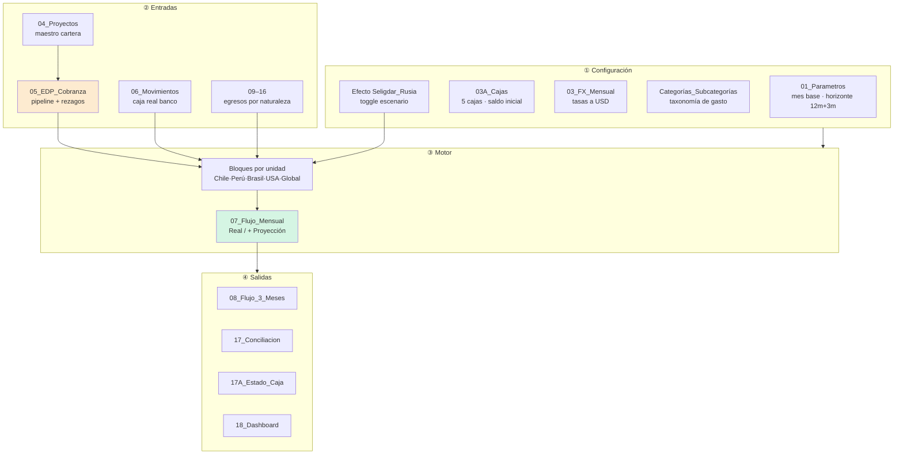

# Reporte del Modelo de Presupuesto — `Archivos 2026`

> **Pilar:** `pilar_a` — Dimensión Estratégica · **Artefacto:** modelo de presupuesto / flujo de caja 2026
> **Generado:** 2026-06-22 · **Fuente:** `pilar_a/data/Archivos 2026/05_Modelo_Flujo_de_Caja_REDCO_Mining_Consultants.xlsm`
> **Audiencia:** agente IA de data science / BI de REDCO.
> Documento gemelo: [`Archivos 2025/REPORTE_Modelo_Presupuesto_2025.md`](../Archivos%202025/REPORTE_Modelo_Presupuesto_2025.md).
> Reporte de inventario de la carpeta: [`REPORTE_Archivos_2026.md`](REPORTE_Archivos_2026.md) (§7 describe este archivo).

---

## 0. Qué es y dónde vive

En 2026 **no existe un archivo "presupuesto" independiente**. La función presupuestaria está **embebida dentro del modelo maestro de flujo de caja** (`05_Modelo_Flujo_de_Caja…xlsm`, 39 hojas, con macros). Según su propio `00_README`, es un *"modelo rápido de rescate para empresas con información dispersa"*. El **presupuesto es el flujo de caja a 12 meses parametrizable** — la misma herramienta hace de **motor de caja, de presupuesto/Stratex y de escenarios** a la vez.

La diferencia conceptual con 2025 es radical:

| | 2025 (`…Modulos 1_Edu.xlsx`) | 2026 (`…Flujo_de_Caja…xlsm`) |
| --- | --- | --- |
| **Naturaleza** | P&L de gestión (devengo) + anexo de caja | **Flujo de caja puro**, normalizado a USD |
| **Presupuesto** | Hoja explícita `Resumen Budget 25´` | **Implícito** = flujo proyectado 12m |
| **Driver de ingreso** | Meta de Ventas × tasa 0,43 | **Pipeline real de EDP** (`05_EDP_Cobranza`) |
| **Cobranza** | Lag fijo de 2 meses | **Rezagos empíricos** por EDP (días a aprobación/factura/caja) |
| **Geografía** | Países en `Flujo Caja` | **5 cajas** operativas con saldo inicial propio |
| **Escenarios** | Caso Rusia implícito | **Interruptor `Efecto Seligdar_Rusia`** |
| **Verdad de caja** | Devengo proyectado | **`06_Movimientos`** (extractos bancarios reales) |

---

## 1. Filosofía del modelo (las 6 reglas del `00_README`)

El README codifica las reglas de diseño que hacen del modelo un sistema y no una planilla:

1. **Moneda base USD** — todo se normaliza vía `03_FX_Mensual`.
2. **Mes vigente automático** — se detecta con `TODAY()`; el modelo "sabe" qué meses son pasado (real) y cuáles futuro (proyección).
3. **Separar devengo de caja** — la cartera/pipeline sale de `05_EDP_Cobranza`; la caja real sale de `06_Movimientos`; el flujo los combina **sin mezclarlos**.
4. **Cargar cada compromiso una sola vez** — lo programado va en su pestaña de naturaleza (09–16); lo real en `06_Movimientos` → evita doble conteo.
5. **Una caja por unidad** — cada EDP y cada costo se asocia a una de las cajas (Chile/Perú/Brasil/USA).
6. **Cerrar con conciliación y dashboard** — `17_Conciliacion` debe quedar en OK y sin caja negativa.

Flujo de uso documentado: *FX → proyecto → EDP/cobranza → movimientos reales → gastos programados → conciliación → dashboard.*

---

## 2. Arquitectura en 4 capas



### Capa ① — Configuración (las celdas que gobiernan todo)

**`01_Parametros`** — los parámetros centrales (solo celdas verdes son editables):

| Parámetro | Valor | Lógica |
| --- | --- | --- |
| Fecha actual automática | `=TODAY()` | Determina el mes vigente. |
| Mes vigente | `=DATE(YEAR,MONTH,1)` | Primer día del mes actual. |
| Mes inicial flujo | ene-2026 | Editable. |
| **N.º meses flujo mensual** | **12** | **Horizonte del presupuesto.** |
| **Caja inicial global** | **560.088 USD** | `=03A_Cajas!B13` (suma de las cajas). |
| N.º meses flujo proyectado corto | 3 | Vista táctica. |
| Moneda base | USD | Fijo. |

**`03A_Cajas`** — las **5 cajas operativas** y su saldo inicial (cada una con su moneda y FX a USD):

| Caja | Saldo inicial USD |
| --- | ---: |
| Chile | 24.112 |
| Perú | 73.457 |
| Brasil | 392.757 |
| USA | 69.762 |
| Rusia | **0** |
| **Global** | **560.088** (`=SUM`) |

> La caja **Rusia = 0** es deliberada: refleja que el negocio ruso (Seligdar) **no aporta caja** pese a inflar el contrato/POM. Es la geografía del "Core + adyacencias" del diagnóstico.

**`Categorías_Subcategorías`** — la **taxonomía canónica de gasto**, que mapea cada hoja de egreso (09–16) a una categoría y subcategoría:

`OPERACIONES · DESARROLLO DE NEGOCIOS · G&A · INVERSIONES · GASTOS FINANCIEROS · OTROS`
(subcategorías: Sueldos, Honorarios, Finiquitos, Bonos/Aguinaldos, Viajes, Ferias, Servicio de terceros, Asesoría, Mejoramiento, Oficina, Arriendo, Materiales, Créditos, Impuestos, Backoffice…).

### Capa ② — Entradas (las dos fuentes de verdad, separadas)

| Hoja | Mundo | Contenido |
| --- | --- | --- |
| `04_Proyectos` (58) | devengo | Maestro de cartera. |
| **`05_EDP_Cobranza` (136 EDP)** | **devengo / pipeline** | **El driver de ingreso proyectado.** 36 campos por EDP. |
| `06_Movimientos` (≤5.000) | **caja real** | Extractos bancarios — verdad de corto plazo. |
| `09_Personal` (84) … `16_REDCROSS` | egreso programado | Compromisos por naturaleza. |

**Campos clave de `05_EDP_Cobranza`** (esquema de las 4 etapas con sus rezagos):

```
Monto EDP USD (Q)  ·  Tipo ingreso (AG)  ·  Unidad Caja (E)
Etapa 2 → Fecha envío usada (L)          + Días aprobación override (R)
Etapa 3 → Fecha aprobación/factura usada (T,W) + Días factura override (U)
Etapa 4 → Fecha caja usada (Z) → Mes caja (AA)  + Días caja override (X)
Días ciclo total (AD) · Acumulado proyecto (AE) · Saldo contrato (AF)
```

El campo **`Mes caja` (AA)** es el pivote de toda la proyección: indica **en qué mes cada EDP se vuelve caja**, y se deriva de las fechas reales o de los **rezagos** (días a aprobación → factura → caja). Estos rezagos son los **parámetros estocásticos** de cualquier Monte Carlo de cobranza.

---

## 3. El motor de cálculo: bloques por unidad → consolidado

El flujo se construye en **bloques verticales por unidad** dentro de `07_Flujo_Mensual` (cada bloque ≈ 65 filas: Global usa la consolidación, y debajo van Chile, Perú, Brasil, USA). El **consolidado (filas 11–72)** simplemente **suma los 5 bloques** celda a celda:

```
Caja inicial[mes]    = Σ caja inicial de las 5 unidades
Ingresos totales     = B82+B147+B212+B277+B342   (suma de bloques)
…
Caja Total final     = Caja inicial + Flujo neto
```

### 3.1 Estructura de líneas del flujo (el "P&L de caja")

```
Caja inicial                         (= caja final del mes anterior)
 ├─ INGRESOS TOTALES
 │   ├─ Ingresos - Proyectos        ← driver: EDP cobranza por "Mes caja"
 │   ├─ Ingresos - Créditos | FFMM | Cuentas Personales
 │   ├─ Ingreso por IVA/IGV/Otros
 │   └─ Ingreso por Movimiento entre Cajas (Chile/Brasil/Perú/USA/REDTEC/R+/Otras)
 ├─ EGRESOS TOTALES
 │   ├─ Personal (Sueldos+Honorarios fijos | Honorarios variables | Finiquitos | Imptos. Honorarios)
 │   ├─ Bonos/Comisiones/Dividendos | Aguinaldos
 │   ├─ Viajes y Ferias (Proyectos | Comercial | Ferias)
 │   ├─ Externos (Terceros técnicos | Servicios admin | Comercial)
 │   ├─ Asesorías/Inversiones | Oficina | Impuestos (IVA/IGV)
 │   ├─ Créditos | REDCROSS Backoffice
 │   └─ Relacionados / entre cajas (hacia Chile/Brasil/Perú/USA/REDTEC/R+/Otras)
 ├─ Ingreso Operacional / Gasto Operacional / Margen Operacional (+ acumulado)
 ├─ Total Ingresos / Total Egresos / Flujo neto
 └─ CAJA TOTAL FINAL  (= Caja inicial + Flujo neto)
```

> Nota de diseño: el **Margen Operacional** (fila 65) aísla `Ingreso Operacional − Gasto Operacional` **excluyendo** los movimientos no operacionales (créditos, FFMM, IVA, movimientos entre cajas). Es el puente hacia el Estado de Resultados formal que el pilar debe construir.

### 3.2 Encadenamiento de caja

Cada mes **arranca con el saldo final del anterior** (`Caja inicial[m] = Caja final[m−1]`, encadenado bloque a bloque vía `=…D139` etc.). Así el modelo propaga el efecto de cada mes sobre la liquidez futura.

---

## 4. El núcleo: Real vs Proyección (cómo se vuelve "presupuesto")

El modelo mantiene **dos hojas gemelas**:
- **`07_Flujo_Mensual - Real`** — solo caja efectiva (movimientos).
- **`07_Flujo_Mensual + Proyección`** — combina real (meses pasados) + **proyección** (meses futuros).

El corte lo marca la celda **`Proyección desde`** (B7 = **abr-2026** en esta foto). El mecanismo de proyección de ingreso es un **`SUMIFS` sobre el pipeline de EDP**:

```excel
Ingresos-Proyectos[mes, unidad] =
  SUMIFS('05_EDP_Cobranza'!$Q$7:$Q$9984,         ← Monto EDP USD
         '05_EDP_Cobranza'!$AA,  = Mes,          ← filtra por "Mes caja"
         '05_EDP_Cobranza'!$AG,  = "Ingresos - Proyectos",
         '05_EDP_Cobranza'!$E,   = "Chile")      ← filtra por unidad
```

Es decir: **el ingreso proyectado de un mes = suma de todos los EDP cuyo "Mes caja" cae en ese mes**. La proyección es **100 % pipeline-driven**: no inventa ingresos, los **agenda** según cuándo se espera que cada EDP llegue a caja (vía sus rezagos). Los egresos futuros se proyectan análogamente desde las hojas de naturaleza (09–16), filtrando por mes y categoría.

### 4.1 La serie consolidada 2026 (12 meses, kUS$)

| Línea | ene | feb | mar | abr | may | jun | jul | ago | sep | oct | nov | dic |
| --- | ---: | ---: | ---: | ---: | ---: | ---: | ---: | ---: | ---: | ---: | ---: | ---: |
| Ingreso Op. | 1.645 | 254 | 422 | 472 | 817 | 910 | 656 | 127 | **0** | **0** | **0** | **0** |
| Gasto Op. | 716 | 571 | 583 | 603 | 599 | 578 | 619 | 578 | 578 | 578 | 599 | 619 |
| Margen Op. | 929 | −317 | −160 | −131 | 219 | 332 | 37 | −452 | −578 | −578 | −599 | −619 |
| **Caja final** | 503 | 482 | 803 | 639 | 876 | 1.188 | 1.206 | 734 | 136 | **−462** | **−1.081** | **−1.720** |

> 🚩 **Hallazgo estructural — el "acantilado" de la proyección.** El ingreso proyectado **cae a 0 desde sep-2026** no porque el negocio se detenga, sino porque **el pipeline de EDP solo está cargado hasta cierto horizonte**: el modelo "solo ve" la cobranza ya ingresada en `05_EDP_Cobranza`. Sin EDP futuros, los egresos (que sí están programados todo el año) arrastran la caja a **−1,7 M USD en diciembre**. Esto explica las **"16 celdas con caja final negativa"** que marca la conciliación. Es a la vez una **limitación** (subestima ingreso lejano) y una **señal de gestión legítima**: *con la cartera actual, la caja no alcanza el año* → urgencia comercial cuantificada.

---

## 5. Escenarios: el interruptor Seligdar/Rusia

La hoja **`Efecto Seligdar_Rusia`** es un **árbol de decisión de un nodo** materializado como toggle:

```
Con Seligdar = 1
Sin Seligdar = 0
Efecto deseado = 0   ← interruptor activo (hoy: SIN Seligdar)
```

Permite encender/apagar el contrato ruso en todo el modelo. En el deck semanal (`03_…Sem24`) el ajuste considera solo **400 kUSD** del efecto, no el contrato completo (4,3 M) — reconociendo que el grueso **no convierte a caja**. Conceptualmente es generalizable a un **árbol multi-nodo** (Bid/No Bid, apertura de país) y a **Monte Carlo** sobre conversión y rezagos.

---

## 6. Las salidas de control y reporte

| Hoja | Rol | Estado actual |
| --- | --- | --- |
| `08_Flujo_3_Meses` | Vista táctica del trimestre | sin caja negativa ✔ |
| **`17_Conciliacion`** | **15 controles OK/REVISAR** | ⚠ Viajes sin proyecto 63 · Terceros sin proyecto 122 · **Caja negativa 16 meses** |
| `17A_Estado_Caja` | Saldo inicial + caja final 3 meses por unidad | Global: 560k → 500k → 475k → 796k |
| **`18_Dashboard`** | **Tablero ejecutivo** | Caja global **80.094** · Burn medio **213k/mes** · Cartera pendiente **2,52 M** · Mín. caja 90D 80k · Gap 0 |

**`17_Conciliacion`** es el guardián de integridad del modelo: cuenta proyectos (58 ✔), EDP (136 ✔), personal (84 ✔), detecta FX faltantes (0 ✔) y, sobre todo, marca **caja mensual negativa (16)** y partidas **sin proyecto** que rompen la trazabilidad costo↔proyecto.

---

## 7. Mapa de fórmulas (referencia rápida para reconstrucción)

| Magnitud | Fórmula canónica | Hoja |
| --- | --- | --- |
| Mes vigente | `=DATE(YEAR(TODAY()),MONTH(TODAY()),1)` | 01_Parametros |
| Caja inicial global | `=SUM(03A_Cajas!F7:F10)` = 560.088 | 01_Parametros |
| Saldo inicial USD por caja | `=Saldo_MO × FX_a_USD` | 03A_Cajas |
| **Ingreso proyectado** | `SUMIFS(EDP.Q, Mes caja=mes, Tipo="Ingresos-Proyectos", Unidad=u)` | 07 + Proyección |
| Caja inicial mensual | `= Caja final mes anterior` | 07 (encadenado) |
| Margen Operacional | `Ingreso Op − Gasto Op` | 07, fila 65 |
| Caja Total final | `Caja inicial + Flujo neto` | 07, fila 72 |
| Caja final negativa (control) | `COUNTIF(07!B50:M71,"<0")` = 16 | 17_Conciliacion |
| Escenario Rusia | `Efecto deseado ∈ {0,1}` | Efecto Seligdar_Rusia |

---

## 8. Limitaciones, riesgos y calidad de datos

1. **Proyección truncada por el pipeline:** sin EDP cargados más allá de ~ago-2026, el ingreso proyectado es 0 y la caja se desploma. *Usar siempre con conciencia del horizonte real cargado;* no leer sep–dic como pronóstico de negocio, sino como "lo que hay comprometido hoy".
2. **POM crudo sobreestima (efecto Rusia):** usar el flujo **con el toggle Seligdar apagado** o ajustado (400k), nunca el POM bruto.
3. **Partidas sin proyecto:** 63 viajes y 122 terceros sin proyecto rompen la trazabilidad costo↔proyecto → sesgan la rentabilidad por proyecto.
4. **16 meses con caja negativa marcados** — priorizar su revisión antes de presentar proyecciones.
5. **FX manual:** las tasas de `03_FX_Mensual` se cargan a mano (se evita conexión web frágil) → riesgo de desactualización.
6. **`20_BBDD Costos` vacía** — reservada; la taxonomía de costos aún no se ha poblado al máximo detalle.

---

## 9. Conexión con los objetivos del `pilar_a`

| Capacidad objetivo del pilar | Implementación sobre el `.xlsm` | Skill / técnica |
| --- | --- | --- |
| **Presupuesto / Stratex** | El flujo 12m parametrizable **es** el presupuesto base | base para BSC (`xlsx`/dashboards) |
| **Flujo de caja proyectado** | Replicar `caja_inicial + Σ(EDP×lag) − egresos` en notebook | `polars`, `statistical-analysis` |
| **Escenarios — árbol de decisión** | Generalizar `Efecto Seligdar_Rusia` + Bid/No Bid + apertura de país | `networkx`, `what-if-oracle` |
| **Escenarios — Monte Carlo** | Muestrear `Días a aprobación/factura/caja` y tasas de conversión | `numpy`/`scipy`, `pymc` |
| **Costos · pipeline** | `Categorías_Subcategorías` como taxonomía; poblar `20_BBDD Costos` | `exploratory-data-analysis` |
| **Reducción de dependencia del fundador** | Institucionaliza en una herramienta lo que era criterio del dueño | (meta-objetivo del programa) |

> **Síntesis:** el "presupuesto 2026" es un **modelo de flujo de caja a 12 meses, normalizado a USD y segmentado en 5 cajas**, cuyo ingreso se **agenda desde el pipeline real de EDP** (vía el campo *Mes caja* y sus rezagos), cuyos egresos se programan por naturaleza, y que se cierra con conciliación y dashboard. Comparado con 2025, sustituye la **meta-de-ventas-con-tasa-fija** por un **pipeline real con rezagos empíricos**, y la **caja-por-país estática** por **cajas vivas encadenadas**. Su mayor virtud analítica —y su mayor trampa— es que la proyección **solo muestra lo comprometido**: el acantilado de caja del 2.º semestre no es un pronóstico de quiebra, es la medida exacta de **cuánta venta nueva falta cerrar** para sostener el año.

---

*Fin del reporte del modelo de presupuesto `Archivos 2026`.*
