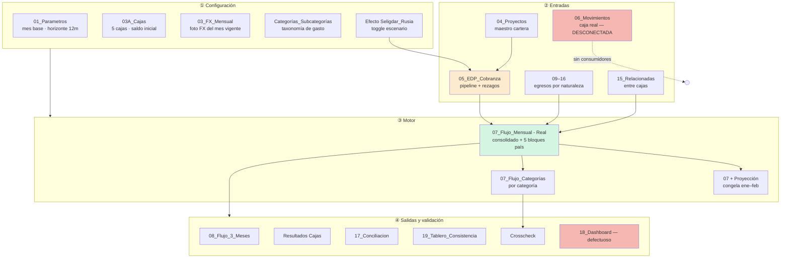

# Reporte del Modelo de Presupuesto — `Archivos 2026`

> **Pilar:** `pilar_a` — Dimensión Estratégica · **Artefacto:** modelo de presupuesto / flujo de caja 2026
> **Generado:** 2026-06-22 · **Verificado celda-a-celda y ampliado:** 2026-06-25 (lectura directa de fórmulas con `openpyxl` sobre las 39 hojas).
> **Fuente:** `pilar_a/data/Archivos 2026/05_Modelo_Flujo_de_Caja_REDCO_Mining_Consultants.xlsm`
> **Audiencia:** agente IA de data science / BI de REDCO.
> Documento gemelo: [`Archivos 2025/REPORTE_Modelo_Presupuesto_2025.md`](../Archivos%202025/REPORTE_Modelo_Presupuesto_2025.md).
> Reporte de inventario de la carpeta: [`REPORTE_Archivos_2026.md`](REPORTE_Archivos_2026.md) (§7 describe este archivo).

> **Nota de revisión (2026-06-25):** este documento se reescribió tras abrir el `.xlsm` y rastrear cada referencia entre celdas de las 39 hojas. La versión anterior describía bien la arquitectura conceptual pero (a) documentaba solo ~15 hojas, (b) se apoyaba en la narrativa del `00_README` en vez de en las fórmulas, y (c) contenía tres afirmaciones que el modelo real **no** cumple. Las correcciones están marcadas con **✱ Corrección** y consolidadas en §8.

---

## 0. Qué es y dónde vive

En 2026 **no existe un archivo "presupuesto" independiente**. La función presupuestaria está **embebida dentro del modelo maestro de flujo de caja** (`05_Modelo_Flujo_de_Caja…xlsm`, **39 hojas**, con macros). Según su propio `00_README`, es un *"modelo rápido de rescate para empresas con información dispersa"*. El **presupuesto es el flujo de caja a 12 meses parametrizable** — la misma herramienta hace de **motor de caja, de presupuesto/Stratex y de escenarios** a la vez.

La diferencia conceptual con 2025 es radical:

|                             | 2025 (`…Modulos 1_Edu.xlsx`)                   | 2026 (`…Flujo_de_Caja…xlsm`)                                                      |
| --------------------------- | ------------------------------------------------- | ------------------------------------------------------------------------------------- |
| **Naturaleza**        | P&L de gestión (devengo) + anexo de caja         | **Flujo de caja puro**, normalizado a USD                                       |
| **Presupuesto**       | Hoja explícita`Resumen Budget 25´`            | **Implícito** = flujo proyectado 12m                                           |
| **Driver de ingreso** | Meta de Ventas × tasa 0,43 → externo SharePoint | **Pipeline real de EDP** (`05_EDP_Cobranza`)                                  |
| **Cobranza**          | Lag fijo de 2 meses                               | **Rezagos empíricos** por EDP (días a aprobación/factura/caja)               |
| **Geografía**        | Países en`Flujo Caja`                          | **5 bloques-caja** encadenados con saldo inicial propio                         |
| **Escenarios**        | Caso Rusia implícito                             | **Interruptor `Efecto Seligdar_Rusia`**                                       |
| **Verdad de caja**    | Devengo proyectado                                | *(declarado)* `06_Movimientos` — **pero ver ✱ §8.1: no está conectada** |

### 0.1 Inventario real de las 39 hojas

|  # | Hoja                               | Filas×Cols | Fórmulas | Rol                                               |
| -: | ---------------------------------- | ----------- | --------: | ------------------------------------------------- |
|  0 | `00_README`                      | 20×8       |         0 | Manual de uso                                     |
|  1 | `01_Parametros`                  | 14×6       |         4 | Config central (mes base, horizonte)              |
|  2 | `02_Listas`                      | 1039×55    |         0 | Catálogos / desplegables                         |
|  3 | `03_FX_Mensual`                  | 30×8       |         9 | FX a USD (**solo mes vigente** ✱)          |
|  4 | `03A_Cajas`                      | 13×7       |        15 | 5 cajas + saldo inicial                           |
|  5 | `04_Proyectos`                   | 500×24     |     1.177 | Maestro de cartera (58 proyectos)                 |
|  6 | `05_EDP_Cobranza`                | 1484×36    |    10.931 | **Pipeline EDP (136)** — driver de ingreso |
|  7 | `06_Movimientos`                 | 5000×25    |    22.922 | Caja real banco —**desconectada ✱ §8.1** |
|  8 | `07_Flujo_Mensual - Real`        | 400×19     |     4.276 | **Motor** (consolidado + 5 bloques-país)   |
|  9 | `07_Flujo_Categorías`           | 454×17     |     3.997 | Egresos re-pivotados por categoría               |
| 10 | `07_Flujo_Categorías_Proy`      | 454×14     |     4.518 | Versión proyectada de la anterior                |
| 11 | `07_Flujo_Mensual + Proyección` | 400×17     |     3.933 | Real con ene–feb congelados ✱                   |
| 12 | `Resultados Cajas (Resumen)`     | 35×18      |       222 | Caja por país (Real y Real+Proy)                 |
| 13 | `Ingreso`                        | 224×17     |     3.581 | Matriz de ingresos calendarizada 12M              |
| 14 | `08_Flujo_3_Meses`               | 19×4       |        46 | Vista táctica del trimestre                      |
| 15 | `09_Personal_Contrato_HonFijo`   | 484×40     |     4.214 | Nómina estructural (84 personas)                 |
| 16 | `09B_Honorarios-Personal`        | 100×12     |       260 | Honorarios profesionales                          |
| 17 | `09A_Bonos_Comi_Divid`           | 250×12     |       479 | Bonos/comisiones/dividendos                       |
| 18 | `10_Viajes y Ferias`             | 500×29     |     1.452 | Viajes y ferias                                   |
| 19 | `11_Terceros`                    | 1504×25    |     3.419 | Externos operativos                               |
| 20 | `11A_Asesorias_Inversiones`      | 500×24     |     5.233 | Asesorías e inversiones                          |
| 21 | `12_Gastos_Oficina`              | 498×23     |     1.934 | Oficina/arriendo/servicios                        |
| 22 | `13_Creditos`                    | 500×23     |     2.421 | Créditos/financiamiento (ingreso y egreso)       |
| 23 | `14_Impuestos`                   | 500×23     |     5.103 | Impuestos/tributos                                |
| 24 | `15_Relacionadas_Cajas`          | (full)×23  |    34.341 | Traspasos entre cajas                             |
| 25 | `16_REDCROSS_Backoffice`         | 500×23     |     3.859 | Backoffice/shared services                        |
| 26 | `17_Conciliacion`                | 15×3       |        20 | 15 controles OK/REVISAR                           |
| 27 | `17A_Estado_Caja`                | 10×6       |        25 | Caja por unidad, 3 meses                          |
| 28 | `18_Dashboard`                   | 87×15      |        76 | Tablero ejecutivo —**defectuoso ✱ §8.3** |
| 29 | `18A_Dashboard_Data`             | 94×20      |       256 | Helper del dashboard + aging cartera              |
| 30 | `19_Tablero_Consistencia`        | 792×8      |     4.682 | Cuadre granular Unidad×Mes×Ítem                |
| 31 | `20_BBDD Costos`                 | 1×1        |         0 | **Vacía** (reservada)                      |
| 32 | `Crosscheck`                     | 31×14      |       104 | Real vs Categorías + 6 hallazgos                 |
| 33 | `Efecto Seligdar_Rusia`          | 3×2        |         0 | Toggle de escenario                               |
| 34 | `Categorías_Subcategorías`     | 38×8       |         0 | Taxonomía canónica de gasto                     |
| 35 | `Resumen_Egresos_Pais`           | 50×14      |       462 | Egresos por país × categoría                   |
| 36 | `Validación_Países`            | 59×12      |       521 | Consolidado = Σ países                          |
| 37 | `Validación_Países_Proy`       | 59×12      |       521 | Ídem, versión proyectada                        |
| 38 | `G&A_Resumen`                    | 234×18     |        27 | Resumen G&A (tabla`Detalle`)                    |

> Hojas **antes no documentadas** y ahora incorporadas: `02_Listas`, `Ingreso`, `07_Flujo_Categorías` (+`_Proy`), `Resultados Cajas`, `18A_Dashboard_Data`, `19_Tablero_Consistencia`, `Crosscheck`, `Resumen_Egresos_Pais`, `Validación_Países` (+`_Proy`), `G&A_Resumen`.

---

## 1. Filosofía del modelo (las 6 reglas del `00_README`)

El README codifica las reglas de diseño que hacen del modelo un sistema y no una planilla:

1. **Moneda base USD** — todo se normaliza vía `03_FX_Mensual`.
2. **Mes vigente automático** — se detecta con `TODAY()`; el modelo "sabe" qué meses son pasado (real) y cuáles futuro (proyección).
3. **Separar devengo de caja** — la cartera/pipeline sale de `05_EDP_Cobranza`; la caja real *debería* salir de `06_Movimientos`. **✱ En las fórmulas esto no ocurre (§8.1): `06_Movimientos` no se consume; el flujo es 100 % devengo-proyectado.**
4. **Cargar cada compromiso una sola vez** — lo programado va en su pestaña de naturaleza (09–16); lo real en `06_Movimientos` → evita doble conteo.
5. **Una caja por unidad** — cada EDP y cada costo se asocia a una de las cajas (Chile/Perú/Brasil/USA, + Rusia ≈0).
6. **Cerrar con conciliación y dashboard** — `17_Conciliacion` debe quedar en OK y sin caja negativa.

Flujo de uso documentado: *FX → proyecto → EDP/cobranza → movimientos reales → gastos programados → conciliación → dashboard.* (El paso "movimientos reales" está cargado en datos pero **no cableado** al cálculo — ver §8.1.)

---

## 2. Arquitectura en 4 capas



**Grafo de dependencias (verificado, conteo = nº de fórmulas que cruzan):**

- **`03_FX_Mensual` es el hub aguas arriba**: lo leen 14 hojas.
- **`04_Proyectos` enriquece** a EDP (7.111 refs), Movimientos, Ingreso y a las hojas de egreso con atribución de proyecto (`11A`, `14`, `16`).
- **`05_EDP_Cobranza` es el único driver de ingreso** del flujo y del dashboard.
- **`07_Flujo_Mensual - Real` es el nodo central**: alimenta 8 hojas (Categorías, +Proyección, 08, Resultados Cajas, 17A, 18A, 19, Crosscheck).
- **`06_Movimientos` es una hoja-hoja (leaf)**: lee de Proyectos/Listas/FX pero **nadie la lee**.

### Capa ① — Configuración

**`01_Parametros`** — los parámetros centrales (solo celdas verdes son editables):

| Parámetro                         | Valor                                 | Lógica                                      |
| ---------------------------------- | ------------------------------------- | -------------------------------------------- |
| Fecha actual automática           | `=TODAY()`                          | Determina el mes vigente.                    |
| Mes vigente                        | `=DATE(YEAR,MONTH,1)`               | Primer día del mes actual (jun-2026).       |
| **Mes inicial flujo**        | **ene-2026** (`B9`, editable) | Ancla`EDATE` de todas las columnas de mes. |
| **N.º meses flujo mensual** | **12**                          | **Horizonte del presupuesto.**         |
| **Caja inicial global**      | **560.088 USD**                 | `=03A_Cajas!B13`.                          |
| N.º meses flujo proyectado corto  | 3                                     | Vista táctica.                              |

> Matiz: el flujo corre **ene–dic 2026 fijo** (`B9`); el "mes vigente" (jun) solo se usa para FX y para marcar pasado/futuro. No son lo mismo.

**`03_FX_Mensual`** — **✱ Corrección: es una sola foto, no una serie mensual.** Tiene una única columna `C = USD por 1 unidad`, y **todas las filas de mes apuntan al mes vigente** (`B9:B15 = $E$6`). Es decir: **toda la historia y toda la proyección se normalizan con la tasa de hoy**. Monedas y tasas actuales: USD=1, CLP=0,001111 (≈900 CLP/USD), UF=41,5, BRL=0,18, PEN=0,27, RUB=0,012, EUR=1,08. Carga **manual**.

**`03A_Cajas`** — las **5 cajas operativas** y su saldo inicial:

| Caja                                | Saldo inicial USD |
| ----------------------------------- | ----------------: |
| Chile                               |            24.112 |
| Perú                               |            73.457 |
| Brasil                              |           392.757 |
| USA                                 |            69.762 |
| Rusia                               |       **0** |
| **Global** (`=SUM(F7:F10)`) | **560.088** |

> ✱ Dos sutilezas: (1) **Rusia existe como fila (11) pero el global la excluye** estructuralmente (`B13=SUM(F7:F10)` solo abarca Chile–USA). Pero el *motor de flujo sí incluye* un bloque Rusia (§3), que aporta ≈0. (2) En esta foto todas las cajas están en USD (FX=1).

**`Categorías_Subcategorías`** — el **diccionario de gasto**: mapea, para cada hoja de egreso (09–16), **qué columna lleva la Categoría y cuál la Subcategoría** (es lo que habilita el re-pivote de `07_Flujo_Categorías`):

| Hoja            |   Col. Categoría   | Col. Subcategoría |
| --------------- | :-----------------: | :----------------: |
| 09_Personal     |         AJ         |         AN         |
| 09A_Bonos       |          K          |         L         |
| 09B_Honorarios  |          K          |         L         |
| 10_Viajes       |         AB         |         AC         |
| 11_Terceros     |          V          |         Y         |
| 11A_Asesorías  |          V          |         X         |
| 12_Oficina      |          U          |         W         |
| 13_Créditos    |          O          |         Q         |
| 14_Impuestos    |          U          |         W         |
| 15_Relacionadas | — (sin categoría) |         —         |
| 16_REDCROSS     |          U          |         W         |

Categorías canónicas: `OPERACIONES · DESARROLLO DE NEGOCIOS · G&A · INVERSIONES · GASTOS FINANCIEROS · OTROS`.

### Capa ② — Entradas

| Hoja                                    | Mundo                        | Contenido                                                                                     |
| --------------------------------------- | ---------------------------- | --------------------------------------------------------------------------------------------- |
| `04_Proyectos` (58)                   | devengo                      | Maestro de cartera. País de facturación → unidad-caja por defecto. Timings 15/15/30 días. |
| **`05_EDP_Cobranza` (136 EDP)** | **devengo / pipeline** | **El driver de ingreso proyectado.** 36 campos por EDP.                                 |
| `06_Movimientos` (≤5.000)            | **caja real**          | Extractos bancarios —**hoy desconectada del cálculo (§8.1)**.                        |
| `Ingreso` (224)                       | devengo                      | Matriz calendarizada 12M (proyecto × mes).                                                   |
| `09_Personal` (84) … `16_REDCROSS` | egreso programado            | Compromisos por naturaleza.                                                                   |

**Esquema verificado de `05_EDP_Cobranza`** (fila-ejemplo 7):

| Col          | Campo                                                                 | Ejemplo                   |
| ------------ | --------------------------------------------------------------------- | ------------------------- |
| A            | Código EDP                                                           | `CH-CCO-CS-OTR00-159-A` |
| B/C          | Proyecto / Cliente                                                    | Capstone Copper           |
| **E**  | **País facturación = Unidad Caja**                            | Chile                     |
| M            | Estado de cobranza                                                    | `Ingresado a Caja`      |
| N/O/P        | Monto MO / Moneda / FX                                                | 28.270 / USD / 1          |
| **Q**  | **Monto EDP USD** `=N*P`                                      | 28.270                    |
| **Z**  | **Fecha caja usada**                                            | 2026-01-02                |
| **AA** | **Mes caja** `=DATE(YEAR(Z),MONTH(Z),1)`                      | **2026-01-01**      |
| AB           | Tipo de plan (Real/POM/OTI)                                           | `Real`                  |
| AD           | Días ciclo total`=Z-L`                                             | 63                        |
| AE / AF      | Acumulado proyecto / Saldo contrato`=INDEX('04_Proyectos'!P,…)-AE` | 28.270 / 120.011          |
| AG           | **Tipo de ingreso**                                             | `Ingresos - Proyectos`  |

El campo **`Mes caja` (AA)** es el pivote de toda la proyección: indica **en qué mes cada EDP se vuelve caja**, y se deriva de la fecha real `Z` o de los **rezagos** (días a aprobación → factura → caja). Estos rezagos son los **parámetros estocásticos** de cualquier Monte Carlo de cobranza.

---

## 3. El motor de cálculo: bloques por unidad → consolidado

### 3.1 Layout físico verificado

La hoja `07_Flujo_Mensual - Real` tiene **un bloque consolidado (filas 10–72)** y **5 bloques-país debajo**, cada uno de 61 filas con idéntica estructura interna:

| Bloque               | Filas    | Caja inicial | Caja final |
| -------------------- | -------- | :----------: | :--------: |
| Consolidado (Global) | 10–72   |     r11     |    r71    |
| **Chile**      | 75–138  |      78      |    138    |
| **Perú**      | 140–203 |     143     |    203    |
| **Brasil**     | 205–268 |     208     |    268    |
| **USA**        | 270–333 |     273     |    333    |
| **Rusia**      | 335–399 |     339     |    399    |

> ✱ El 5º bloque **es Rusia** (lo confirma `Resultados Cajas`, que lee `Real!B339`/`B399`), y el consolidado **sí lo suma**: `r11 = +B78+B143+B208+B273+B339`. Como Rusia arranca en 0 y sus EDP no convierten, aporta ≈0 — pero está cableado.

El **consolidado (10–72)** es pura suma celda-a-celda de los 5 bloques (p.ej. `r29 Personal = +B96+B161+B226+B291+B357`). **Toda la lógica de cálculo vive dentro de los bloques; el consolidado solo agrega.**

### 3.2 Estructura de líneas del flujo (el "P&L de caja", mapa de filas del consolidado)

```
11 Caja inicial   (= caja final del mes anterior)
13 INGRESOS TOTALES
   14 · Ingresos - Proyectos   ← driver: EDP por "Mes caja"
   15 · Ingresos - Créditos | 16 FFMM | 17 Otras cuentas Personales
   18 · Ingreso por IVA/IGV/Otros
   19 · Ingreso por Movimiento entre Cajas (20-26 Desde Chile/Brasil/Perú/USA/REDTEC/R+/Otras)
28 EGRESOS TOTALES
   29 Personal (30 Sueldos+Hon.fijos | 31 Hon.variables | 32 Finiquitos | 33 Imptos.Honorarios)
   34 Bonos/Comis./Divid. (35 Bonos | 36 Comisiones | 37 Dividendos) · 38 Aguinaldos
   39 Viajes y Ferias (40 Proyectos | 41 Comercial | 42 Ferias) · 43 Ferias
   44 Externos (45 Terceros Téc | 46 Servicios Adm | 47 Comercial)
   48 Asesorías/Inversiones · 49 Oficina · 50 Impuestos · 51 IVA/IGV · 52 Créditos · 53 REDCROSS
   54 Relacionados / entre cajas (55-61 Hacia Chile/Brasil/Perú/USA/REDTEC/R+/Otras)
63 Ingreso Operacional / 64 Gasto Operacional / 65 Margen Operacional / 66 Margen Acumulado
68 Total egresos / 69 Flujo neto / 71 CAJA TOTAL FINAL  (= Caja inicial + Flujo neto)
```

> El **Margen Operacional** (fila 65) aísla `Ingreso Op − Gasto Op` **excluyendo** créditos, FFMM, IVA y movimientos entre cajas. Es el puente al Estado de Resultados formal.

### 3.3 La fórmula driver de ingreso (verificada)

En cada bloque, la línea de ingreso de proyectos es el corazón del modelo (Chile, `B81`):

```excel
=IF($B$4="Global",
   IFERROR(SUMIFS('05_EDP_Cobranza'!$Q$7:$Q$9984,                ← Monto EDP USD
                  '05_EDP_Cobranza'!$AA$7:$AA$9984, B$10,         ← Mes caja = mes columna
                  '05_EDP_Cobranza'!$AG$7:$AG$9984, "Ingresos - Proyectos",
                  '05_EDP_Cobranza'!$E$7:$E$9984,  "Chile"), 0), "")
```

→ **Ingreso del mes = Σ de todos los EDP cuyo `Mes caja` cae en ese mes**, filtrado por tipo y unidad. 100 % pipeline-driven, en las 12 columnas. Variantes por tipo (`AG`): `Ingresos - Créditos` (que **además** suma `13_Creditos` con `M="Ingreso"` — doble fuente), `FFMM`, `otras cuentas Personales`, `IVA/IGV`. Los **movimientos entre cajas** salen de `SUMIFS('15_Relacionadas_Cajas'…)` neteando Egreso(origen)+Ingreso(destino). Los egresos se proyectan análogamente desde las hojas 09–16, filtrando por mes y categoría.

### 3.4 Encadenamiento de caja

`Caja inicial[mes m] = Caja final[mes m−1]` (encadenado columna a columna y bloque a bloque). Así el déficit de un mes se propaga a la liquidez futura.

---

## 4. Real vs Proyección vs Categorías (cómo se vuelve "presupuesto")

### 4.1 ✱ Corrección: "Real" también es proyección

El modelo mantiene **dos hojas gemelas** de flujo mensual:

- **`07_Flujo_Mensual - Real`**
- **`07_Flujo_Mensual + Proyección`**

La versión anterior decía que "- Real" usa *solo caja efectiva (movimientos)*. **Es falso:** su línea de ingreso usa `SUMIFS` sobre EDP en **las 12 columnas**, igual que `+Proyección`. Ambas dan ingresos **idénticos** (verificado celda a celda). La **única** diferencia: `+Proyección` **congela los meses ya transcurridos como valores pegados** y deja el resto vivos.

Ejemplo (Chile, Ingresos-Proyectos):

|                             | ene (B)                       | feb (C)                      | mar (D)              | abr (E)               | …   |
| --------------------------- | ----------------------------- | ---------------------------- | -------------------- | --------------------- | ---- |
| **`- Real`**        | `=SUMIFS(EDP)` →478.175    | `=SUMIFS` →54.243         | `=SUMIFS` →68.315 | `=SUMIFS` →103.105 | live |
| **`+ Proyección`** | **478.175 (hardcoded)** | **54.243 (hardcoded)** | `=SUMIFS` →68.315 | `=SUMIFS` →103.105 | live |

La celda `B7 = "Proyección desde" = abr-2026`, pero el congelado real abarca solo **ene–feb**. La `+Proyección` relabela además los subtotales (`r68 Total Ingresos`, `r69 Total Egresos`, `r70 Flujo neto`, `r72 Caja Total final`).

> **Conclusión:** ninguna de las dos hojas usa caja efectiva. Ambas son proyección 100 % EDP. "Real" solo significa "los meses pasados fijados", no "caja bancaria".

### 4.2 `07_Flujo_Categorías` (+ `_Proy`)

Re-pivote de **egresos por las 6 categorías** del diccionario. Los ingresos (r13–26) se copian de `- Real`; los egresos se recalculan con `SUMIFS(hoja_egreso, columna_Categoría = "OPERACIONES"|…, mes)`. Estructura: `I. OPERACIONES` · `II. DESARROLLO DE NEGOCIOS` · `III. G&A` · `IV. INVERSIONES` · `V. GASTOS FINANCIEROS` · `VI. Relacionados` · `VII. Otros`, con su propio Margen Operacional y `CAJA FINAL MES`, más 5 bloques-país replicados abajo. **Es el borrador del Estado de Resultados por categoría.** `_Proy` la copia y sustituye abr–dic por estimaciones.

### 4.3 `Ingreso` (matriz calendarizada)

"Matriz de ingresos calendarizados": fila por proyecto/tipo-de-ingreso, columnas `F..Q = ene..dic 2026`, más `E = Total 12M`. Lee EDP (2.544) + Proyectos (800). Es el **detalle desagregado** detrás de "Ingresos - Proyectos": materializa el pipeline EDP en una grilla mes×proyecto (tabla de hechos ideal para el notebook).

### 4.4 La serie consolidada 2026 (12 meses, kUS$)

| Línea               |   ene |   feb |   mar |   abr | may |   jun |   jul |   ago |         sep |             oct |               nov |               dic |
| -------------------- | ----: | ----: | ----: | ----: | --: | ----: | ----: | ----: | ----------: | --------------: | ----------------: | ----------------: |
| Ingreso Op.          | 1.645 |   254 |   422 |   472 | 817 |   910 |   656 |   127 | **0** |     **0** |       **0** |       **0** |
| Gasto Op.            |   716 |   571 |   583 |   603 | 599 |   578 |   619 |   578 |         578 |             578 |               599 |               619 |
| Margen Op.           |   929 | −317 | −160 | −131 | 219 |   332 |    37 | −452 |       −578 |           −578 |             −599 |             −619 |
| **Caja final** |   503 |   482 |   803 |   639 | 876 | 1.188 | 1.206 |   734 |         136 | **−462** | **−1.081** | **−1.720** |

> 🚩 **El "acantilado" de la proyección.** El ingreso proyectado **cae a 0 desde sep-2026** no porque el negocio se detenga, sino porque **el pipeline de EDP solo está cargado hasta cierto horizonte**: el modelo "solo ve" la cobranza ya ingresada en `05_EDP_Cobranza`. Sin EDP futuros, los egresos (programados todo el año) arrastran la caja a **−1,7 M USD en diciembre**. Es a la vez una **limitación** y una **señal de gestión legítima**: *con la cartera actual, la caja no alcanza el año* → urgencia comercial cuantificada.

---

## 5. Escenarios: el interruptor Seligdar/Rusia

La hoja **`Efecto Seligdar_Rusia`** es un **árbol de decisión de un nodo** materializado como toggle:

```
Con Seligdar = 1
Sin Seligdar = 0
Efecto deseado = 0   ← interruptor activo (hoy: SIN Seligdar)
```

Solo `05_EDP_Cobranza` la lee (1 referencia) → el toggle actúa filtrando el pipeline. En el deck semanal el ajuste considera solo **400 kUSD** del efecto, no el contrato completo (4,3 M) — reconociendo que el grueso **no convierte a caja**. Conceptualmente generalizable a un **árbol multi-nodo** (Bid/No Bid, apertura de país) y a **Monte Carlo** sobre conversión y rezagos.

---

## 6. Las salidas de control y reporte

| Hoja                                               | Rol                                                          | Estado actual                                                                       |
| -------------------------------------------------- | ------------------------------------------------------------ | ----------------------------------------------------------------------------------- |
| `08_Flujo_3_Meses`                               | Passthrough de las 3 primeras columnas de`- Real`          | sin caja negativa ✔                                                                |
| `Resultados Cajas`                               | Caja inicial/final por país (Real y Real+Proy), incl. Rusia | Global 560k→500k→475k→796k                                                       |
| **`17_Conciliacion`**                      | **15 controles OK/REVISAR**                            | ⚠ Viajes sin proyecto 63 · Terceros sin proyecto 122 ·**Caja negativa 16** |
| `17A_Estado_Caja`                                | Saldo + caja final 3 meses por unidad                        | —                                                                                  |
| **`19_Tablero_Consistencia`**              | **Cuadre fino Unidad×Mes×Ítem (792 filas) ✔/✖**   | cruza cada total vs`SUMIFS` de la hoja fuente                                     |
| `Crosscheck`                                     | Egresos`- Real` vs `Categorías` + 6 hallazgos           | ver §8.4                                                                           |
| `Resumen_Egresos_Pais` / `Validación_Países` | Egresos por país × categoría; consolidado = Σ países    | —                                                                                  |
| **`18_Dashboard`**                         | **Tablero ejecutivo**                                  | **✱ defectuoso (§8.3): no usar sin re-anclar**                              |

**`17_Conciliacion`** — los 15 controles, con fórmulas verificadas:

| Control                                | Fórmula                                            | Hoy              |
| -------------------------------------- | --------------------------------------------------- | ---------------- |
| Proyectos cargados                     | `COUNTIF('04_Proyectos'!A7:A10000,"<>")`          | 58 ✔            |
| EDP cargados                           | `COUNTIF('05_EDP_Cobranza'!A7:A9984,"<>")`        | 136 ✔           |
| Personal cargado                       | `COUNTIF('09_Personal'!B17:B9984,"<>")`           | 84 ✔            |
| **Viajes sin proyecto**          | `COUNTIFS('10'!C…"<>", '10'!L…"")`              | **63 ⚠**  |
| **Terceros sin proyecto**        | `COUNTIFS('11'!B…"<>", '11'!G…"")`              | **122 ⚠** |
| FX faltante (personal/viajes/terceros) | `COUNTIFS(… moneda<>USD, FX="")`                 | 0/0/0 ✔         |
| **Caja final mensual negativa**  | `COUNTIF('07_Flujo_Mensual - Real'!B50:M71,"<0")` | **16 ⚠**  |
| Caja final 3 meses negativa            | `COUNTIF('08'!B19:D19,"<0")`                      | 0 ✔             |

**`19_Tablero_Consistencia`** es el guardián de integridad **fino** (vs los 15 controles gruesos de `17`): 792 filas = Global + 4 países × 12 meses × ~13 ítems, cada una comparando el total del flujo contra el `SUMIFS` de la hoja fuente con ✔/✖.

---

## 7. Mapa de fórmulas (referencia rápida para reconstrucción)

| Magnitud                      | Fórmula canónica                                                  | Hoja                   |
| ----------------------------- | ------------------------------------------------------------------- | ---------------------- |
| Mes vigente                   | `=DATE(YEAR(TODAY()),MONTH(TODAY()),1)`                           | 01_Parametros          |
| Caja inicial global           | `=SUM(03A_Cajas!F7:F10)` = 560.088 (excluye Rusia)                | 03A_Cajas              |
| Saldo inicial USD por caja    | `=Saldo_MO × FX_a_USD` (FX = foto del mes)                       | 03A_Cajas              |
| **Ingreso proyectado**  | `SUMIFS(EDP.Q, Mes caja=mes, Tipo, Unidad)` — en las 12 columnas | 07 - Real (por bloque) |
| Ingresos-Créditos            | `SUMIFS(EDP) + SUMIFS(13_Creditos, M="Ingreso")`                  | 07 - Real              |
| Egreso por categoría         | `SUMIFS(hoja_egreso, col_Categoría, mes)`                        | 07_Categorías         |
| Caja inicial mensual          | `= Caja final mes anterior`                                       | 07 (encadenado)        |
| Margen Operacional            | `Ingreso Op − Gasto Op`                                          | 07, fila 65            |
| Caja Total final              | `Caja inicial + Flujo neto`                                       | 07, fila 71            |
| Caja final negativa (control) | `COUNTIF('07 - Real'!B50:M71,"<0")` = 16                          | 17_Conciliacion        |
| Escenario Rusia               | `Efecto deseado ∈ {0,1}`                                         | Efecto Seligdar_Rusia  |

---

## 8. Limitaciones, riesgos y calidad de datos (incluye correcciones verificadas)

### ✱ 8.1 `06_Movimientos` no está conectada al flujo (hallazgo principal)

El `00_README` afirma que *"la caja real sale de `06_Movimientos`"*. En las fórmulas, **ninguna hoja referencia `06_Movimientos`**. El motor es **100 % EDP (ingreso) + hojas 09–16 (egreso) + 15 (entre cajas)**. Consecuencias: el "flujo real" **no contrasta** contra la caja bancaria efectiva; la conciliación devengo↔caja prometida **no está implementada en fórmulas** (podría estar en macros VBA, no verificable sin ejecutar el `.xlsm`). *Para el notebook: si se quiere verdad de caja, hay que unir `06_Movimientos` explícitamente.*

### ✱ 8.2 "Real" también es proyección

`07_Flujo_Mensual - Real` proyecta los 12 meses desde EDP igual que `+Proyección` (§4.1); no usa movimientos. La distinción Real/Proyección se reduce a **congelar ene–feb** como valores pegados.

### ✱ 8.3 El `18_Dashboard` muestra cifras incorrectas

Dos defectos compuestos en `18A_Dashboard_Data`:

1. **Mes base mal anclado:** `B2 = DATE(YEAR('03A_Cajas'!C7),MONTH(C7),1) = ene-2026` (la fecha del *saldo inicial*), no `TODAY()`. `B3 = MATCH(...) = 1`. El dashboard **siempre mira enero**.
2. **Anclas `INDEX` desalineadas:** las celdas "globales" apuntan al **bloque de Brasil**:

   - `B8 (Caja global actual) = INDEX('07_Flujo_Mensual - Real'!B268:M401,1,1)` → fila **268 = "Caja Final Brasil"** = **80.094**.
   - `B7 (egresos) = INDEX(…B265…)` = "Total egresos Brasil"; `B9 (flujo neto) = INDEX(…B266…)`; `B6 (ingresos) = INDEX(…B231…)` = "Bonos/Comis./Divid. Brasil" (ni siquiera ingresos).

   El **titular "Caja global 80.094"** es en realidad **la caja de Brasil en enero**. El global real de enero es `Real!B71 = 500.317`. El "Burn medio 213k" se calcula sobre las mismas filas de Brasil; "Vencido actual" sale `$0` (aging anclado a enero). **No usar los KPIs del dashboard sin re-anclar el mes a `TODAY()` y las filas al bloque consolidado (11–72).** Las pestañas `17/17A/Resultados Cajas/19` sí leen filas correctas.

### ✱ 8.4 Hallazgos auto-documentados en `Crosscheck`

La hoja `Crosscheck` valida que `egresos(07_Real) = egresos(07_Categorías)` y lista 6 inconsistencias del propio modelista — respetarlas en cualquier análisis:

1. ⚠ `11_Terceros`: fila con categoría "DES. NEG" no se captura.
2. ℹ `15_Relacionadas_Cajas`: sin columna de categoría.
3. ℹ "Sueldos" fusiona 3 fuentes en 1 línea.
4. ℹ Aguinaldos: subcat en `09A` pero sin datos.
5. ℹ `12_Oficina` subcat "Materiales" sin datos.
6. ℹ `11_Terceros` subcat "Asesoría" mezcla 3 conceptos.

### Otros riesgos

7. **FX manual y único:** `03_FX_Mensual` es una foto del mes vigente cargada a mano → toda moneda no-USD se normaliza con la tasa de hoy (distorsiona meses pasados). Riesgo de desactualización.
8. **Proyección truncada por el pipeline (§4.4):** no leer sep–dic como pronóstico de negocio.
9. **POM crudo sobreestima (efecto Rusia):** usar el flujo con el toggle Seligdar apagado o ajustado (400k).
10. **Partidas sin proyecto:** 63 viajes y 122 terceros sin proyecto rompen la trazabilidad costo↔proyecto.
11. ✱ **El "16 caja negativa"** cuenta **celdas negativas en `B50:M71`** (impuestos, créditos, relacionados, **márgenes, flujo neto y caja final**), no "16 meses de caja final negativa".
12. **`20_BBDD Costos` vacía** — la taxonomía de costos no se ha poblado al máximo detalle.

---

## 9. Conexión con los objetivos del `pilar_a`

| Capacidad objetivo del pilar                     | Implementación sobre el`.xlsm`                                            | Trampa a evitar                                       | Skill / técnica                     |
| ------------------------------------------------ | ---------------------------------------------------------------------------- | ----------------------------------------------------- | ------------------------------------ |
| **Presupuesto / Stratex**                  | El flujo 12m parametrizable**es** el presupuesto base                  | No tomar el dashboard como fuente (§8.3)             | `xlsx`/dashboards                  |
| **Flujo de caja proyectado**               | Replicar`SUMIFS(EDP.Q, Mes caja=mes, Unidad)` por unidad y mes             | "- Real" ya es proyección, no caja efectiva (§8.2)  | `polars`, `statistical-analysis` |
| **Conciliación devengo↔caja**            | Unir`06_Movimientos` (hoy huérfana) contra EDP por `Mes caja`/proyecto  | El`.xlsm` **no** lo hace en fórmulas (§8.1) | `polars`                           |
| **Escenarios — árbol**                   | Generalizar`Efecto Seligdar_Rusia` + Bid/No Bid + apertura país           | —                                                    | `networkx`, `what-if-oracle`     |
| **Escenarios — Monte Carlo**              | Muestrear`días a aprobación/factura/caja` (R/U/X) y tasas de conversión | FX único distorsiona montos en MO no-USD (§8.7)     | `numpy`/`scipy`, `pymc`        |
| **Estado de Resultados por categoría**    | `07_Flujo_Categorías` ya tiene el esqueleto (6 cat × 5 países)          | Respetar los 6 hallazgos de`Crosscheck`             | `exploratory-data-analysis`        |
| **Reducción de dependencia del fundador** | Institucionaliza en una herramienta lo que era criterio del dueño           | —                                                    | (meta-objetivo del programa)         |

> **Síntesis:** el "presupuesto 2026" es un **modelo de flujo de caja a 12 meses, normalizado a USD y segmentado en 5 bloques-caja encadenados**, cuyo **ingreso se agenda exclusivamente desde el pipeline de EDP** (campo *Mes caja* + rezagos), cuyos **egresos se programan por naturaleza y se re-pivotean por categoría**, y que se cierra con dos capas de validación (`17`/`19`) y un dashboard. Verificado a nivel de celda, el modelo es más **devengo-proyectado** y menos **caja-real** de lo que su propio README declara: `06_Movimientos` está desconectada y el dashboard apunta a filas equivocadas. La fortaleza analítica intacta es el **driver EDP→caja**; las dos debilidades a sanear antes de construir el BSC son la **conciliación con caja bancaria** y el **re-anclaje del dashboard**. Su mayor virtud —y su mayor trampa— sigue siendo que la proyección **solo muestra lo comprometido**: el acantilado del 2.º semestre no es un pronóstico de quiebra, es la medida exacta de **cuánta venta nueva falta cerrar**.

---

*Fin del reporte del modelo de presupuesto `Archivos 2026`.*
