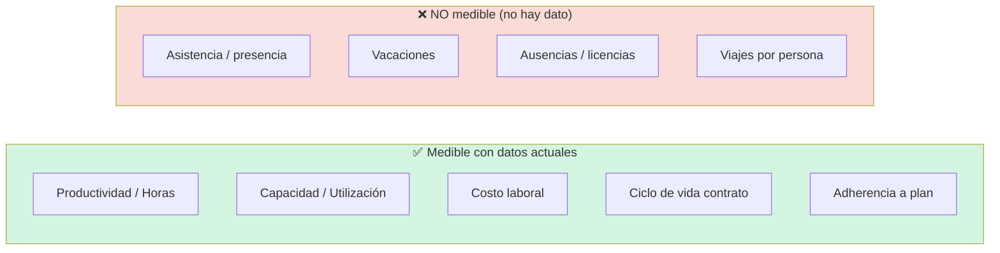

# Reporte — ¿Hay datos suficientes para medir el rendimiento de los colaboradores?

> **Pregunta evaluada:** *¿Cómo podemos medir a la persona?* → números asociados a los colaboradores: **Asistencia · Vacaciones · Viajes · Ausencias**, etc.
> **Fuentes revisadas:** `pilar_a/data/Archivos 2025/` y `pilar_a/data/Archivos 2026/` (inspección directa de hojas, no solo de los REPORTE).
> **Generado:** 2026-06-26 · **Pilar:** conceptualmente `pilar_b` (dimensión organizacional), pero los datos viven hoy en `pilar_a`.
> **Audiencia:** agente IA de data science / BI de REDCO.

---

## 1. Veredicto

**Parcialmente. Con los datos actuales NO se puede medir a la persona en las dimensiones que enumeras** (asistencia, vacaciones, ausencias, viajes-por-persona): esos registros son de **RR.HH./control de presencia** y **no existen** en estas carpetas. Lo que hay es un sistema **financiero-operacional**, no un sistema de personas.

**Sí se puede medir a la persona, y bastante bien, en otra familia de indicadores** — los de **productividad, carga y costo**: horas trabajadas (plan vs. real), utilización/sobre-asignación de capacidad, costo laboral por persona, multi-proyecto y ciclo de vida del contrato (antigüedad/rotación).

En síntesis: los datos permiten medir **“cuánto produce y cuánto cuesta”** cada colaborador, pero **no “cuánto asiste / cuánto falta / cuántas vacaciones toma”**.

| Lo que pediste | ¿Hay dato? | Fuente / Observación |
| --- | :---: | --- |
| **Asistencia** (presencia, marcaje entrada/salida) | ❌ **No** | No hay registro de presencia. Único proxy débil: **HH Real** (horas cargadas a proyecto), y solo existe para **diciembre 2025**. |
| **Vacaciones** | ❌ **No** | No hay saldo ni uso de vacaciones. Solo **feriados nacionales** (Chile/Perú) en `Calendario` — son festivos, no vacaciones de la persona. |
| **Viajes** | ⚠️ **Esquema sí, datos no** | `10_Viajes y Ferias` tiene columnas `Persona`, `ID Personal`, `Fecha salida`, `Fecha regreso`… pero en los **63 registros reales están vacías**: los viajes se cargan como **costo agregado** (“Pago tarjeta de crédito”, “Reembolso Gtos.”), sin persona ni proyecto. |
| **Ausencias / licencias / permisos** | ❌ **No** | No se registran. Solo inferibles de forma indirecta y ambigua (días con plan pero 0 horas reales ≠ necesariamente ausencia). |
| *(Bonus disponible)* **Carga / utilización HH** | ✅ **Sí** | `Summary HH POM`, `Resumen Personal` (horas asignadas vs. 192 máx, holgura). |
| *(Bonus)* **Costo por persona** (sueldo/honorario/bono) | ✅ **Sí** | `09_Personal`, `09B_Honorarios`, `09A_Bonos`, nóminas 2025. |
| *(Bonus)* **Antigüedad / rotación** | ✅ **Sí** | `09_Personal` (Fecha ingreso/salida, Motivo salida, Finiquito); `Listado Profesionales` (Fecha Inicio/Fin Contrato). |
| *(Bonus)* **Adherencia a plan** (OTI/POM/Real) | ✅ **Sí** | `Listado de verificación` (por persona, Dic-2025); a nivel proyecto mensual en `02_POM 2024`. |

---

## 2. Por qué: estos archivos son un sistema financiero, no de personas

Todo `pilar_a/data/` está vertebrado por el **ciclo EdP** (Propuesta → … → caja). La persona aparece **solo como insumo de costo y de capacidad** (Horas-Hombre y remuneración), nunca como sujeto de un sistema de gestión de personas. La pregunta “¿cómo medimos a la persona?” es, por diseño, un objetivo de **`pilar_b`** (dimensión organizacional: *Capability* × *Personal Identity*), cuyo dataset propio **aún no existe** en el repo.

Lo que estas carpetas ofrecen es la **materia prima parcial** para el lado “Capability/desempeño” de `pilar_b`, no para el lado “presencia/RR.HH.”.

---

## 3. Inventario verificado de datos a nivel de persona

Inspección celda-a-celda de las hojas con dimensión de persona (no solo lo que dicen los REPORTE):

| Fuente | Hoja | Grano | Personas | Campos clave a nivel de persona |
| --- | --- | --- | :---: | --- |
| `04_POM Junio 2026.xlsx` | `Listado Profesionales` | maestro | **58** (rango hasta 68) | País · RUT/DNI · Nombre · **Área** · **Cargo** · **Fecha Inicio/Fin Contrato** |
| `04_POM Junio 2026.xlsx` | `Summary HH POM` | persona / mes | ~90 filas | Horas asignadas · **Horas máx mes (192)** · **holgura** (sobre/sub-asignación) |
| `04_POM Junio 2026.xlsx` | `Resumen Personal` | persona × proyecto | — | Nombre · Proyecto · Horas · **Nº Proyectos** · Horas Totales · flag **>168 h** |
| `04_POM Junio 2026.xlsx` | `Reporte POM PBI` | persona × día × tarea | **34** | Usuario · Proyecto · Fecha · **DuraciónMinutos** · **Tarea** (ShiftDisplayName) · Tipo = `POM` |
| `04_POM Junio 2026.xlsx` | ~50 hojas-proyecto | persona × día | — | grilla HH diaria asignada (plan, estilo Gantt, con feriados) |
| `HH_EDP_Diciembre 2025.xlsx` | `Listado de verificación` | persona × proyecto × día × tipo | **76** | **Profesional · Horas_v2 · Tipo {OTI/POM/Real} · Año/Mes/Día** (3.010 filas) |
| `05_…Flujo_de_Caja.xlsm` | `09_Personal_Contrato_HonFijo` | persona / mes | ~84 | RUT · Nombre · **Fecha ingreso/salida · Motivo salida** · Renta líquida · **Gasto Empresa USD** · Finiquito · Aguinaldo · Bono |
| `05_…Flujo_de_Caja.xlsm` | `09B_Honorarios-Personal` | persona / mes | 86 reg | Nombre · Gasto Empresa USD · Mes · Categoría |
| `05_…Flujo_de_Caja.xlsm` | `09A_Bonos_Comi_Divid` | persona / mes | 236 reg | Nombre · **Tipo {Bono/Comisión/Dividendo}** · USD |
| `05_…Flujo_de_Caja.xlsm` | `10_Viajes y Ferias` | viaje | 63 reg | *(esquema: Persona / Fecha salida / regreso / Proyecto — **vacío**)*; solo Total USD, País, Motivo |
| `202601_FLUJO REDCO 2025…xlsx` | `Nómina de pago *`, `Bono Anual 2024` | persona / mes | varios | Nombre · Monto |
| `202601_Proyeccion_Ing+Modulos…xlsx` | `Personal` | maestro | ~88 | Personal · Cargo · Empresa · País · Tipo Contrato · **Competencia 1-3** *(mayormente vacías)* |

> Nota: `01_KPI Gestión REDCO_2026.xlsx` y `02_POM 2024.xlsx` operan a nivel **empresa/proyecto**, sin dimensión de persona.

---

## 4. Qué SÍ se puede medir hoy (con estos datos)

1. **Productividad / horas ejecutadas** — Horas reales por persona × proyecto × día (`Listado de verificación`, tipo `Real`). Permite ranking de horas, distribución de esfuerzo, comparación OTI/POM/Real.
2. **Capacidad y sobre-carga (“héroes”)** — `Summary HH POM`: horas asignadas vs. 192 h/mes y holgura. Ya revela casos como **Luis Chumpitaz 330 h (−138 de holgura)** → dependencia de personas críticas, directamente alineado con el meta-objetivo del programa (reducir dependencia de “héroes”).
3. **Costo laboral por persona** — sueldo líquido + gasto empresa USD + honorarios + bonos/comisiones (`09_Personal`, `09B`, `09A`). Habilita **costo/HH** y, cruzado con horas reales, **rentabilidad por persona**.
4. **Ciclo de vida del contrato (antigüedad / rotación)** — `Fecha ingreso/salida`, `Motivo salida`, `Finiquito` en `09_Personal` + `Fecha Inicio/Fin Contrato` en `Listado Profesionales` → **tenure**, **turnover**, costo de salida.
5. **Adherencia a plan y multi-proyecto** — OTI vs. POM vs. Real por persona (Dic-2025); Nº de proyectos por persona; tarea/actividad planificada (`Reporte POM PBI`).

---

## 5. Qué NO se puede medir (y por qué)

- **Asistencia:** no hay ningún registro de presencia (marcaje, jornada, entrada/salida). Las HH son **horas imputadas a entregables de proyecto**, no presencia laboral. Una persona puede estar presente y no imputar horas, o imputar horas sin reflejar asistencia real.
- **Vacaciones:** no hay saldo ni consumo de vacaciones por persona. `Calendario` solo lista **feriados nacionales** (Chile/Perú) y horas laborales del día — es el *denominador de capacidad*, no un registro individual.
- **Ausencias / licencias / permisos:** no se capturan. Inferirlas como “días con plan POM pero 0 horas Real” es **ambiguo** (puede ser reasignación, holgura, fin de tarea, o falta de registro), no equivale a una ausencia.
- **Viajes por persona:** el modelo `10_Viajes y Ferias` **fue diseñado** para soportarlo (tiene `Persona`, `ID Personal`, `Fecha salida/regreso`), pero los 63 registros cargados son **importes agregados sin persona ni proyecto**. Hoy no se puede responder “¿cuántos viajes/días de viaje hizo X?”.

---

## 6. Limitaciones y trampas de datos (a respetar en cualquier análisis)

1. **“Real” granular = un solo mes.** El único dataset de **horas ejecutadas** por persona y día es **`HH_EDP_Diciembre 2025`** (Dic-2025). Para 2026 solo hay **plan (POM)**; el “Real” aún no se exporta a estos archivos (vive en MS Shifts/Teams). → No hay serie temporal de desempeño real por persona; hay una **foto**.
2. **Sin clave única de persona (identity resolution).** Conviven tres identificadores: **RUT/DNI** (maestros y nómina), **“Nombre TEAMS”** (p. ej. *Alex Pacheco*) y **texto libre “Profesional”** en las HH (p. ej. *ALEX RODRIGO PACHECO*). Además el `Listado de verificación` mezcla personas reales con **roles genéricos** (*“Líder de Proyecto”*) y **externos** (*“Externo (IMS)”*). Unir fuentes exige una tabla puente RUT↔nombre.
3. **Plantillas vs. datos.** Las hojas-registro del modelo `05` tienen filas de ejemplo/instrucciones y rangos formateados; los conteos brutos (~468 filas) **sobreestiman**: los registros reales son **~84 personas / 63 viajes / 86 honorarios / 236 bonos**.
4. **Viajes y terceros sin trazabilidad** — ya marcado en los REPORTE: 63 viajes y 122 terceros sin proyecto **ni persona**.
5. **Multi-moneda / multi-entidad** — costos en CLP/BRL/USD y entidades REDCO/REDCROSS/R+/REDTEC/BVI; estandarizar a **USD** antes de comparar costo por persona.

---

## 7. Recomendaciones

**Para responder la pregunta tal como está planteada (asistencia/vacaciones/ausencias/viajes), se necesita capturar datos nuevos** — es trabajo de `pilar_b`, no derivable de `pilar_a`:

| Para medir… | Hay que capturar (no existe hoy) | Dónde apoyarse |
| --- | --- | --- |
| **Asistencia** | Registro de jornada / marcaje, o exportación de presencia desde Teams/Shifts | extender `Reporte POM PBI` con tipo `Real` |
| **Vacaciones** | Libro de vacaciones por persona (saldo, tomadas, pendientes) | sistema de RR.HH. / planilla nueva |
| **Ausencias / licencias** | Registro de licencias médicas, permisos, inasistencias | sistema de RR.HH. |
| **Viajes por persona** | **Poblar** las columnas `Persona`, `Fecha salida/regreso`, `Proyecto` que ya existen en `10_Viajes y Ferias` | el esquema ya está listo: es carga de dato, no rediseño |

**Para aprovechar de inmediato lo que SÍ hay** (entregables de bajo costo y alto valor para `pilar_b`):

1. **Tabla puente de identidad** (RUT ↔ Nombre TEAMS ↔ Profesional) — desbloquea cualquier análisis cruzado por persona. *Primer paso obligatorio.*
2. **Ficha de persona (“Baseline 360 light”)** consolidando lo disponible: cargo/área/país, antigüedad, costo USD, horas reales (Dic-25), utilización POM, Nº proyectos, sobre-asignación.
3. **Indicador de dependencia / sobre-carga** a partir de `Summary HH POM` (holgura negativa) — mide directamente el riesgo de “héroes”, prioridad estratégica del programa.
4. **Conectar el “Real” mensual de 2026**: si se logra exportar HH reales por persona (como en Dic-25) de forma recurrente, se habilita la serie de desempeño y la adherencia OTI/POM/Real continua.

---

## 8. Conclusión para el roadmap

- **Dimensión “productividad y costo” de la persona:** **datos suficientes** (con la salvedad de que el “Real” granular es solo Dic-2025). Se puede construir ya una **línea base de capacidad/costo/utilización por colaborador**.
- **Dimensión “presencia y RR.HH.” (asistencia, vacaciones, ausencias, viajes-por-persona):** **datos insuficientes**. Requiere **nuevas fuentes** propias de `pilar_b`; el modelo `05` ya tiene el **esquema de viajes por persona** listo para poblar, lo que lo convierte en la mejora más barata.

---

### Apéndice — Fuentes inspeccionadas

`04_POM Junio 2026.xlsx` (66 hojas) · `05_Modelo_Flujo_de_Caja_REDCO_Mining_Consultants.xlsm` (39 hojas) · `HH_EDP_Diciembre 2025.xlsx` (3 hojas) · `202601_FLUJO REDCO 2025 - Cierre diciembre.xlsx` (39 hojas) · `202601_Proyeccion_Ing+Modulos 1_Edu.xlsx` (16 hojas) · `01_KPI Gestión REDCO_2026.xlsx` · `02_POM 2024.xlsx`.
Inspección directa de hojas y conteo de registros realizada el 2026-06-26 (pandas/openpyxl).

*Fin del reporte.*
