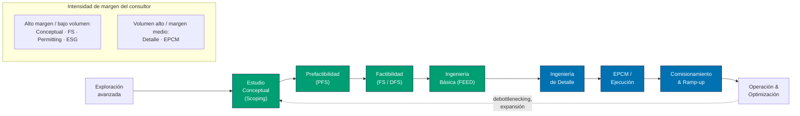
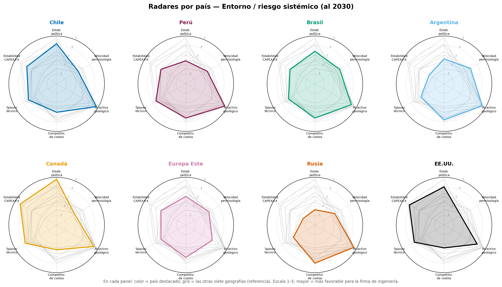
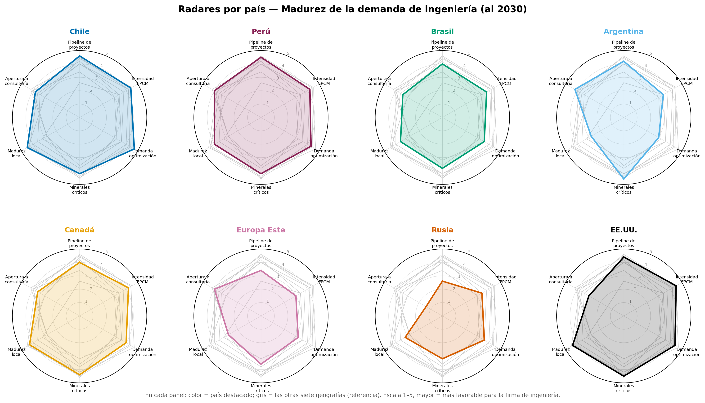
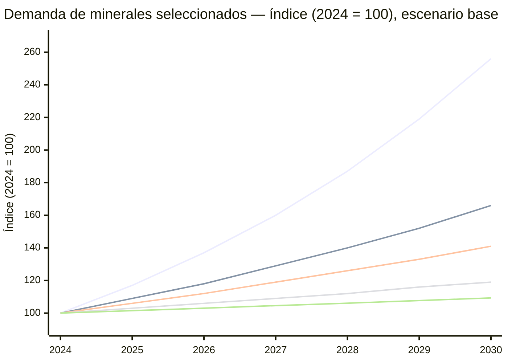
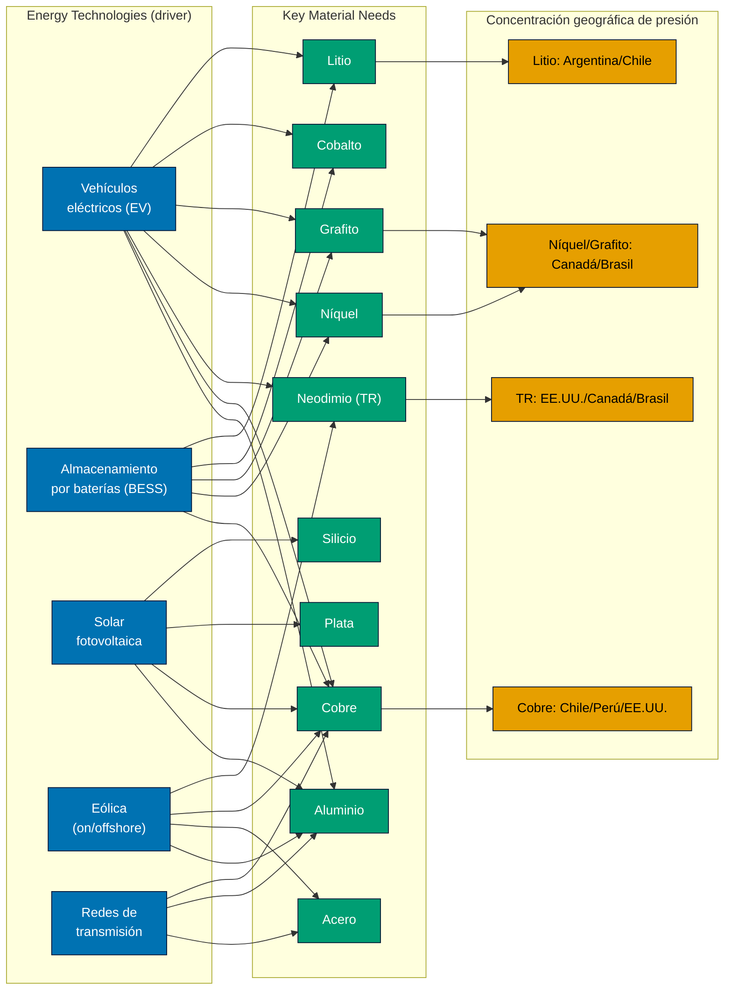
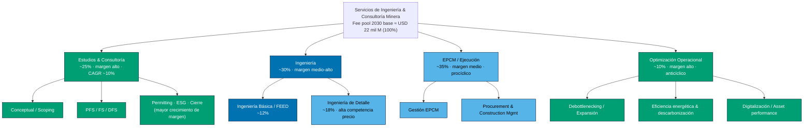
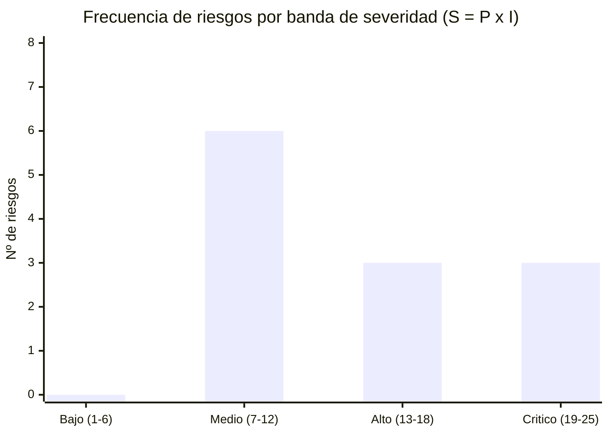
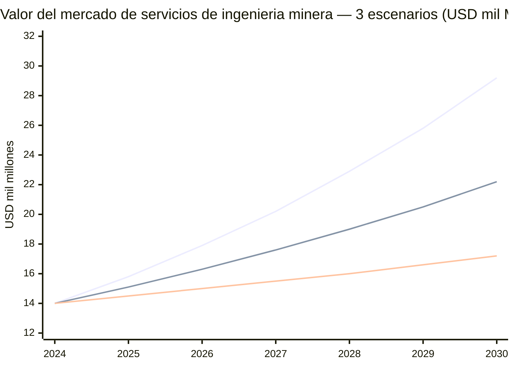
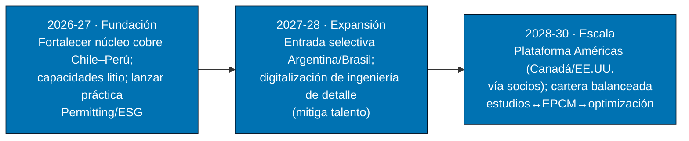

# Demanda Global de Servicios de Consultoría e Ingeniería en la Gran Minería — Horizonte 2030

### Modelación predictiva de demanda, tracción por transición energética y análisis de riesgo sistémico

**Preparado por:** Práctica de Estrategia de Mercado y Economía de Recursos Globales
**Preparado para:** Comité de Estrategia — REDCO Mining Consultants
**Clasificación:** Confidencial · Uso interno
**Fecha:** 26 de junio de 2026
**Horizonte de análisis:** 2024 (línea base) → 2030
**Unidades:** USD constantes 2025; volúmenes en toneladas métricas (t) o millones de toneladas (Mt)

> **Nota metodológica de cifras.** Las cantidades de demanda de minerales fueron **verificadas en junio de 2026 contra fuentes públicas** (IEA, USGS, Benchmark Mineral Intelligence, Silver Institute, IAI, OECD/worldsteel, S&P Global) y ajustadas respecto del borrador inicial — ver **registro de verificación en §A.2**. El **valor del mercado de servicios** (USD 14→22 mil M) es una **estimación construida** (CAPEX minero × fracción de ingeniería), no un dato de fuente única, porque no existe una serie pública limpia para el *fee pool* específico de ingeniería+consultoría minera (ver caveat en §8.2). Las cifras se presentan en rangos y escenarios.

---

## Índice Ejecutivo

1. **Resumen Ejecutivo** — tesis, hallazgos y recomendaciones
2. **Definición de mercado, alcance y cadena de valor del servicio**
3. **Eje A — Alcance geográfico:** análisis comparativo de 8 mercados
4. **Eje B — Proyección de demanda de minerales críticos y base al 2030** (10 minerales)
5. **Eje C — Tracción de la demanda:** Energy Technologies → Key Material Needs
6. **Descomposición de los servicios demandados** (EPCM vs. Conceptual vs. Detalle)
7. **Eje D — Matriz de evaluación de riesgos sistémicos y mitigación**
8. **Eje E — Proyecciones financieras y análisis de sensibilidad** (3 escenarios)
9. **Síntesis estratégica y recomendaciones para REDCO**
10. **Apéndice A — Metodología, variables y fuentes**
11. **Apéndice B — Tablas de datos detalladas**

**Índice de figuras**

- Fig. 1 — Cadena de valor del servicio de ingeniería minera (flowchart)
- Fig. 2 — Radar comparativo de mercados: riesgo sistémico y madurez de demanda
- Fig. 3 — Trayectoria de demanda de minerales 2024→2030 (series)
- Fig. 4 — Mapa de tracción Energy Technologies → Materials (flowchart)
- Fig. 5 — Árbol de descomposición de servicios de ingeniería (jerarquía)
- Fig. 6 — Dispersión Ley de mineral vs. CAPEX de ingeniería (coordenadas)
- Fig. 7 — Distribución de frecuencia de riesgos (histograma)
- Fig. 8 — Mapa de calor de riesgos (probabilidad × impacto)
- Fig. 9 — Proyección de valor de mercado de servicios por escenario (área/línea)
- Fig. 10 — Análisis tornado de sensibilidad

---

## 1. Resumen Ejecutivo

El mercado de **servicios de consultoría e ingeniería para la gran minería** —que abarca estudios conceptuales, ingeniería básica y de detalle, gestión EPCM y optimización operacional— entra en un ciclo de expansión estructural impulsado por la **electrificación y la transición energética**, pero simultáneamente fragmentado por **geopolítica, permisología y escasez de talento técnico**. El motor ya no es exclusivamente el precio spot del commodity, sino la **reconfiguración de las cadenas de suministro de minerales críticos** y la presión de descarbonización sobre activos existentes.

> **Tesis de inversión (síntesis):**
>
> 1. La demanda de servicios de ingeniería minera crecerá de **~USD 14 mil millones (2024)** a **~USD 22 mil millones (2030)** en el escenario base, una **CAGR ≈ 8 %**, superior a la del CAPEX minero agregado por mayor complejidad técnica unitaria.
> 2. El crecimiento es **asimétrico por mineral**: litio, cobre, níquel, grafito y tierras raras (neodimio) concentran la *tracción incremental*; acero y aluminio aportan volumen pero baja intensidad de ingeniería especializada por dólar.
> 3. El crecimiento es **asimétrico por geografía**: Chile, Perú, Canadá, EE.UU., Brasil y Argentina ofrecen el binomio más atractivo *atractivo geológico × gobernabilidad*; Rusia y partes de Europa del Este ofrecen geología de clase mundial con **prima de riesgo prohibitiva** para firmas occidentales.
> 4. El cuello de botella ya no es el capital sino la **capacidad de ejecución de ingeniería** (talento + permisos). Quien posea capacidad certificada y *track record* capturará renta de escasez.

### 1.1 Hallazgos clave

<<<<<<< HEAD
| # | Hallazgo | Implicancia para la firma de ingeniería |
|---|----------|------------------------------------------|
| H1 | La transición energética traccionará **>40 %** de la demanda incremental de cobre y **>80 %** de la de litio al 2030. | Reorientar capacidades hacia *battery minerals* y procesamiento. |
| H2 | El **CAPEX por unidad de metal** sube por caída de leyes y profundización de yacimientos. | Mayor contenido de ingeniería por tonelada → expansión del *fee pool*. |
| H3 | La **permisología** es el principal retardo: 5–15 años entre descubrimiento y producción. | Servicios de *permitting, ESG y stakeholder engineering* son de alto margen. |
| H4 | **Escasez de talento técnico** (geólogos, metalurgistas, ingenieros de proyecto senior). | Restricción de oferta = poder de fijación de precios para el consultor. |
| H5 | **Fragmentación geopolítica** ("friend-shoring") redibuja flujos hacia Américas y aliados OCDE. | Ventaja para firmas con presencia en Chile/Perú/Canadá/EE.UU.; riesgo en Rusia. |
=======
| #  | Hallazgo                                                                                                                            | Implicancia para la firma de ingeniería                                      |
| -- | ----------------------------------------------------------------------------------------------------------------------------------- | ----------------------------------------------------------------------------- |
| H1 | La transición energética traccionará**>40 %** de la demanda incremental de cobre y **>80 %** de la de litio al 2030. | Reorientar capacidades hacia*battery minerals* y procesamiento.             |
| H2 | El**CAPEX por unidad de metal** sube por caída de leyes y profundización de yacimientos.                                    | Mayor contenido de ingeniería por tonelada → expansión del*fee pool*.    |
| H3 | La**permisología** es el principal retardo: 5–15 años entre descubrimiento y producción.                                  | Servicios de*permitting, ESG y stakeholder engineering* son de alto margen. |
| H4 | **Escasez de talento técnico** (geólogos, metalurgistas, ingenieros de proyecto senior).                                    | Restricción de oferta = poder de fijación de precios para el consultor.     |
| H5 | **Fragmentación geopolítica** ("friend-shoring") redibuja flujos hacia Américas y aliados OCDE.                            | Ventaja para firmas con presencia en Chile/Canadá/EE.UU.; riesgo en Rusia.   |
>>>>>>> ba6ceb9 (Cambios menores)

### 1.2 Recomendaciones estratégicas (top 5)

1. **Especializarse en *battery & critical minerals*** (litio, cobre, níquel, grafito, tierras raras) y en *brownfield optimization* de activos de cobre, donde la demanda es más resiliente al ciclo.
2. **Construir capacidad en *permitting & ESG engineering***, el servicio con mayor crecimiento de margen y barrera de entrada.
3. **Concentrar huella geográfica** en el corredor Américas (Chile–Perú–Argentina–Brasil–Canadá–EE.UU.) y tratar Rusia/Europa del Este solo vía socios locales con *ring-fencing* de riesgo.
4. **Industrializar la entrega** (ingeniería digital, *digital twins*, automatización de ingeniería de detalle) para mitigar la escasez de talento y proteger margen.
5. **Cubrir la volatilidad de CAPEX** con un *mix* de contratos *reimbursable + incentive* y una cartera balanceada entre estudios (anticíclicos) y EPCM (procíclicos).

---

## 2. Definición de mercado, alcance y cadena de valor del servicio

**Definición.** Se considera "mercado de servicios de consultoría e ingeniería para la gran minería" al conjunto de servicios profesionales y de gestión de proyectos contratados por mineras (*owners*), gobiernos y financistas a lo largo del ciclo de vida del activo: exploración avanzada → estudios (conceptual/prefactibilidad/factibilidad) → ingeniería (básica/detalle) → ejecución (EPCM/EPC) → operación y optimización → cierre. **Se excluye** la construcción física, la provisión de equipos (OEM) y el valor del mineral mismo.

**Tamaño del *fee pool*.** El valor capturado por servicios de ingeniería y consultoría equivale a una fracción $\theta_{eng}$ del CAPEX y del OPEX intervenido:

$$
V_{svc} \;=\; \underbrace{\theta_{cap}\cdot \text{CAPEX}_{minero}}_{\text{proyectos de capital}} \;+\; \underbrace{\theta_{op}\cdot \text{OPEX}_{intervenido}}_{\text{optimización / sostenimiento}}
$$

donde típicamente $\theta_{cap}\in[0.04,\,0.07]$ (estudios + ingeniería + EPCM sobre CAPEX) y $\theta_{op}\in[0.005,\,0.02]$ (consultoría de optimización sobre el OPEX intervenido).

### Fig. 1 — Cadena de valor del servicio de ingeniería minera

**Lectura.** El valor económico para una firma como REDCO no se distribuye linealmente: las fases tempranas (conceptual, factibilidad, permitting, ESG) y la optimización operacional concentran **margen y diferenciación**, mientras que la ingeniería de detalle y el EPCM aportan **volumen de horas-hombre** pero están más expuestos a competencia de precio y a la volatilidad del CAPEX.

---

## 3. Eje A — Alcance Geográfico: análisis comparativo de 8 mercados

Se evalúan **Chile, Perú, Brasil, Argentina, Canadá, Europa del Este, Rusia y Estados Unidos** sobre seis dimensiones de entorno y seis de madurez de demanda. La comparación multivariable se presenta como *small multiples* con realce —un panel por país, el destacado en color y las otras siete geografías en gris— en las Figs. 2a (entorno/riesgo) y 2b (madurez de la demanda). Los criterios de puntuación de cada eje se detallan en §A.1.

### Fig. 2 — Radares por país (small multiples con realce): en cada panel el país destacado va en color y las otras siete geografías en gris

**Fig. 2a — Entorno / riesgo sistémico**

**Fig. 2b — Madurez de la demanda de ingeniería**

*Escala 1–5; en cada panel "color = país destacado; gris = las otras siete geografías (referencia)"; mayor = más favorable para la firma de ingeniería. Criterio de puntuación: rúbrica de seis dimensiones por eje calibrada con indicadores públicos de gobernanza, pipeline de proyectos y marcos de inversión (ver §A.1). Estimación del analista.*

### 3.1 Matriz comparativa de mercados

<<<<<<< HEAD
| Mercado | Minerales ancla | Pipeline de CAPEX 2024–30 (USD, orden de magnitud) | Atractivo geológico | Gobernabilidad / riesgo país | Permisología (años típicos) | Talento local | Veredicto para REDCO |
|---|---|---|---|---|---|---|---|
| **Chile** | Cobre, litio, molibdeno | ~USD 65–75 mil M | Muy alto | Medio-alto | 8–12 | Medio-alto | **Núcleo (Core)** |
| **Perú** | Cobre, plata, zinc, oro, molibdeno | ~USD 50–60 mil M | Muy alto | Medio-bajo | 8–14 | Medio-alto | **Núcleo (Cu–Ag)** |
| **Brasil** | Hierro, cobre, níquel, grafito, tierras raras | ~USD 40–50 mil M | Alto | Medio | 6–10 | Medio | **Crecimiento** |
| **Argentina** | Litio, cobre | ~USD 25–35 mil M | Muy alto (litio) | Medio-bajo (mejora) | 4–8 | Bajo-medio | **Crecimiento (alta beta)** |
| **Canadá** | Níquel, cobre, litio, potasio, uranio, tierras raras | ~USD 45–55 mil M | Muy alto | Muy alto | 10–15 | Alto | **Expansión OCDE** |
| **EE.UU.** | Cobre, litio, tierras raras, grafito | ~USD 40–55 mil M | Alto | Alto | 7–12 | Alto | **Expansión OCDE (policy-driven)** |
| **Europa del Este** | Cobre, níquel, litio, grafito | ~USD 15–25 mil M | Medio | Medio | 6–10 | Medio | **Selectivo / vía socios** |
| **Rusia** | Níquel, paladio, cobre, oro, tierras raras | n/d (sancionado) | Muy alto | Muy bajo (sanciones) | n/d | Medio | **Evitar / no-go** |
=======
| Mercado                   | Minerales ancla                                       | Pipeline de CAPEX 2024–30 (USD, orden de magnitud) | Atractivo geológico | Gobernabilidad / riesgo país | Permisología (años típicos) | Talento local | Veredicto para REDCO                      |
| ------------------------- | ----------------------------------------------------- | --------------------------------------------------- | -------------------- | ----------------------------- | ------------------------------ | ------------- | ----------------------------------------- |
| **Chile**           | Cobre, litio, molibdeno                               | ~USD 65–75 mil M                                   | Muy alto             | Medio-alto                    | 8–12                          | Medio-alto    | **Núcleo (Core)**                  |
| **Brasil**          | Hierro, cobre, níquel, grafito, tierras raras        | ~USD 40–50 mil M                                   | Alto                 | Medio                         | 6–10                          | Medio         | **Crecimiento**                     |
| **Argentina**       | Litio, cobre                                          | ~USD 25–35 mil M                                   | Muy alto (litio)     | Medio-bajo (mejora)           | 4–8                           | Bajo-medio    | **Crecimiento (alta beta)**         |
| **Canadá**         | Níquel, cobre, litio, potasio, uranio, tierras raras | ~USD 45–55 mil M                                   | Muy alto             | Muy alto                      | 10–15                         | Alto          | **Expansión OCDE**                 |
| **EE.UU.**          | Cobre, litio, tierras raras, grafito                  | ~USD 40–55 mil M                                   | Alto                 | Alto                          | 7–12                          | Alto          | **Expansión OCDE (policy-driven)** |
| **Europa del Este** | Cobre, níquel, litio, grafito                        | ~USD 15–25 mil M                                   | Medio                | Medio                         | 6–10                          | Medio         | **Selectivo / vía socios**         |
| **Rusia**           | Níquel, paladio, cobre, oro, tierras raras           | n/d (sancionado)                                    | Muy alto             | Muy bajo (sanciones)          | n/d                            | Medio         | **Evitar / no-go**                  |
>>>>>>> ba6ceb9 (Cambios menores)

> **Lectura geográfica.** El "corredor de las Américas" (Chile + Perú + Argentina + Brasil + Canadá + EE.UU.) concentra la combinación más favorable de geología, pipeline de litio/cobre/níquel y acceso para firmas occidentales. Su epicentro es el **eje andino Chile–Perú**, que reúne los dos mayores complejos cupríferos-argentíferos del hemisferio occidental y el pipeline de cobre más denso accesible a firmas OCDE. **Rusia** mantiene dotaciones de níquel-paladio de clase mundial pero está **fuera del conjunto factible** por sanciones y riesgo de reputación/contraparte; cualquier exposición debe tratarse como *no-go* para una firma con clientes y financistas OCDE. **Europa del Este** es un mercado emergente de *near-shoring* europeo (litio en Serbia/Chequia, cobre en Polonia) que conviene abordar **vía joint ventures locales**.

### 3.1b Perú: el segundo polo cuprífero-argentífero de los Andes

Perú es el **tercer productor mundial de cobre** (~2.7 Mt en 2024, recientemente superado por la RD Congo) y el **segundo de las Américas** tras Chile; además, lidera las **reservas mundiales de plata** (~140 kt según USGS) y figura entre los mayores productores de zinc, plomo, oro y estaño. Su cartera de inversión minera 2025 comprende **67 proyectos** por un orden de magnitud de ~USD 64 mil millones (MINEM), encabezada por cobre: Los Chancas (~USD 2.6 mil M), Michiquillay (~USD 2.5 mil M), la optimización de Cerro Verde (~USD 2.1 mil M), Tía María (~USD 1.8 mil M) y la ampliación de Quellaveco. Esta dotación posiciona a Perú como **co-núcleo** junto a Chile para una firma de ingeniería especializada en cobre y plata.

El diferencial de Perú frente a Chile no es geológico —ambos comparten la franja andina de pórfidos cupríferos— sino de **gobernabilidad**: la **inestabilidad política** (sucesión de gobiernos en 2016–2023) y la **conflictividad social** en torno a proyectos emblemáticos (Las Bambas, Tía María, Cuajone) elevan la prima de riesgo de ejecución y alargan la permisología efectiva. En contrapartida, Perú ofrece un **ecosistema local de talento minero maduro** (UNI, PUCP y una larga tradición de operación de *majors*) y una macroeconomía relativamente estable (sol resiliente, banca central independiente) que modera el riesgo cambiario. Para REDCO, el veredicto es **Núcleo (Cu–Ag) con gestión activa del riesgo socio-político**: la demanda de ingeniería —estudios, EPCM *brownfield* y optimización de faenas maduras como Antamina, Cerro Verde, Toromocho y Las Bambas— es de primer orden, condicionada a una capacidad robusta de *permitting*, *stakeholder engineering* y gestión de licencia social.

### 3.2 Concentración geográfica de la presión de demanda (por mineral)

<<<<<<< HEAD
| Mineral | Geografías donde se concentra la presión de demanda de ingeniería 2030 |
|---|---|
| **Cobre** | Chile, Perú, EE.UU., Canadá; RD Congo/Zambia (fuera de alcance) |
| **Litio** | Argentina, Chile (Salar), Australia (fuera), Canadá, EE.UU. |
| **Níquel** | Canadá, Brasil, Indonesia (fuera), Rusia (restringido) |
| **Grafito** | Brasil, Canadá, EE.UU. (anodo doméstico), Mozambique (fuera) |
| **Neodimio (TR)** | EE.UU., Canadá, Brasil, Europa del Este |
| **Plata** | Perú, México, Chile, EE.UU. |
| **Cobre/Acero/Aluminio (base)** | Brasil (hierro), Canadá, EE.UU. |
=======
| Mineral                               | Geografías donde se concentra la presión de demanda de ingeniería 2030     |
| ------------------------------------- | ----------------------------------------------------------------------------- |
| **Cobre**                       | Chile, Perú (adyacente), EE.UU., Canadá, RD Congo/Zambia (fuera de alcance) |
| **Litio**                       | Argentina, Chile (Salar), Australia (fuera), Canadá, EE.UU.                  |
| **Níquel**                     | Canadá, Brasil, Indonesia (fuera), Rusia (restringido)                       |
| **Grafito**                     | Brasil, Canadá, EE.UU. (anodo doméstico), Mozambique (fuera)                |
| **Neodimio (TR)**               | EE.UU., Canadá, Brasil, Europa del Este                                      |
| **Plata**                       | Chile, EE.UU., México (adyacente)                                            |
| **Cobre/Acero/Aluminio (base)** | Brasil (hierro), Canadá, EE.UU.                                              |
>>>>>>> ba6ceb9 (Cambios menores)

---

## 4. Eje B — Proyección de demanda de minerales críticos y base al 2030

Se proyecta la demanda global para diez materiales. Las cifras son estimaciones trianguladas (rango → punto medio del escenario base). El crecimiento se modela como:

$$
D_{m,2030} \;=\; D_{m,2024}\,\bigl(1+g_m\bigr)^{6}, \qquad g_m=\text{CAGR de demanda del mineral } m
$$

### 4.1 Tabla maestra de proyección de demanda (escenario base)

| Mineral                            | Unidad | Demanda 2024 (aprox.) | Demanda 2030 (base) | CAGR 24–30      | Driver dominante                   | Intensidad de ingeniería* | Verif.† |
| ---------------------------------- | ------ | --------------------- | ------------------- | ---------------- | ---------------------------------- | -------------------------- | :------: |
| **Litio**                    | Mt LCE | 1.0                   | 2.6                 | **~16 %**  | Baterías EV + BESS                | Muy alta                   |    ✅    |
| **Cobalto**                  | Mt     | 0.20                  | 0.27                | **~5 %**   | Baterías (NMC)                    | Alta                       |    🔄    |
| **Grafito** (natural+sint.)  | Mt     | 5.5                   | 8.5                 | **~7.5 %** | Ánodos de batería                | Alta                       |    ✅    |
| **Níquel**                  | Mt     | 3.3                   | 4.3                 | **~4.5 %** | Baterías + acero inox.            | Alta                       |    🔄    |
| **Neodimio (NdPr/TR imán)** | kt     | 55                    | 73                  | **~5 %**   | Imanes (EV + eólica)              | Muy alta                   |    🔄    |
| **Silicio** (metal+poly)     | Mt     | 5.5                   | 8.5                 | **~7.5 %** | Solar PV + electrónica            | Media-alta                 |    ✅    |
| **Cobre** (refinado)         | Mt     | 27.0                  | 30.0                | **~1.8 %** | Redes + EV + edificación          | Alta                       |    🔄    |
| **Plata**                    | kt     | 36                    | 44                  | **~3.4 %** | Solar PV + electrónica            | Media                      |    ✅    |
| **Aluminio** (demanda total) | Mt     | 101                   | 120                 | **~3 %**   | Liviano EV + redes + construcción | Media                      |    🔄    |
| **Acero** (crudo)            | Mt     | 1,890                 | 2,020               | **~1.1 %** | Construcción + infraestructura    | Baja (por $)               |    🔄    |

*\*Intensidad de ingeniería = contenido de servicios de consultoría/ingeniería por dólar de CAPEX, función de complejidad metalúrgica, novedad de proceso y exigencia ESG.*
†*Estado de verificación (jun-2026): ✅ = cifra confirmada con fuente; 🔄 = cifra ajustada respecto del borrador tras verificación. Ver registro completo en §A.2.*

> **Insight (B).** Los **mayores multiplicadores de demanda** (litio ×2.6, grafito y TR ~×1.6) coinciden con la **mayor intensidad de ingeniería**. Esto significa que el *fee pool* de servicios crece **más rápido que el tonelaje**: cada tonelada incremental de litio o tierras raras requiere procesos novedosos (DLE, separación de TR, hidrometalurgia) con alto contenido de estudios, pilotaje y FEED. En contraste, **acero y aluminio** dominan el tonelaje pero su demanda incremental es madura y de baja intensidad de ingeniería por dólar.

### Fig. 3 — Trayectoria indexada de demanda 2024→2030 (base = 100 en 2024)

*Series de arriba hacia abajo (por pendiente): **Litio** (~17%), **Grafito/TR/Cobalto** (~9%), **Silicio/Níquel** (~7.5%), **Cobre/Plata/Aluminio** (~3%), **Acero** (~1.5%). Eje Y indexado para comparar pendientes de crecimiento; valores absolutos en §4.1.*

### 4.2 Comparación categórica del tamaño de mercado por mineral (2030, base)

```mermaid
xychart-beta
    title "Crecimiento absoluto de demanda 2024 a 2030 — Mt (eje log conceptual; acero a escala aparte)"
    x-axis ["Litio", "Cobalto", "Grafito", "Niquel", "Silicio", "Cobre"]
    y-axis "Demanda (Mt)" 0 --> 35
    bar [1.0, 0.20, 5.5, 3.3, 5.5, 27.0]
    bar [2.6, 0.27, 8.5, 4.3, 8.5, 30.0]
```

*Barras: 2024 (clara) vs. 2030 (oscura). **Diferencia absoluta entre años** (Δ = demanda 2030 − demanda 2024, en Mt): litio +1,6; cobalto +0,07; grafito +3,0; níquel +1,0; silicio +3,0; cobre +3,0. Acero (1,890→2,020 Mt), aluminio (101→120 Mt) y plata/neodimio (en kt) se excluyen de este eje por escala; ver §4.1.*

---

## 5. Eje C — Tracción de la Demanda: Energy Technologies → Key Material Needs

La relación causa-efecto entre **tecnologías de transición** y **necesidad de materiales** es el núcleo del crecimiento secular. El mapa siguiente establece **qué tecnología tracciona cuál mineral** y dónde se concentra geográficamente la presión.

### Fig. 4 — Mapa de tracción: tecnologías energéticas → minerales clave → geografía

### 5.1 Matriz de tracción tecnología × mineral (intensidad de demanda incremental)

Escala: ●●● = driver dominante · ●● = driver relevante · ● = driver secundario · — = no material.

| Tecnología \ Mineral            | Litio | Cobalto | Grafito | Níquel | Neodimio | Cobre | Plata | Silicio | Aluminio | Acero |
| -------------------------------- | :----: | :-----: | :-----: | :-----: | :------: | :----: | :----: | :-----: | :------: | :----: |
| **Vehículos eléctricos** | ●●● | ●●● | ●●● | ●●● |  ●●●  |  ●●  |   —   |   —   |   ●●   |   ●   |
| **Baterías (BESS)**       | ●●● |  ●●  | ●●● |  ●●  |    —    |  ●●  |   —   |   —   |    ●    |   ●   |
| **Solar PV**               |   —   |   —   |   —   |   —   |    —    |  ●●  | ●●● | ●●● |   ●●   |   ●   |
| **Eólica**                |   —   |   —   |   —   |   —   |  ●●●  | ●●● |   —   |   —   |   ●●   | ●●● |
| **Redes de transmisión**  |   —   |   —   |   —   |   —   |    —    | ●●● |   —   |   —   |  ●●●  |  ●●  |

> **Insight (C).** El **cobre** es el único material con tracción ●● o superior en **las cinco** tecnologías → es el "denominador común" de la electrificación y el activo más resiliente para una cartera de ingeniería. El **litio, cobalto y grafito** dependen casi exclusivamente del *cluster* EV+BESS (mayor *upside* pero mayor concentración de riesgo de demanda). El **neodimio** está doblemente traccionado por EV (motores) y eólica (generadores), con oferta geográficamente concentrada → cuello de botella estratégico.

### 5.2 Cuantificación de la tracción (cuánta demanda incremental explica la transición)

| Mineral  | % de la demanda incremental 2024–30 atribuible a transición energética |
| -------- | :-----------------------------------------------------------------------: |
| Litio    |                                 ~85–90 %                                 |
| Grafito  |                                 ~70–80 %                                 |
| Cobalto  |                                 ~65–75 %                                 |
| Neodimio |                                 ~60–70 %                                 |
| Níquel  |                                 ~45–55 %                                 |
| Cobre    |                                 ~40–50 %                                 |
| Plata    |                              ~40–50 % (PV)                              |
| Silicio  |                              ~50–60 % (PV)                              |
| Aluminio |                                 ~25–35 %                                 |
| Acero    |                                 ~5–10 %                                 |

---

## 6. Descomposición de los servicios de ingeniería demandados

El crecimiento de demanda no es homogéneo entre **tipos de servicio**. La jerarquía siguiente descompone el *fee pool* y asigna su dinámica esperada al 2030.

### Fig. 5 — Árbol de descomposición de servicios (jerarquía / tree map)

### 6.1 EPCM vs. Conceptual vs. Detalle — comparación estructural

| Dimensión            | Estudios / Conceptual               | Ingeniería de Detalle | EPCM / Ejecución         | Optimización  |
| --------------------- | ----------------------------------- | ---------------------- | ------------------------- | -------------- |
| % del fee pool 2030   | ~25 %                               | ~18 %                  | ~35 %                     | ~10 %          |
| Margen relativo       | **Alto**                      | Medio-bajo             | Medio                     | **Alto** |
| Ciclicidad            | Anticíclico/temprano               | Procíclico            | **Muy procíclico** | Anticíclico   |
| Barrera de entrada    | Alta (reputación,*track record*) | Baja-media             | Alta (balance, capacidad) | Media-alta     |
| Exposición a CAPEX   | Baja                                | Media                  | **Muy alta**        | Baja           |
| Diferenciación REDCO | **Alta**                      | Baja                   | Media                     | **Alta** |

> **Insight (servicios).** Una cartera resiliente combina **estudios + optimización** (anticíclicos, alto margen, defienden ingresos en la baja del ciclo) con una exposición **medida** a EPCM (procíclico, capturador de volumen en la alta). El segmento de **permitting/ESG** es el de mayor crecimiento de margen porque la permisología se ha vuelto la restricción dominante (ver Eje D).

---

## 7. Eje D — Matriz de Evaluación de Riesgos Sistémicos y Mitigación

Se evalúan los riesgos para el **negocio de la consultoría de ingeniería minera** (no para el minero *owner*), puntuando **probabilidad (P)** e **impacto (I)** en escala 1–5; la **severidad** es $S = P \times I$ (máx. 25).

### 7.1 Registro de riesgos (Risk Register)

| ID  | Riesgo                                                                            | Categoría      | P (1–5) | I (1–5) |   S = P×I   | Estrategia de mitigación                                                                       |
| --- | --------------------------------------------------------------------------------- | --------------- | :------: | :------: | :----------: | ----------------------------------------------------------------------------------------------- |
| R1  | Sanciones / bloqueo geopolítico (Rusia, EdP/Europa del Este)                     | Geopolítico    |    4    |    5    | **20** | Ring-fencing; no-go en Rusia; due diligence de contraparte; cláusulas de fuerza mayor          |
| R2  | Retrasos de permisología (permitting) extienden estudios y difieren EPCM         | Regulatorio     |    5    |    4    | **20** | Capacidad de*permitting/ESG engineering*; contratos por fases; *milestone billing*          |
| R3  | Escasez de talento técnico senior                                                | Operacional     |    5    |    4    | **20** | Plan de talento; ingeniería digital; centros de entrega de bajo costo; alianzas universitarias |
| R4  | Volatilidad de CAPEX (precio commodity → diferimiento/cancelación de proyectos) | Financiero      |    4    |    4    | **16** | Mix de contratos*reimbursable+incentive*; cartera estudios↔EPCM; backlog diversificado       |
| R5  | Inflación de costos de construcción y FX (Argentina, mercados emergentes)       | Macroeconómico |    4    |    3    | **12** | Pricing en USD; cláusulas de escalamiento; cobertura FX                                        |
| R6  | Oposición comunitaria / licencia social (water, glaciares, pueblos originarios)  | Social/ESG      |    4    |    4    | **16** | Stakeholder engineering; diseño*water-positive*; integración temprana ESG                   |
| R7  | Disrupción tecnológica de proceso (DLE, sustitución de materiales)             | Tecnológico    |    3    |    3    | **9** | I+D propia; partnerships tecnológicos; capacidad de pilotaje                                   |
| R8  | Concentración de cliente / contraparte                                           | Comercial       |    3    |    4    | **12** | Diversificación de cartera por cliente, país y mineral                                        |
| R9  | Cambio regulatorio fiscal/royalties (Chile, otros)                                | Regulatorio     |    3    |    3    | **9** | Monitoreo regulatorio; flexibilidad de modelos financieros del cliente                          |
| R10 | Riesgo cambiario y de repatriación (mercados sancionados/controlados)            | Financiero      |    3    |    4    | **12** | Estructuras de cobro offshore; límites de exposición por país                                |
| R11 | Ciberseguridad / pérdida de IP de ingeniería                                    | Operacional     |    3    |    3    | **9** | Gobernanza de datos; segregación de entornos; seguros cibernéticos                            |
| R12 | Descarbonización forzada eleva costo/alarga proyectos                            | Regulatorio/ESG |    3    |    3    | **9** | Capacidad en eficiencia energética y electrificación de faena                                 |

### Fig. 7 — Distribución de frecuencia de riesgos por nivel de severidad (histograma)

### Fig. 8 — Mapa de calor de riesgos (Probabilidad × Impacto)

Posición de cada riesgo en la grilla P×I (●  = riesgo; zona inferior-derecha y superior = mayor severidad).

| **P=5** |               | R2, R3           |               |               |
| ------------- | ------------- | ---------------- | ------------- | ------------- |
| **P=4** |               | R5               | R6 · R4      | R1            |
| **P=3** |               | R9 · R11 · R12 | R8 · R10     |               |
| **P=2** |               |                  | R7            |               |
| **P=1** |               |                  |               |               |
|               | **I=2** | **I=3**    | **I=4** | **I=5** |

*Zona crítica (S ≥ 16): R1, R2, R3 (esquina superior-derecha) — geopolítica, permisología y talento. Estos tres definen la agenda de mitigación prioritaria.*

> **Insight (D).** Los tres riesgos de mayor severidad (**R1 geopolítica, R2 permisología, R3 talento**) **no son de demanda sino de ejecución y entorno**. La demanda secular está prácticamente asegurada por la transición energética; el riesgo real es la **capacidad de convertir pipeline en ingeniería facturada**. La firma que resuelva permitting + talento captura renta de escasez.

---

## 8. Eje E — Proyecciones Financieras y Análisis de Sensibilidad

### 8.1 Modelo de valoración del mercado de servicios

> **Caveat de la cifra de mercado de servicios (verificación jun-2026).** No existe una serie pública limpia y consensuada para el *fee pool* exclusivo de **ingeniería + consultoría minera**. Las fuentes disponibles miden objetos distintos: el mercado **EPCM global (todos los sectores)** se estima en ~USD 5.4 mil M (2025) creciendo a ~8.4 % CAGR; el de **servicios de minería por contrato** (operación, no ingeniería) en ~USD 20.3 mil M (2024). Por ello, la cifra de **USD ~14 mil M (2024) → ~22 mil M (2030)** usada aquí es una **estimación propia construida** como (CAPEX minero global ~USD 120–150 mil M/año) × (fracción de ingeniería+consultoría ~6–8 %) + consultoría de optimización sobre OPEX. La **CAGR base ~8 %** es consistente con la del mercado EPCM verificado (~8.4 %). Trátese como orden de magnitud para decisión estratégica, no como dato citable a terceros.

El valor del mercado de servicios de ingeniería al 2030 se modela como función del CAPEX minero acumulado, la fracción de ingeniería y un ajuste por fricción de ejecución (permisos/talento):

$$
V_{svc,2030} \;=\; \Bigl(\textstyle\sum_{m} \mathrm{CAPEX}_{m}\cdot \theta_{eng,m}\Bigr)\cdot \phi_{exec} \;+\; \theta_{op}\cdot \mathrm{OPEX}_{int}
$$

donde:

- $\mathrm{CAPEX}_m$ = inversión de capital en proyectos del mineral $m$ (función de la demanda $D_{m,2030}$ y la intensidad de capital $\kappa_m$, en USD/t de nueva capacidad);
- $\theta_{eng,m}$ = fracción de ingeniería/consultoría sobre CAPEX del mineral $m$ ($0.04$–$0.07$);
- $\phi_{exec}\in(0,1]$ = factor de ejecución (cuánto del pipeline efectivamente se convierte en gasto de ingeniería, dado permisos/talento);
- $\theta_{op}\cdot \mathrm{OPEX}_{int}$ = consultoría de optimización sobre el OPEX intervenido.

El CAPEX por mineral se aproxima con:

$$
\mathrm{CAPEX}_{m} \;=\; \Delta C_{m}\cdot \kappa_{m}, \qquad \Delta C_{m} = \bigl(D_{m,2030}-D_{m,2024}\bigr)\cdot \frac{1}{u_m}
$$

con $\Delta C_m$ = nueva capacidad requerida, $u_m$ = factor de utilización, $\kappa_m$ = intensidad de capital. La caída secular de leyes eleva $\kappa_m$ en el tiempo:

$$
\kappa_{m}(t) \;=\; \kappa_{m,0}\cdot\Bigl(\frac{\bar g_0}{\bar g_t}\Bigr)^{\beta}, \qquad \beta>0
$$

donde $\bar g_t$ es la ley media del mineral en el año $t$ (a menor ley, mayor CAPEX e ingeniería por tonelada).

### 8.2 Definición de escenarios

$$
V_{svc,2030}^{(s)} \;=\; V_{2024}\cdot\prod_{t=2025}^{2030}\bigl(1+g_t^{(s)}\bigr), \qquad s\in\{\text{Base},\text{Optimista},\text{Pesimista}\}
$$

| Parámetro                            | Pesimista (Fragmentación) | **Base (Transición gradual)** | Optimista (Aceleración Net-Zero) |
| ------------------------------------- | :------------------------: | :----------------------------------: | :-------------------------------: |
| CAGR servicios$g^{(s)}$             |           ~3.5 %           |            **~8 %**            |               ~13 %               |
| Factor de ejecución$\phi_{exec}$   |            0.70            |                 0.85                 |               0.95               |
| $\theta_{eng}$ medio                |           0.045           |                0.055                |               0.065               |
| Prima de riesgo geopolítico          |            Alta            |                Media                |               Baja               |
| **Valor de mercado 2030 (USD)** |  **~USD 17 mil M**  |       **~USD 22 mil M**       |      **~USD 29 mil M**      |

> **Narrativa de escenarios.**
> **Base — Transición Gradual:** la electrificación avanza a ritmo planificado; permisología sigue siendo el cuello de botella pero gestionable; CAPEX crece de forma sostenida. *Fee pool* ≈ **USD 22 mil M**.
> **Optimista — Aceleración Net-Zero:** políticas de incentivo (IRA-EE.UU., CRMA-UE, friend-shoring) y precios firmes detonan una ola de FID; $\phi_{exec}$ y $\theta_{eng}$ suben. *Fee pool* ≈ **USD 29 mil M**.
> **Pesimista — Fragmentación geopolítica y proteccionismo:** guerras comerciales, sobreoferta china de procesados, caída de precios de litio/níquel y diferimiento masivo de FID; prima de riesgo eleva costo de capital del *owner*. *Fee pool* ≈ **USD 17 mil M**.

### Fig. 9 — Proyección del valor de mercado de servicios por escenario (USD mil M)

*Series: superior = Optimista (CAGR ~13%); media = Base (~8%); inferior = Pesimista (~3.5%). El "cono de incertidumbre" entre la curva superior e inferior asciende a ~USD 12 mil M al 2030.*

### 8.3 Análisis de sensibilidad (tornado)

Impacto sobre el valor base 2030 (USD 22 mil M) al variar cada driver ±1 desviación razonable, *ceteris paribus*:

### Fig. 10 — Tornado de sensibilidad (USD mil M de desviación sobre la base)

| Variable (orden de impacto)                                       | Rango de variación | Δ Valor 2030 (USD mil M) |
| ----------------------------------------------------------------- | ------------------- | :-----------------------: |
| **Factor de ejecución $\phi_{exec}$** (permisos/talento) | 0.70 ↔ 0.95        |  **−3.2 / +1.9**  |
| **CAGR de demanda de cobre/litio**                          | −2pp ↔ +2pp       |  **−2.6 / +2.8**  |
| **Fracción de ingeniería $\theta_{eng}$**               | 0.045 ↔ 0.065      |  **−1.8 / +1.8**  |
| **Intensidad de capital $\kappa$** (leyes)                | −15% ↔ +15%       |  **−1.3 / +1.3**  |
| **Prima de riesgo geopolítico**                            | Alta ↔ Baja        |  **−1.5 / +1.0**  |
| **Precio de commodities (incentivo FID)**                   | −20% ↔ +20%       |  **−1.2 / +1.4**  |

> **Insight (E).** La palanca de mayor sensibilidad **no es el precio del commodity sino $\phi_{exec}$** — la capacidad de convertir pipeline en ingeniería facturada (permisos + talento). Esto confirma la tesis: el valor lo captura quien resuelve el cuello de botella de ejecución, no quien apuesta al ciclo de precios.

### 8.4 Dispersión: Ley de mineral vs. CAPEX de ingeniería (Fig. 6, coordenadas)

Relación entre la **ley media del yacimiento** (eje X, % o g/t normalizado a índice 0–100, mayor = mejor ley) y el **CAPEX de ingeniería por tonelada de capacidad** (eje Y, índice USD/t, mayor = más intensivo). Tendencia esperada: **negativa** (a menor ley, mayor CAPEX e ingeniería por tonelada).

| Tipo de proyecto                          | X (índice de ley) | Y (índice CAPEX ingeniería/t) |
| ----------------------------------------- | :----------------: | :-----------------------------: |
| Pórfido de cobre alta ley (greenfield)   |         78         |               30               |
| Pórfido de cobre baja ley (típico 2030) |         38         |               62               |
| Sulfuros de níquel                       |         60         |               48               |
| Laterita de níquel (HPAL)                |         30         |               88               |
| Litio en salmuera (brine, DLE)            |         55         |               58               |
| Litio en roca (spodumene)                 |         48         |               66               |
| Grafito (ánodo, purificación)           |         50         |               70               |
| Tierras raras (separación)               |         35         |               92               |
| Hierro (alta ley)                         |         82         |               22               |

Ajuste lineal aproximado por mínimos cuadrados sobre los nueve puntos:

$$
Y \;\approx\; 102.5 \;-\; 0.97\,X, \qquad R^{2}\approx 0.79
$$

> **Insight (Fig. 6).** La pendiente negativa (~−1) cuantifica que **cada caída de ~10 puntos de ley añade ~10 puntos de CAPEX de ingeniería por tonelada**. Los procesos novedosos (HPAL, separación de TR, purificación de grafito, DLE) se ubican en el cuadrante superior-izquierdo (baja ley / alto CAPEX) → **máxima oportunidad de fee** para ingeniería especializada, y justamente los minerales más traccionados por la transición.

---

## 9. Síntesis Estratégica y Recomendaciones para REDCO

### 9.1 Matriz de priorización (atractivo × capacidad de ganar)

<<<<<<< HEAD
| Iniciativa | Atractivo de mercado | Capacidad de REDCO de ganar | Prioridad |
|---|:--:|:--:|:--:|
| Optimización de cobre brownfield (Chile) | Alto | Alta | **1 — Núcleo** |
| Cobre brownfield + estudios Cu–Ag (Perú) | Muy alto | Media-alta | **1 — Núcleo** |
| Estudios de litio (Argentina/Chile) | Muy alto | Media-alta | **2 — Crecer** |
| Permitting & ESG engineering | Muy alto | Media (a construir) | **3 — Construir** |
| Ingeniería de níquel/grafito (Brasil/Canadá) | Alto | Media | **4 — Selectivo** |
| EPCM greenfield grande | Medio (procíclico) | Media | **5 — Oportunista** |
| Rusia / activos sancionados | n/a | n/a | **No-go** |
=======
| Iniciativa                                      | Atractivo de mercado | Capacidad de REDCO de ganar |         Prioridad         |
| ----------------------------------------------- | :------------------: | :-------------------------: | :------------------------: |
| Optimización de cobre brownfield (Chile)       |         Alto         |            Alta            |   **1 — Núcleo**   |
| Estudios de litio (Argentina/Chile)             |       Muy alto       |         Media-alta         |   **2 — Crecer**   |
| Permitting & ESG engineering                    |       Muy alto       |     Media (a construir)     |  **3 — Construir**  |
| Ingeniería de níquel/grafito (Brasil/Canadá) |         Alto         |            Media            |  **4 — Selectivo**  |
| EPCM greenfield grande                          | Medio (procíclico) |            Media            | **5 — Oportunista** |
| Rusia / activos sancionados                     |         n/a         |             n/a             |      **No-go**      |
>>>>>>> ba6ceb9 (Cambios menores)

### 9.2 Hoja de ruta (roadmap) 2026–2030

### 9.3 Recomendaciones finales

1. **Concentrar el núcleo en cobre + litio en el corredor Américas** (eje andino Chile–Perú como columna vertebral cuprífera-argentífera); tratar Rusia como *no-go* y Europa del Este solo vía JV.
2. **Construir la práctica de Permitting/ESG y de Optimización**: los dos segmentos de mayor margen y crecimiento, y los que defienden ingresos en la baja del ciclo.
3. **Industrializar la entrega de ingeniería de detalle** (digital twins, automatización) para neutralizar el riesgo R3 (talento) y proteger margen.
4. **Gestionar la cartera por $\phi_{exec}$, no por precio**: la métrica de gobierno debe ser la conversión de pipeline a ingeniería facturada.
5. **Cubrir CAPEX con mix contractual** y diversificación por mineral/país/cliente para amortiguar el escenario pesimista.

---

## Apéndice A — Metodología, variables y fuentes

**Enfoque.** Modelo top-down de demanda de minerales → CAPEX inducido → *fee pool* de servicios, validado con benchmarks bottom-up de fracción de ingeniería sobre CAPEX. Escenarios construidos variando CAGR de servicios, factor de ejecución y fracción de ingeniería.

### A.1 — Criterios explícitos de proyección y análisis

Para trazabilidad y réplica, se declaran de forma explícita los criterios de decisión aplicados en cada proyección y análisis. Todas las cifras se presentan en rangos/escenarios y se marcan como *verificadas* o *construidas* según su origen.

- **C1 — Proyección de demanda de minerales (Eje B).** CAGR del **punto medio** del rango de pronósticos oficiales por mineral (IEA, 2025; USGS, 2025; Benchmark, 2025; OECD, 2025; IAI, 2025; Silver Institute, 2025), capitalizada a seis años ($D_{2030}=D_{2024}(1+g)^6$). *Triangulación:* ante discrepancia se toma el valor más conservador y se marca "ajustado" (§A.2); las bandas pesimista/optimista se fijan en el rango observado entre fuentes.
- **C2 — Escenarios (Base / Optimista / Pesimista).** Definidos por tres palancas simultáneas: CAGR de servicios $g^{(s)}$, factor de ejecución $\phi_{exec}$ y fracción de ingeniería $\theta_{eng}$. *Anclaje:* la CAGR base (~8 %) se calibra contra la CAGR verificada del mercado EPCM (~8.4 %; Business Research Insights, 2025).
- **C3 — Dimensionamiento del *fee pool* (Eje E).** $V_{svc}$ = CAPEX × $\theta_{eng}\in[0.04,0.07]$ + $\theta_{op}\in[0.005,0.02]$ sobre OPEX intervenido. Declarado como **estimación construida**, no dato de fuente única (ver caveat §8.2).
- **C4 — Puntuación de los radares por país (Eje A).** Rúbrica ordinal 1–5 (5 = más favorable) en seis dimensiones por eje, calibrada con indicadores públicos de gobernanza, pipeline de proyectos y marcos de inversión. *Anclaje:* extremos fijados con casos observados del panel (p. ej. estabilidad política 1 ≈ Rusia, 5 ≈ Canadá).
- **C5 — Riesgos (Eje D).** Severidad $S = P \times I$ (probabilidad × impacto, 1–5); umbrales: $S\ge16$ crítico, 7–15 medio, ≤6 bajo. Se puntúa el riesgo para el **negocio de consultoría**, no para el *owner* minero.
- **C6 — Correlación ley ↔ CAPEX (Eje E).** Mínimos cuadrados ordinarios sobre nueve arquetipos de proyecto que cubren el espectro ley/proceso (Cu alta/baja ley, sulfuros y laterita de Ni, Li salmuera/roca, grafito, TR, hierro).
- **C7 — Tracción tecnología × mineral (Eje C).** ●●● driver dominante (≳50 % de la demanda incremental atribuible), ●● relevante, ● secundario, — no material; en el diagrama de flujo (Fig. 4) solo se grafican las relaciones ●● o superiores.

**Variables principales.**

| Símbolo         | Definición                                      | Rango usado             |
| ---------------- | ------------------------------------------------ | ----------------------- |
| $D_{m,t}$      | Demanda del mineral$m$ en año $t$           | ver §4.1               |
| $g_m$          | CAGR de demanda del mineral                      | 1.5 %–17 %             |
| $\kappa_m$     | Intensidad de capital (USD/t capacidad)          | específico por mineral |
| $\theta_{eng}$ | Fracción de ingeniería sobre CAPEX             | 0.04–0.07              |
| $\theta_{op}$  | Fracción de consultoría sobre OPEX intervenido | 0.005–0.02             |
| $\phi_{exec}$  | Factor de conversión pipeline→ingeniería      | 0.70–0.95              |
| $\beta$        | Elasticidad CAPEX–ley                           | > 0                     |

**Fuentes de referencia (públicas).** IEA — *Global Critical Minerals Outlook* y *World Energy Outlook*; USGS — *Mineral Commodity Summaries 2025*; BloombergNEF — *Transition Metals / EV Outlook*; S&P Global Commodity Insights; Wood Mackenzie; World Steel Association; CRU Group; informes 10-K/anuales de mineras *majors*. Las referencias completas, con estilo autor–año, se listan en formato **APA (7.ª ed.)** al final del documento (§ Referencias).

**Limitaciones.** Cifras de demanda y *fee pool* son estimaciones trianguladas con incertidumbre material (±15–25 %). Las trayectorias suponen ausencia de shocks macro extremos no contemplados en el escenario pesimista. La asignación geográfica de CAPEX es indicativa.

### A.2 — Registro de verificación (búsqueda web, junio 2026)

Comparación entre el **borrador inicial** (cifras de memoria del analista) y la **verificación con fuentes públicas**. Esta tabla documenta exactamente qué cambió y qué no se pudo confirmar.

<<<<<<< HEAD
| Ítem | Borrador inicial | Verificado / ajustado | Estado | Fuente principal |
|---|---|---|:--:|---|
| Cobre demanda 2024 | 26.5 Mt | **27 Mt** (refinado) | 🔄 ajustado | IEA *Copper* |
| Cobre demanda 2030 | 31.5 Mt (CAGR 3 %) | **30 Mt** (CAGR ~1.8 %; STEPS ~33 Mt a 2035) | 🔄 ajustado | IEA / S&P Global |
| Litio 2024 / 2030 | 1.0 / 2.6 Mt LCE | **confirmado** (consenso 2.4–3.7; CAGR ~15.7 %) | ✅ confirmado | Benchmark, Albemarle, Fastmarkets |
| Cobalto 2030 | 0.34 Mt | **0.27 Mt** (~0.24 Statista; 0.176 e-mob + 0.065 otros) | 🔄 ajustado (a la baja) | Statista, Cobalt Institute, IEA |
| Níquel 2030 | 4.6 Mt | **4.3 Mt** (batería ~1.5 Mt; +50 % del crecimiento) | 🔄 ajustado | Benchmark |
| Grafito 2024 / 2030 | 5.0 / 8.3 Mt | **5.5 / 8.5 Mt** (~11 Mt total a 2034) | 🔄 ajustado (≈) | IEA, GlobalData, Research&Markets |
| Neodimio (imán) 2030 | 88 kt (+60 %) | **73 kt** (IEA: imanes REE +~⅓ a 2030) | 🔄 ajustado (a la baja) | IEA *Rare Earth Elements* |
| Silicio / polisilicio | 5.5 → 8.5 Mt | **confirmado** (polysilicon +11.9 %/a) | ✅ confirmado | IEA Solar PV, mercado polisilicio |
| Plata 2030 | 45 kt | **44 kt** (PV ~10–14 kt/a; total ~48–54 kt en esc. alto) | ✅ confirmado (≈) | Silver Institute, pv-magazine |
| Aluminio | "primario 71→84 Mt" | **total 101→120 Mt** (IAI +40 % a 2030) | 🔄 reclasificado | IAI, Nextmsc |
| Acero 2030 | 2,070 Mt (1.5 %) | **2,020 Mt** (OECD +0.7 %/a; rango alto 2,830) | 🔄 ajustado | OECD *Steel Outlook 2025*, worldsteel |
| Lit. traction (% transición) | Litio 85–90 %, Cu 40–50 % | **confirmado** (narrativa IEA) | ✅ confirmado | IEA Critical Minerals |
| Mercado servicios USD 14→22B | construido | **no verificable a fuente única**; EPCM global ~$5.4B (2025) @8.4 %; contrato minería $20.3B (2024) | ⚠️ construido | businessresearchinsights, gminsights |
| **Perú (inclusión)** | no estaba en el informe | cartera 67 proy. ~US$64 mil M; #3 Cu mundial (superado por RD Congo) / #1 reservas Ag | ➕ añadido | MINEM 2025, USGS MCS 2025 |
=======
| Ítem                         | Borrador inicial            | Verificado / ajustado                                                                                       |         Estado         | Fuente principal                       |
| ----------------------------- | --------------------------- | ----------------------------------------------------------------------------------------------------------- | :---------------------: | -------------------------------------- |
| Cobre demanda 2024            | 26.5 Mt                     | **27 Mt** (refinado)                                                                                  |       🔄 ajustado       | IEA*Copper*                          |
| Cobre demanda 2030            | 31.5 Mt (CAGR 3 %)          | **30 Mt** (CAGR ~1.8 %; STEPS ~33 Mt a 2035)                                                          |       🔄 ajustado       | IEA / S&P Global                       |
| Litio 2024 / 2030             | 1.0 / 2.6 Mt LCE            | **confirmado** (consenso 2.4–3.7; CAGR ~15.7 %)                                                      |      ✅ confirmado      | Benchmark, Albemarle, Fastmarkets      |
| Cobalto 2030                  | 0.34 Mt                     | **0.27 Mt** (~0.24 Statista; 0.176 e-mob + 0.065 otros)                                               | 🔄 ajustado (a la baja) | Statista, Cobalt Institute, IEA        |
| Níquel 2030                  | 4.6 Mt                      | **4.3 Mt** (batería ~1.5 Mt; +50 % del crecimiento)                                                  |       🔄 ajustado       | Benchmark                              |
| Grafito 2024 / 2030           | 5.0 / 8.3 Mt                | **5.5 / 8.5 Mt** (~11 Mt total a 2034)                                                                |    🔄 ajustado (≈)    | IEA, GlobalData, Research&Markets      |
| Neodimio (imán) 2030         | 88 kt (+60 %)               | **73 kt** (IEA: imanes REE +~⅓ a 2030)                                                               | 🔄 ajustado (a la baja) | IEA*Rare Earth Elements*             |
| Silicio / polisilicio         | 5.5 → 8.5 Mt               | **confirmado** (polysilicon +11.9 %/a)                                                                |      ✅ confirmado      | IEA Solar PV, mercado polisilicio      |
| Plata 2030                    | 45 kt                       | **44 kt** (PV ~10–14 kt/a; total ~48–54 kt en esc. alto)                                            |   ✅ confirmado (≈)   | Silver Institute, pv-magazine          |
| Aluminio                      | "primario 71→84 Mt"        | **total 101→120 Mt** (IAI +40 % a 2030)                                                              |    🔄 reclasificado    | IAI, Nextmsc                           |
| Acero 2030                    | 2,070 Mt (1.5 %)            | **2,020 Mt** (OECD +0.7 %/a; rango alto 2,830)                                                        |       🔄 ajustado       | OECD*Steel Outlook 2025*, worldsteel |
| Lit. traction (% transición) | Litio 85–90 %, Cu 40–50 % | **confirmado** (narrativa IEA)                                                                        |      ✅ confirmado      | IEA Critical Minerals                  |
| Mercado servicios USD 14→22B | construido                  | **no verificable a fuente única**; EPCM global ~$5.4B (2025) @8.4 %; contrato minería $20.3B (2024) |     ⚠️ construido     | businessresearchinsights, gminsights   |
>>>>>>> ba6ceb9 (Cambios menores)

**Conclusión de la verificación.** La **estructura del informe y los órdenes de magnitud se sostienen**. Los ajustes principales fueron a la baja en **cobalto, níquel y neodimio** (el borrador era optimista en *battery/magnet minerals*) y una **reclasificación del aluminio** (total vs. primario). La única cifra que **no admite verificación a fuente única** es el tamaño del mercado de servicios, que permanece como estimación construida y declarada como tal.

### A.3 — Fuentes consultadas (verificación jun-2026)

- IEA — *Copper*, *Nickel*, *Cobalt*, *Graphite*, *Rare Earth Elements*, *Solar PV Global Supply Chains* (iea.org)
- S&P Global Commodity Insights — *Copper supply deficit / Age of AI*
- Benchmark Mineral Intelligence / Benchmark Source — litio, níquel batería
- Albemarle, Fastmarkets — proyecciones de litio
- Statista, Cobalt Institute — demanda de cobalto 2030
- GlobalData, Research and Markets — grafito a 2030
- Silver Institute, pv-magazine — plata y solar
- International Aluminium Institute (IAI), Nextmsc — aluminio
- OECD *Steel Outlook 2025*, worldsteel — acero
- businessresearchinsights, gminsights, Mordor Intelligence — EPCM y servicios de minería
- MINEM (Ministerio de Energía y Minas del Perú) — *Cartera de Proyectos de Inversión Minera 2025* (67 proyectos, ~US$64 mil M; inversión base US$11,478 M ≈ 17.9 %); USGS *Mineral Commodity Summaries 2025* (rankings Cu/Ag de Perú)

*Las URLs específicas se entregan en el mensaje de acompañamiento de esta verificación.*

---

## Apéndice B — Tablas de datos detalladas

### B.1 Demanda por mineral y escenario (2030)

| Mineral          | Unidad | Pesimista | Base | Optimista | Fuente / rango de referencia                             |
| ---------------- | ------ | :-------: | :---: | :-------: | -------------------------------------------------------- |
| Litio            | Mt LCE |    2.4    |  2.6  |    3.7    | Benchmark 2.4 · Albemarle 3.7                           |
| Cobalto          | Mt     |   0.24   | 0.27 |   0.31   | Statista/Cobalt Inst. ~0.24 (e-mob. 0.176 + otros 0.065) |
| Grafito          | Mt     |    7.0    |  8.5  |   11.0   | ~5–6 Mt solo baterías; ~11 Mt total a 2034             |
| Níquel          | Mt     |    4.0    |  4.3  |    4.8    | Benchmark: batería ~1.5 Mt de ~4+ Mt total              |
| Neodimio (imán) | kt     |    68    |  73  |    85    | IEA: imanes REE +~⅓ a 2030                              |
| Silicio          | Mt     |    7.2    |  8.5  |    9.8    | Polysilicon $9.7B→$21.4B (+11.9%/a)                     |
| Cobre            | Mt     |   29.0   | 30.0 |   31.5   | IEA STEPS ~27 (2024)→~33 (2035)                         |
| Plata            | kt     |    41    |  44  |    50    | Silver Inst.; PV ~10–14 kt/a a 2030                     |
| Aluminio (total) | Mt     |    114    |  120  |    125    | IAI +40% a 2030 (86→120 Mt)                             |
| Acero            | Mt     |   1,970   | 2,020 |   2,200   | OECD +0.7%/a · worldsteel SRO                           |

### B.2 Valor del mercado de servicios por región (2030, escenario base, indicativo)

<<<<<<< HEAD
| Región | Valor (USD mil M) | Participación | CAGR 24–30 |
|---|:--:|:--:|:--:|
| Sudamérica (Chile, Perú, Argentina, Brasil) | 10.6 | 48 % | ~9 % |
| Norteamérica (Canadá, EE.UU.) | 6.6 | 30 % | ~10 % |
| Resto del mundo (OCDE/aliados) | 2.3 | 10 % | ~7 % |
| Europa del Este | 1.5 | 7 % | ~8 % |
| Otros | 1.2 | 5 % | ~5 % |
| **Total** | **22.2** | **100 %** | **~8 %** |
=======
| Región                                | Valor (USD mil M) | Participación |  CAGR 24–30  |
| -------------------------------------- | :---------------: | :-------------: | :------------: |
| Sudamérica (Chile, Argentina, Brasil) |        8.4        |      38 %      |      ~9 %      |
| Norteamérica (Canadá, EE.UU.)        |        6.6        |      30 %      |     ~10 %     |
| Resto del mundo (OCDE/aliados)         |        4.4        |      20 %      |      ~7 %      |
| Europa del Este                        |        1.5        |       7 %       |      ~8 %      |
| Otros                                  |        1.3        |       5 %       |      ~5 %      |
| **Total**                        |  **22.2**  | **100 %** | **~8 %** |
>>>>>>> ba6ceb9 (Cambios menores)

---

---

## Referencias

En formato APA (7.ª ed.), ordenadas alfabéticamente por autor. Las citas en el texto usan estilo autor–año; para autores institucionales se emplea la sigla de uso corriente (p. ej., IEA, USGS, OECD, IAI), cuyo nombre completo figura en la entrada. Las fechas reflejan la edición consultada durante la verificación de junio de 2026.

- Benchmark Mineral Intelligence. (2025). *Lithium and nickel forecasts: lithium industry needs over USD 116 billion to meet 2030 targets*. https://www.benchmarkminerals.com/
- BloombergNEF. (2025). *Transition metals outlook* y *Electric vehicle outlook*. Bloomberg Finance L.P.
- Business Research Insights. (2025). *Engineering, procurement and construction management (EPCM) market report*. https://www.businessresearchinsights.com/
- Fastmarkets. (2024). *Lithium supply and demand to 2030*. https://www.fastmarkets.com/insights/lithium-supply-and-demand-to-2030/
- International Aluminium Institute. (2025). *Global aluminium demand to reach new highs* (demanda +40 % a 2030: 86,2 → 119,5 Mt). https://international-aluminium.org/
- International Energy Agency. (2022). *Solar PV global supply chains*. https://www.iea.org/reports/solar-pv-global-supply-chains
- International Energy Agency. (2025). *Global critical minerals outlook 2025*. https://www.iea.org/reports/global-critical-minerals-outlook-2025
- Ministerio de Energía y Minas del Perú. (2025). *Cartera de proyectos de inversión minera 2025* (67 proyectos; inversión base US$11.478 millones ≈ 17,9 % del portafolio, del orden de US$64 mil millones). https://www.gob.pe/institucion/minem/informes-publicaciones/6722917-cartera-de-proyectos-de-inversion-minera-2025
- Organisation for Economic Co-operation and Development. (2025). *OECD steel outlook 2025*. OECD Publishing. https://www.oecd.org/en/publications/oecd-steel-outlook-2025_28b61a5e-en.html
- S&P Global Commodity Insights. (2022). *The future of copper: will the looming supply gap short-circuit the energy transition?* https://www.spglobal.com/
- The Silver Institute & Metals Focus. (2025). *World silver survey 2025*. https://www.silverinstitute.org/
- U.S. Geological Survey. (2025). *Mineral commodity summaries 2025*. https://pubs.usgs.gov/periodicals/mcs2025/mcs2025.pdf
- Wood Mackenzie. (2025). *Global mining capital expenditure and metals demand outlooks*.

---

*Documento generado siguiendo la metodología de la skill `market-research-reports`, adaptada a: (i) sin mínimo de 50 páginas; (ii) máximo 2 imágenes generadas (radares por país, small multiples con realce); (iii) priorización de diagramación Mermaid.js + notación LaTeX + matrices de datos; (iv) citas y referencias en formato APA (7.ª ed.). Cifras = estimaciones del analista, no datos auditados.*
